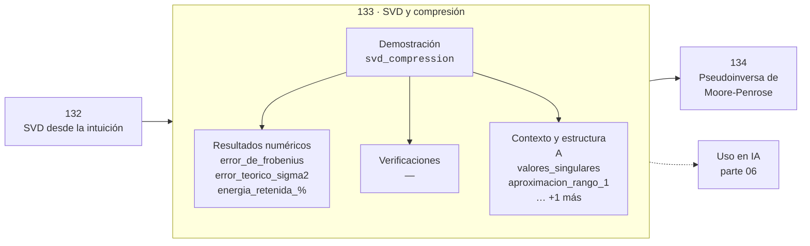

# 133 — SVD y compresión

> [⬅️ 132 SVD desde la intuición](../132-svd-desde-la-intuicion/README.md) · [📚 Parte 06](../README.md) · [🏠 Programa](../../../README.md) · [134 Pseudoinversa de Moore-Penrose ➡️](../134-pseudoinversa-de-moore-penrose/README.md)

**Parte:** 06 — Álgebra lineal II: descomposiciones y tensores · **Nivel:** `intermedio-avanzado` · **Horas estimadas:** 4
**Motor:** `engines.part06` · **Demostración:** `svd_compression` · **Clase 13 de 20** de la parte

---

## 🎯 Propósito

Cambio de base, autovalores, diagonalización, LU, QR, mínimos cuadrados, SVD, pseudoinversa, PCA y álgebra tensorial.

Esta clase concreta ese objetivo sobre **SVD y compresión**: qué es, cómo se
calcula a mano, cómo se implementa sin ocultar el procedimiento y cómo se verifica
que el resultado es correcto y no solo plausible.

## ✅ Resultados de aprendizaje

Al terminar podrás:

1. Explicar **SVD y compresión** con lenguaje cotidiano y con notación matemática.
2. Resolver un caso pequeño a mano y anticipar el orden de magnitud del resultado.
3. Ejecutar y modificar `lab.py`, que corre la demostración `svd_compression`.
4. Interpretar las 7 salidas del laboratorio y decir qué comprueba cada una.
5. Detectar el error típico de esta parte: aplicar pca sin centrar (ni escalar) los datos.

## 🗺️ Ubicación en el programa



## 🧠 Idea rectora de la parte 06

> PCA es la SVD de los datos centrados: no hay magia estadística adicional.

## 🔬 Qué ejecuta el laboratorio

`svd_compression` — Aproximación de rango 1 y energía retenida.

| Grupo | Salidas |
|---|---|
| 🔢 Resultados numéricos (3) | `error_de_frobenius`, `error_teorico_sigma2`, `energia_retenida_%` |
| ✅ Comprobaciones de invariante (0) | — |

Las claves booleanas no son adorno: si alguna fuera `False`, el resultado numérico
no sería fiable aunque el programa terminase sin error.

```bash
python classes/part-06-algebra-lineal-ii-descomposiciones-y-tensores/133-svd-y-compresion/lab.py
compmath run 133
```

> [!TIP]
> Antes de ejecutar, **escribe tu predicción**. Un laboratorio que confirma lo que
> esperabas enseña tanto como uno que te contradice, pero solo si la predicción
> existía antes del resultado.

## ⚠️ Errores frecuentes en esta parte

- Aplicar PCA sin centrar (ni escalar) los datos.
- Interpretar autovalores complejos como error de cálculo.
- Confundir el orden de los índices al reordenar un tensor.

## 🤖 Conexión con IA

LoRA factoriza matrices de bajo rango, la atención se define con productos tensoriales y la estabilidad del entrenamiento depende del espectro de los pesos.

## 📓 Notebooks

| Archivo | Para qué |
|---|---|
| [`notebook.ipynb`](notebook.ipynb) | recorrido guiado con la demostración ejecutada |
| [`notebook_student.ipynb`](notebook_student.ipynb) | versión con `TODO` para resolver |
| [`notebook_solution.ipynb`](notebook_solution.ipynb) | solución de referencia verificada |

## 📝 Evaluación

| Criterio | Peso |
|---|---:|
| Comprensión conceptual | 25 % |
| Resolución manual | 25 % |
| Implementación y verificación | 25 % |
| Interpretación y comunicación | 15 % |
| Conexión con aplicación real | 10 % |

Detalle y criterios de error crítico en [`assessment.md`](assessment.md).

## ❓ Preguntas de comprobación

1. ¿Cuál es la entrada, cuál la salida y qué unidades tienen?
2. ¿Qué operación domina el comportamiento del resultado?
3. ¿Qué caso extremo revelaría un error conceptual?
4. ¿Cómo verificarías el resultado por un método independiente?
5. ¿Dónde aparece esto en compresión?

Si necesitas releer el código para responderlas, la clase todavía no está superada.

## 📥 Entregable

`notebook_student.ipynb` resuelto más un párrafo que explique el resultado **sin citar
código**: qué entra, qué sale, qué invariante se comprueba y qué pasaría en un caso límite.

## 🔗 Referencias

- Golub, G.; Van Loan, C. *Matrix Computations*. 4ª ed., Johns Hopkins, 2013.
- Trefethen, L. N.; Bau, D. *Numerical Linear Algebra*. SIAM, 1997.
- Kolda, T.; Bader, B. *Tensor Decompositions and Applications*. SIAM Review, 2009.

## 📂 Material de la clase

[`intuition.md`](intuition.md) · [`theory.md`](theory.md) · [`derivation.md`](derivation.md) · [`exercises.md`](exercises.md) · [`assessment.md`](assessment.md) · [`where-is-this-used.md`](where-is-this-used.md) · [`lesson.yaml`](lesson.yaml)

---

> [⬅️ 132 SVD desde la intuición](../132-svd-desde-la-intuicion/README.md) · [📚 Parte 06](../README.md) · [🏠 Programa](../../../README.md) · [134 Pseudoinversa de Moore-Penrose ➡️](../134-pseudoinversa-de-moore-penrose/README.md)
