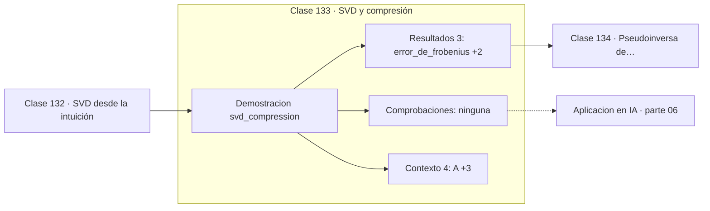

# 133 — SVD y compresión

> [⬅️ 132 SVD desde la intuición](../132-svd-desde-la-intuicion/README.md) · [📚 Parte 06](../README.md) · [🏠 Programa](../../../README.md) · [134 Pseudoinversa de Moore-Penrose ➡️](../134-pseudoinversa-de-moore-penrose/README.md)

**Parte:** 06 — Álgebra lineal II: descomposiciones y tensores · **Nivel:** `intermedio-avanzado` · **Horas estimadas:** 4
**Motor:** `engines.part06` · **Demostración:** `svd_compression` · **Clase 13 de 20** de la parte

---

## 🎯 Propósito

**Truncar la SVD da la mejor aproximación de rango k que existe, no una buena.**

Cambio de base, autovalores, diagonalización, LU, QR, mínimos cuadrados, SVD, pseudoinversa, PCA y álgebra tensorial.

## ✅ Resultados de aprendizaje

Al terminar podrás:

1. Explicar **SVD y compresión** con lenguaje cotidiano y con notación matemática.
2. Resolver un caso pequeño a mano y anticipar el orden de magnitud del resultado.
3. Ejecutar y modificar `lab.py`, que corre la demostración `svd_compression`.
4. Interpretar las 7 salidas del laboratorio y decir qué comprueba cada una.
5. Detectar el error típico de esta parte: aplicar pca sin centrar (ni escalar) los datos.

## 🧩 Fórmulas de la clase

```text
Aₖ = Σᵢ₌₁ᵏ σᵢ uᵢ vᵢᵀ
‖A − Aₖ‖_F = √(Σᵢ₌ₖ₊₁ σᵢ²)
energía retenida = Σᵢ₌₁ᵏ σᵢ² / Σ σᵢ²
```

## 🗺️ Ubicación en el programa



## 📖 Fundamentos

El teorema de Eckart-Young (1936) es de los resultados más fuertes del álgebra lineal
aplicada: entre **todas** las matrices de rango k, la que mejor aproxima a `A` es la SVD
truncada, y el error cometido es exactamente la raíz de la suma de los cuadrados de los
valores singulares descartados.

«La mejor» es una afirmación de optimalidad, no una recomendación heurística. No existe
ninguna otra matriz de rango k más cercana, ni en norma de Frobenius ni en norma
espectral. Eso convierte la truncación SVD en el estándar contra el que se comparan
todos los métodos de compresión y reducción de dimensionalidad.

La **energía retenida** —la fracción de la suma de cuadrados de los valores singulares
que conservan los k primeros— es el criterio habitual para elegir k. En PCA se llama
«varianza explicada» y es exactamente la misma cantidad. Un salto brusco en el espectro
indica el rango natural de los datos.

El ahorro de almacenamiento es real: guardar `Aₖ` requiere `k(m + n + 1)` números en
lugar de `mn`. Para una matriz 1000×1000 aproximada con rango 10, son 20 010 números
frente a un millón. Esa es la aritmética que hace viable LoRA, que adapta modelos
gigantes añadiendo matrices de rango muy bajo.

## 🧮 Ejemplo trabajado

Aproximación de rango 1 de una matriz 2×2.

```text
A = [[4, 0],
     [3,−5]]

valores singulares: σ₁ = 6.0644,  σ₂ = 3.2977

Aproximación de rango 1:
  error de Frobenius = 3.2977 = σ₂          ✓ coincide con la teoría
  energía retenida = σ₁²/(σ₁²+σ₂²) = 77.2 %

Teorema de Eckart-Young:
  ninguna otra matriz de rango 1 se acerca más.
```

## 🔬 Qué ejecuta el laboratorio

`svd_compression` — Aproximación de rango 1 y energía retenida.

| Grupo | Salidas |
|---|---|
| 🔢 Resultados numéricos (3) | `error_de_frobenius`, `error_teorico_sigma2`, `energia_retenida_%` |
| ✅ Comprobaciones de invariante (0) | — |

Las claves booleanas no son adorno: si alguna fuera `False`, el resultado numérico
no sería fiable aunque el programa terminase sin error.

```bash
python classes/part-06-algebra-lineal-ii-descomposiciones-y-tensores/133-svd-y-compresion/lab.py
compmath run 133
```

> [!TIP]
> Antes de ejecutar, **escribe tu predicción**. Un laboratorio que confirma lo que
> esperabas enseña tanto como uno que te contradice, pero solo si la predicción
> existía antes del resultado.

## ⚠️ Errores conceptuales frecuentes

1. Elegir k sin mirar el espectro de valores singulares.
2. Confundir energía retenida (cuadrados) con la fracción de valores singulares.
3. Suponer que otra factorización de rango k podría aproximar mejor.

## 🚀 Dónde se usa de verdad

Compresión de imágenes, PCA, sistemas de recomendación por factorización, eliminación de
ruido y LoRA.

## 🤖 Conexión con IA

LoRA factoriza matrices de bajo rango, la atención se define con productos tensoriales y la estabilidad del entrenamiento depende del espectro de los pesos.

## 📓 Notebooks

| Archivo | Para qué |
|---|---|
| [`notebook.ipynb`](notebook.ipynb) | recorrido guiado con la demostración ejecutada |
| [`notebook_student.ipynb`](notebook_student.ipynb) | versión con `TODO` para resolver |
| [`notebook_solution.ipynb`](notebook_solution.ipynb) | solución de referencia verificada |

## 📝 Evaluación

| Criterio | Peso |
|---|---:|
| Comprensión conceptual | 25 % |
| Resolución manual | 25 % |
| Implementación y verificación | 25 % |
| Interpretación y comunicación | 15 % |
| Conexión con aplicación real | 10 % |

Detalle y criterios de error crítico en [`assessment.md`](assessment.md).

## ❓ Preguntas de comprobación

1. ¿Cuál es la entrada, cuál la salida y qué unidades tienen?
2. ¿Qué operación domina el comportamiento del resultado?
3. ¿Qué caso extremo revelaría un error conceptual?
4. ¿Cómo verificarías el resultado por un método independiente?
5. ¿Dónde aparece esto en compresión?

Si necesitas releer el código para responderlas, la clase todavía no está superada.

## 📥 Entregable

`notebook_student.ipynb` resuelto más un párrafo que explique el resultado **sin citar
código**: qué entra, qué sale, qué invariante se comprueba y qué pasaría en un caso límite.

## 📚 Bibliografía de la clase

Esta clase enseña **Álgebra lineal · Álgebra lineal numérica**. Cada obra dice qué aporta aquí y cómo se comprobó su localizador:

- [Eckart, C.; Young, G. *The approximation of one matrix by another of lower rank*. Psychometrika, 1936](https://link.springer.com/article/10.1007/BF02288367) — Álgebra lineal y Álgebra lineal numérica: el tema de esta clase · DOI `10.1007/bf02288367` verificado en Crossref (2026-08-19).
- [Hu, E. et al. *LoRA: Low-Rank Adaptation of Large Language Models*. ICLR, 2022](https://arxiv.org/abs/2106.09685) — Álgebra lineal: el tema de esta clase · DOI `10.48550/arxiv.2106.09685` verificado en DataCite (2026-08-19).

Bibliografía de todas las clases, con el porqué de cada obra, en [`docs/BIBLIOGRAPHY.md`](../../../docs/BIBLIOGRAPHY.md) · localizador y estado de cada obra en [`sources/bibliography.json`](../../../sources/bibliography.json).

## 📂 Material de la clase

[`intuition.md`](intuition.md) · [`theory.md`](theory.md) · [`derivation.md`](derivation.md) · [`exercises.md`](exercises.md) · [`assessment.md`](assessment.md) · [`where-is-this-used.md`](where-is-this-used.md) · [`lesson.yaml`](lesson.yaml)

---

> [⬅️ 132 SVD desde la intuición](../132-svd-desde-la-intuicion/README.md) · [📚 Parte 06](../README.md) · [🏠 Programa](../../../README.md) · [134 Pseudoinversa de Moore-Penrose ➡️](../134-pseudoinversa-de-moore-penrose/README.md)
