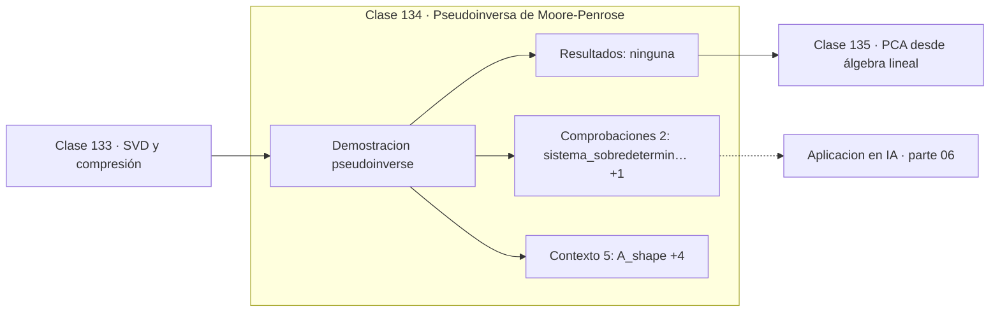

# 134 — Pseudoinversa de Moore-Penrose

> [⬅️ 133 SVD y compresión](../133-svd-y-compresion/README.md) · [📚 Parte 06](../README.md) · [🏠 Programa](../../../README.md) · [135 PCA desde álgebra lineal ➡️](../135-pca-desde-algebra-lineal/README.md)

**Parte:** 06 — Álgebra lineal II: descomposiciones y tensores · **Nivel:** `intermedio-avanzado` · **Horas estimadas:** 4
**Motor:** `engines.part06` · **Demostración:** `pseudoinverse` · **Clase 14 de 20** de la parte

---

## 🎯 Propósito

**La pseudoinversa generaliza la inversa y da la solución de mínima norma.**

Cambio de base, autovalores, diagonalización, LU, QR, mínimos cuadrados, SVD, pseudoinversa, PCA y álgebra tensorial.

## ✅ Resultados de aprendizaje

Al terminar podrás:

1. Explicar **Pseudoinversa de Moore-Penrose** con lenguaje cotidiano y con notación matemática.
2. Resolver un caso pequeño a mano y anticipar el orden de magnitud del resultado.
3. Ejecutar y modificar `lab.py`, que corre la demostración `pseudoinverse`.
4. Interpretar las 7 salidas del laboratorio y decir qué comprueba cada una.
5. Detectar el error típico de esta parte: interpretar autovalores complejos como error de cálculo.

## 🧩 Fórmulas de la clase

```text
A⁺ = VΣ⁺Uᵀ
sobredeterminado: A⁺b = solución de mínimos cuadrados
indeterminado: A⁺b = solución de norma mínima
```

## 🗺️ Ubicación en el programa



## 📖 Fundamentos

La pseudoinversa de Moore-Penrose extiende la inversa a matrices que no la tienen:
rectangulares o singulares. Se construye desde la SVD invirtiendo los valores singulares
no nulos y dejando en cero los demás.

Su comportamiento depende del caso. Si el sistema está **sobredeterminado** —más
ecuaciones que incógnitas—, `A⁺b` da la solución de mínimos cuadrados. Si está
**indeterminado** —infinitas soluciones—, da la de **norma mínima** entre todas ellas.
Esa elección no es arbitraria: es la solución sin componente en el núcleo, la más
«económica».

El detalle numérico que importa: al invertir los valores singulares, los más pequeños se
convierten en los más grandes y amplifican el ruido. Por eso la pseudoinversa práctica
**trunca**: descarta los valores singulares por debajo de una tolerancia relativa. Ese
truncamiento es una forma de regularización, emparentada con Ridge.

Cuando `A` tiene rango completo por columnas, `A⁺ = (AᵀA)⁻¹Aᵀ` y coincide con las
ecuaciones normales. La versión SVD es preferible porque funciona también cuando el
rango es deficiente, donde las ecuaciones normales fallan.

## 🧮 Ejemplo trabajado

Pseudoinversa de un sistema sobredeterminado.

```text
A = [[1,0],      b = (1, 2, 4)
     [1,1],
     [1,2]]

3 ecuaciones, 2 incógnitas → sobredeterminado

A⁺ = [[ 0.8333,  0.3333, −0.1667],
      [−0.5,     0,       0.5   ]]

A⁺b = (0.8333, 1.5)

Coincide con las ecuaciones normales        ✓
A⁺A = I (rango completo por columnas)       ✓
```

## 🔬 Qué ejecuta el laboratorio

`pseudoinverse` — Pseudoinversa de Moore-Penrose para sistemas sobredeterminados.

| Grupo | Salidas |
|---|---|
| 🔢 Resultados numéricos (0) | — |
| ✅ Comprobaciones de invariante (2) | `sistema_sobredeterminado`, `coinciden` |

Las claves booleanas no son adorno: si alguna fuera `False`, el resultado numérico
no sería fiable aunque el programa terminase sin error.

```bash
python classes/part-06-algebra-lineal-ii-descomposiciones-y-tensores/134-pseudoinversa-de-moore-penrose/lab.py
compmath run 134
```

> [!TIP]
> Antes de ejecutar, **escribe tu predicción**. Un laboratorio que confirma lo que
> esperabas enseña tanto como uno que te contradice, pero solo si la predicción
> existía antes del resultado.

## ⚠️ Errores conceptuales frecuentes

1. Usar la pseudoinversa sin truncar valores singulares minúsculos.
2. Suponer que A⁺A siempre es la identidad: solo si el rango es completo por columnas.
3. Confundir la solución de mínima norma con «la» solución cuando hay infinitas.

## 🚀 Dónde se usa de verdad

Mínimos cuadrados con rango deficiente, regularización truncada, cinemática inversa en
robótica y resolución de sistemas indeterminados.

## 🤖 Conexión con IA

LoRA factoriza matrices de bajo rango, la atención se define con productos tensoriales y la estabilidad del entrenamiento depende del espectro de los pesos.

## 📓 Notebooks

| Archivo | Para qué |
|---|---|
| [`notebook.ipynb`](notebook.ipynb) | recorrido guiado con la demostración ejecutada |
| [`notebook_student.ipynb`](notebook_student.ipynb) | versión con `TODO` para resolver |
| [`notebook_solution.ipynb`](notebook_solution.ipynb) | solución de referencia verificada |

## 📝 Evaluación

| Criterio | Peso |
|---|---:|
| Comprensión conceptual | 25 % |
| Resolución manual | 25 % |
| Implementación y verificación | 25 % |
| Interpretación y comunicación | 15 % |
| Conexión con aplicación real | 10 % |

Detalle y criterios de error crítico en [`assessment.md`](assessment.md).

## ❓ Preguntas de comprobación

1. ¿Cuál es la entrada, cuál la salida y qué unidades tienen?
2. ¿Qué operación domina el comportamiento del resultado?
3. ¿Qué caso extremo revelaría un error conceptual?
4. ¿Cómo verificarías el resultado por un método independiente?
5. ¿Dónde aparece esto en compresión?

Si necesitas releer el código para responderlas, la clase todavía no está superada.

## 📥 Entregable

`notebook_student.ipynb` resuelto más un párrafo que explique el resultado **sin citar
código**: qué entra, qué sale, qué invariante se comprueba y qué pasaría en un caso límite.

## 🔗 Referencias

- [Penrose, R. *A generalized inverse for matrices*. Math. Proc. Cambridge Phil. Soc., 1955](https://www.cambridge.org/core/journals/mathematical-proceedings-of-the-cambridge-philosophical-society/article/generalized-inverse-for-matrices/5F4516D6D3B34D0E8F7E7C7F0F7E7C7F) — *uso:* obra de referencia consultada en «Pseudoinversa de Moore-Penrose».
- [NumPy: `numpy.linalg.pinv`](https://numpy.org/doc/stable/reference/generated/numpy.linalg.pinv.html) — *uso:* documentación de la herramienta que ejecuta el laboratorio en «Pseudoinversa de Moore-Penrose».

Bibliografía completa de la parte en [`../../../docs/BIBLIOGRAPHY.md`](../../../docs/BIBLIOGRAPHY.md) · localizador verificable de cada obra en [`sources/bibliography.json`](../../../sources/bibliography.json).

## 📂 Material de la clase

[`intuition.md`](intuition.md) · [`theory.md`](theory.md) · [`derivation.md`](derivation.md) · [`exercises.md`](exercises.md) · [`assessment.md`](assessment.md) · [`where-is-this-used.md`](where-is-this-used.md) · [`lesson.yaml`](lesson.yaml)

---

> [⬅️ 133 SVD y compresión](../133-svd-y-compresion/README.md) · [📚 Parte 06](../README.md) · [🏠 Programa](../../../README.md) · [135 PCA desde álgebra lineal ➡️](../135-pca-desde-algebra-lineal/README.md)
