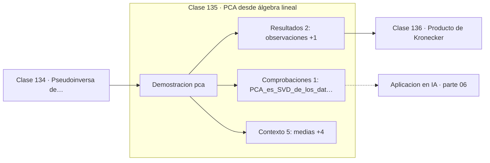

# 135 — PCA desde álgebra lineal

> [⬅️ 134 Pseudoinversa de Moore-Penrose](../134-pseudoinversa-de-moore-penrose/README.md) · [📚 Parte 06](../README.md) · [🏠 Programa](../../../README.md) · [136 Producto de Kronecker ➡️](../136-producto-de-kronecker/README.md)

**Parte:** 06 — Álgebra lineal II: descomposiciones y tensores · **Nivel:** `intermedio-avanzado` · **Horas estimadas:** 4
**Motor:** `engines.part06` · **Demostración:** `pca` · **Clase 15 de 20** de la parte

---

## 🎯 Propósito

**PCA es la autodescomposición de la covarianza, y equivale a la SVD de los datos centrados.**

Cambio de base, autovalores, diagonalización, LU, QR, mínimos cuadrados, SVD, pseudoinversa, PCA y álgebra tensorial.

## ✅ Resultados de aprendizaje

Al terminar podrás:

1. Explicar **PCA desde álgebra lineal** con lenguaje cotidiano y con notación matemática.
2. Resolver un caso pequeño a mano y anticipar el orden de magnitud del resultado.
3. Ejecutar y modificar `lab.py`, que corre la demostración `pca`.
4. Interpretar las 8 salidas del laboratorio y decir qué comprueba cada una.
5. Detectar el error típico de esta parte: confundir el orden de los índices al reordenar un tensor.

## 🧩 Fórmulas de la clase

```text
Σ = XᵀX/(n−1)  con X centrada
componentes = autovectores de Σ
varianza explicada = λᵢ / Σλⱼ
```

## 🗺️ Ubicación en el programa



## 📖 Fundamentos

PCA busca las direcciones de máxima varianza de un conjunto de datos. La primera
componente es la dirección en la que los datos más se dispersan; la segunda, la de
máxima varianza entre las ortogonales a la primera, y así sucesivamente. Esas direcciones
son los autovectores de la matriz de covarianza, y sus autovalores son las varianzas
correspondientes.

**Centrar los datos es obligatorio**, no un preprocesado opcional. Sin centrar, la
primera componente apunta hacia la media en lugar de hacia la dirección de máxima
dispersión, y el resultado carece de sentido. Es el error más frecuente al implementar
PCA a mano.

Escalar es otra decisión, y esta sí es opcional pero consecuente. Si las variables están
en unidades distintas —euros y kilómetros—, la de mayor magnitud domina la covarianza y
la primera componente la sigue. Estandarizar antes de PCA equivale a hacer PCA sobre la
matriz de correlación en lugar de sobre la de covarianza.

PCA y SVD son el mismo cálculo. La SVD de la matriz de datos centrados da directamente
las componentes en `V` y las varianzas en `σ²/(n−1)`, sin necesidad de formar la
covarianza —que, como toda matriz `XᵀX`, eleva al cuadrado el número de condición—. Por
eso las implementaciones profesionales usan SVD.

Una advertencia que conviene repetir: PCA es **no supervisado**. Maximiza varianza, no
capacidad discriminativa, y puede descartar precisamente la dirección que separa las
clases. Para eso está el análisis discriminante lineal, que sí usa las etiquetas.

## 🧮 Ejemplo trabajado

PCA sobre diez observaciones bidimensionales.

```text
medias: (1.81, 1.91)

matriz de covarianza:
  [[0.6166, 0.6154],
   [0.6154, 0.7166]]

autovalores: 1.2840,  0.0491
varianza explicada por PC1: 96.32 %

PC1 = (0.6779, 0.7352)

Proyecciones (primeras 5):
  0.8280, −1.7776, 0.9922, 0.2742, 1.6759

Conclusión: los datos son casi unidimensionales.
```

## 🔬 Qué ejecuta el laboratorio

`pca` — PCA como autodescomposición de la covarianza.

| Grupo | Salidas |
|---|---|
| 🔢 Resultados numéricos (2) | `observaciones`, `varianza_explicada_PC1_%` |
| ✅ Comprobaciones de invariante (1) | `PCA_es_SVD_de_los_datos_centrados` |

Las claves booleanas no son adorno: si alguna fuera `False`, el resultado numérico
no sería fiable aunque el programa terminase sin error.

```bash
python classes/part-06-algebra-lineal-ii-descomposiciones-y-tensores/135-pca-desde-algebra-lineal/lab.py
compmath run 135
```

> [!TIP]
> Antes de ejecutar, **escribe tu predicción**. Un laboratorio que confirma lo que
> esperabas enseña tanto como uno que te contradice, pero solo si la predicción
> existía antes del resultado.

## ⚠️ Errores conceptuales frecuentes

1. No centrar los datos antes de calcular la covarianza.
2. No estandarizar cuando las variables tienen unidades distintas.
3. Esperar que PCA conserve la dirección que separa las clases: es no supervisado.

## 🚀 Dónde se usa de verdad

Reducción de dimensionalidad, visualización, eliminación de ruido, compresión y
detección de multicolinealidad.

## 🤖 Conexión con IA

LoRA factoriza matrices de bajo rango, la atención se define con productos tensoriales y la estabilidad del entrenamiento depende del espectro de los pesos.

## 📓 Notebooks

| Archivo | Para qué |
|---|---|
| [`notebook.ipynb`](notebook.ipynb) | recorrido guiado con la demostración ejecutada |
| [`notebook_student.ipynb`](notebook_student.ipynb) | versión con `TODO` para resolver |
| [`notebook_solution.ipynb`](notebook_solution.ipynb) | solución de referencia verificada |

## 📝 Evaluación

| Criterio | Peso |
|---|---:|
| Comprensión conceptual | 25 % |
| Resolución manual | 25 % |
| Implementación y verificación | 25 % |
| Interpretación y comunicación | 15 % |
| Conexión con aplicación real | 10 % |

Detalle y criterios de error crítico en [`assessment.md`](assessment.md).

## ❓ Preguntas de comprobación

1. ¿Cuál es la entrada, cuál la salida y qué unidades tienen?
2. ¿Qué operación domina el comportamiento del resultado?
3. ¿Qué caso extremo revelaría un error conceptual?
4. ¿Cómo verificarías el resultado por un método independiente?
5. ¿Dónde aparece esto en compresión?

Si necesitas releer el código para responderlas, la clase todavía no está superada.

## 📥 Entregable

`notebook_student.ipynb` resuelto más un párrafo que explique el resultado **sin citar
código**: qué entra, qué sale, qué invariante se comprueba y qué pasaría en un caso límite.

## 🔗 Referencias

- [Jolliffe, I. T. *Principal Component Analysis*, 2ª ed., Springer, 2002](https://link.springer.com/book/10.1007/b98835)
- [Shlens, J. *A Tutorial on Principal Component Analysis*. arXiv, 2014](https://arxiv.org/abs/1404.1100)

Bibliografía completa de la parte en [`../../../docs/BIBLIOGRAPHY.md`](../../../docs/BIBLIOGRAPHY.md).

## 📂 Material de la clase

[`intuition.md`](intuition.md) · [`theory.md`](theory.md) · [`derivation.md`](derivation.md) · [`exercises.md`](exercises.md) · [`assessment.md`](assessment.md) · [`where-is-this-used.md`](where-is-this-used.md) · [`lesson.yaml`](lesson.yaml)

---

> [⬅️ 134 Pseudoinversa de Moore-Penrose](../134-pseudoinversa-de-moore-penrose/README.md) · [📚 Parte 06](../README.md) · [🏠 Programa](../../../README.md) · [136 Producto de Kronecker ➡️](../136-producto-de-kronecker/README.md)
