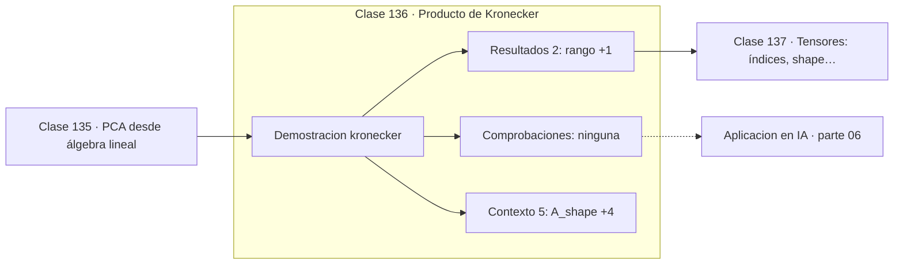

# 136 — Producto de Kronecker

> [⬅️ 135 PCA desde álgebra lineal](../135-pca-desde-algebra-lineal/README.md) · [📚 Parte 06](../README.md) · [🏠 Programa](../../../README.md) · [137 Tensores: índices, shape y orden ➡️](../137-tensores-indices-shape-y-orden/README.md)

**Parte:** 06 — Álgebra lineal II: descomposiciones y tensores · **Nivel:** `intermedio-avanzado` · **Horas estimadas:** 4
**Motor:** `engines.part06` · **Demostración:** `kronecker` · **Clase 16 de 20** de la parte

---

## 🎯 Propósito

**El producto de Kronecker construye matrices en bloques cuyo rango es el producto de los rangos.**

Cambio de base, autovalores, diagonalización, LU, QR, mínimos cuadrados, SVD, pseudoinversa, PCA y álgebra tensorial.

## ✅ Resultados de aprendizaje

Al terminar podrás:

1. Explicar **Producto de Kronecker** con lenguaje cotidiano y con notación matemática.
2. Resolver un caso pequeño a mano y anticipar el orden de magnitud del resultado.
3. Ejecutar y modificar `lab.py`, que corre la demostración `kronecker`.
4. Interpretar las 7 salidas del laboratorio y decir qué comprueba cada una.
5. Detectar el error típico de esta parte: aplicar pca sin centrar (ni escalar) los datos.

## 🧩 Fórmulas de la clase

```text
(A ⊗ B) shape = (m₁m₂, n₁n₂)
rango(A ⊗ B) = rango(A) · rango(B)
(A⊗B)(C⊗D) = (AC)⊗(BD)
```

## 🗺️ Ubicación en el programa



## 📖 Fundamentos

El producto de Kronecker sustituye cada entrada de `A` por esa entrada multiplicada por
toda la matriz `B`, generando una matriz en bloques mucho mayor. Su interés es que
**estructura**: representa operaciones que actúan de forma independiente sobre dos
factores de un problema.

Aparece de forma natural en problemas separables. Discretizar una ecuación en derivadas
parciales sobre una malla rectangular produce matrices de Kronecker, porque el operador
actúa por separado en cada dirección. Lo mismo ocurre al modelar un sistema compuesto por
dos subsistemas independientes.

Las identidades que cumple son las que lo hacen útil computacionalmente: el rango del
producto es el producto de los rangos, y `(A⊗B)(C⊗D) = (AC)⊗(BD)`. Esta última permite
operar con los factores pequeños en lugar de con la matriz gigante, ahorrando memoria y
tiempo.

En machine learning aparece en K-FAC, un método de optimización de segundo orden que
aproxima el Hessiano de una red como un producto de Kronecker de dos matrices pequeñas.
Sin esa estructura, el Hessiano de una capa con un millón de parámetros sería una matriz
de 10¹² entradas: inmanejable.

## 🧮 Ejemplo trabajado

Kronecker de dos matrices 2×2.

```text
A = [[1,2],[3,4]]      B = [[0,5],[6,7]]

A⊗B (4×4):
  [[ 0,  5,  0, 10],
   [ 6,  7, 12, 14],
   [ 0, 15,  0, 20],
   [18, 21, 24, 28]]

shape: (2·2, 2·2) = (4,4)                  ✓
rango(A⊗B) = rango(A)·rango(B) = 2·2 = 4   ✓
```

## 🔬 Qué ejecuta el laboratorio

`kronecker` — Producto de Kronecker: estructura en bloques.

| Grupo | Salidas |
|---|---|
| 🔢 Resultados numéricos (2) | `rango`, `rango_A_por_rango_B` |
| ✅ Comprobaciones de invariante (0) | — |

Las claves booleanas no son adorno: si alguna fuera `False`, el resultado numérico
no sería fiable aunque el programa terminase sin error.

```bash
python classes/part-06-algebra-lineal-ii-descomposiciones-y-tensores/136-producto-de-kronecker/lab.py
compmath run 136
```

> [!TIP]
> Antes de ejecutar, **escribe tu predicción**. Un laboratorio que confirma lo que
> esperabas enseña tanto como uno que te contradice, pero solo si la predicción
> existía antes del resultado.

## ⚠️ Errores conceptuales frecuentes

1. Confundir el producto de Kronecker con el producto matricial ordinario.
2. Construir explícitamente A⊗B cuando se puede operar con los factores.
3. Olvidar que el orden importa: A⊗B ≠ B⊗A en general.

## 🚀 Dónde se usa de verdad

Discretización de PDE separables, sistemas compuestos, K-FAC en optimización de segundo
orden y grafos producto.

## 🤖 Conexión con IA

LoRA factoriza matrices de bajo rango, la atención se define con productos tensoriales y la estabilidad del entrenamiento depende del espectro de los pesos.

## 📓 Notebooks

| Archivo | Para qué |
|---|---|
| [`notebook.ipynb`](notebook.ipynb) | recorrido guiado con la demostración ejecutada |
| [`notebook_student.ipynb`](notebook_student.ipynb) | versión con `TODO` para resolver |
| [`notebook_solution.ipynb`](notebook_solution.ipynb) | solución de referencia verificada |

## 📝 Evaluación

| Criterio | Peso |
|---|---:|
| Comprensión conceptual | 25 % |
| Resolución manual | 25 % |
| Implementación y verificación | 25 % |
| Interpretación y comunicación | 15 % |
| Conexión con aplicación real | 10 % |

Detalle y criterios de error crítico en [`assessment.md`](assessment.md).

## ❓ Preguntas de comprobación

1. ¿Cuál es la entrada, cuál la salida y qué unidades tienen?
2. ¿Qué operación domina el comportamiento del resultado?
3. ¿Qué caso extremo revelaría un error conceptual?
4. ¿Cómo verificarías el resultado por un método independiente?
5. ¿Dónde aparece esto en compresión?

Si necesitas releer el código para responderlas, la clase todavía no está superada.

## 📥 Entregable

`notebook_student.ipynb` resuelto más un párrafo que explique el resultado **sin citar
código**: qué entra, qué sale, qué invariante se comprueba y qué pasaría en un caso límite.

## 🔗 Referencias

- [Van Loan, C. *The ubiquitous Kronecker product*. J. Comput. Appl. Math., 2000](https://www.sciencedirect.com/science/article/pii/S0377042700003939)
- [Martens, J.; Grosse, R. *Optimizing Neural Networks with Kronecker-factored Approximate Curvature*. ICML, 2015](https://arxiv.org/abs/1503.05671)

Bibliografía completa de la parte en [`../../../docs/BIBLIOGRAPHY.md`](../../../docs/BIBLIOGRAPHY.md).

## 📂 Material de la clase

[`intuition.md`](intuition.md) · [`theory.md`](theory.md) · [`derivation.md`](derivation.md) · [`exercises.md`](exercises.md) · [`assessment.md`](assessment.md) · [`where-is-this-used.md`](where-is-this-used.md) · [`lesson.yaml`](lesson.yaml)

---

> [⬅️ 135 PCA desde álgebra lineal](../135-pca-desde-algebra-lineal/README.md) · [📚 Parte 06](../README.md) · [🏠 Programa](../../../README.md) · [137 Tensores: índices, shape y orden ➡️](../137-tensores-indices-shape-y-orden/README.md)
