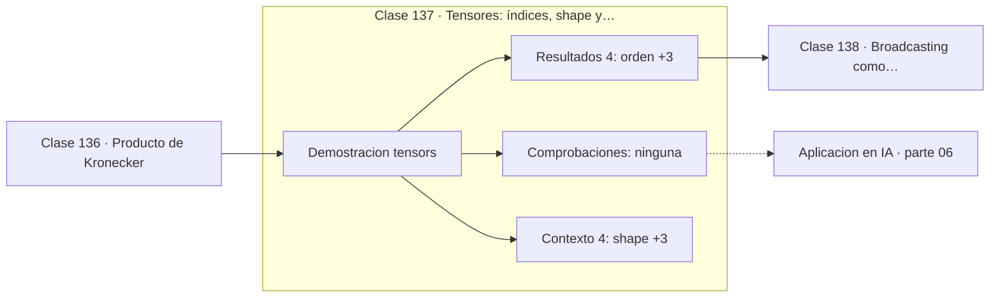

# 137 — Tensores: índices, shape y orden

> [⬅️ 136 Producto de Kronecker](../136-producto-de-kronecker/README.md) · [📚 Parte 06](../README.md) · [🏠 Programa](../../../README.md) · [138 Broadcasting como operación tensorial ➡️](../138-broadcasting-como-operacion-tensorial/README.md)

**Parte:** 06 — Álgebra lineal II: descomposiciones y tensores · **Nivel:** `intermedio-avanzado` · **Horas estimadas:** 4
**Motor:** `engines.part06` · **Demostración:** `tensors` · **Clase 17 de 20** de la parte

---

## 🎯 Propósito

**El orden de un tensor es su número de índices; el shape y el orden de aplanado determinan cómo se recorre.**

Cambio de base, autovalores, diagonalización, LU, QR, mínimos cuadrados, SVD, pseudoinversa, PCA y álgebra tensorial.

## ✅ Resultados de aprendizaje

Al terminar podrás:

1. Explicar **Tensores: índices, shape y orden** con lenguaje cotidiano y con notación matemática.
2. Resolver un caso pequeño a mano y anticipar el orden de magnitud del resultado.
3. Ejecutar y modificar `lab.py`, que corre la demostración `tensors`.
4. Interpretar las 8 salidas del laboratorio y decir qué comprueba cada una.
5. Detectar el error típico de esta parte: interpretar autovalores complejos como error de cálculo.

## 🧩 Fórmulas de la clase

```text
orden = número de índices
índice lineal (row-major) = i·(d₂d₃) + j·d₃ + k
lote de imágenes: (N, C, H, W)
```

## 🗺️ Ubicación en el programa



## 📖 Fundamentos

Un tensor generaliza escalar, vector y matriz a un número arbitrario de índices. En
computación no es más que un array multidimensional con un shape, y el trabajo real está
en no perderse entre los índices.

El **orden de aplanado** determina cómo se recorre en memoria. En *row-major* —el de C,
Python y NumPy por defecto— el último índice varía más rápido; en *column-major* —el de
Fortran, MATLAB y las rutinas BLAS— es el primero. Recorrer en el orden equivocado
destruye la localidad de caché y puede costar un orden de magnitud de rendimiento sin
cambiar el resultado.

Las convenciones de shape importan porque no son universales. Un lote de imágenes es
`(N, C, H, W)` en PyTorch y `(N, H, W, C)` en TensorFlow. Confundirlas produce errores
silenciosos: el código corre y el modelo no aprende. Anotar el shape esperado en cada
punto del código es la práctica que evita esa clase de bug.

Las operaciones de reordenamiento —`transpose`, `permute`, `reshape`, `view`— no mueven
datos necesariamente: cambian la interpretación de los índices. Esa distinción entre
vista y copia es la que explica los errores de contigüidad que aparecen al encadenar
operaciones en PyTorch.

## 🧮 Ejemplo trabajado

Tensor de orden 3 y su aplanado.

```text
shape (2,2,2), 8 elementos

T[0] = [[0,1],[2,3]]
T[1] = [[4,5],[6,7]]

aplanado row-major: [0,1,2,3,4,5,6,7]

elemento T[1][0][1] = 5
índice lineal: 1·4 + 0·2 + 1 = 5           ✓

Convenciones reales:
  PyTorch:    (N, C, H, W)
  TensorFlow: (N, H, W, C)
```

## 🔬 Qué ejecuta el laboratorio

`tensors` — Orden, shape y reordenamiento de índices.

| Grupo | Salidas |
|---|---|
| 🔢 Resultados numéricos (4) | `orden`, `elementos`, `elemento_[1][0][1]`, `indice_lineal` |
| ✅ Comprobaciones de invariante (0) | — |

Las claves booleanas no son adorno: si alguna fuera `False`, el resultado numérico
no sería fiable aunque el programa terminase sin error.

```bash
python classes/part-06-algebra-lineal-ii-descomposiciones-y-tensores/137-tensores-indices-shape-y-orden/lab.py
compmath run 137
```

> [!TIP]
> Antes de ejecutar, **escribe tu predicción**. Un laboratorio que confirma lo que
> esperabas enseña tanto como uno que te contradice, pero solo si la predicción
> existía antes del resultado.

## ⚠️ Errores conceptuales frecuentes

1. Confundir el orden del tensor con el tamaño de sus dimensiones.
2. Mezclar convenciones de shape entre frameworks.
3. Suponer que reshape siempre puede hacerse sin copiar: depende de la contigüidad.

## 🚀 Dónde se usa de verdad

Representación de lotes de imágenes, secuencias y vídeo; interoperabilidad entre
frameworks; optimización de recorridos por localidad de caché.

## 🤖 Conexión con IA

LoRA factoriza matrices de bajo rango, la atención se define con productos tensoriales y la estabilidad del entrenamiento depende del espectro de los pesos.

## 📓 Notebooks

| Archivo | Para qué |
|---|---|
| [`notebook.ipynb`](notebook.ipynb) | recorrido guiado con la demostración ejecutada |
| [`notebook_student.ipynb`](notebook_student.ipynb) | versión con `TODO` para resolver |
| [`notebook_solution.ipynb`](notebook_solution.ipynb) | solución de referencia verificada |

## 📝 Evaluación

| Criterio | Peso |
|---|---:|
| Comprensión conceptual | 25 % |
| Resolución manual | 25 % |
| Implementación y verificación | 25 % |
| Interpretación y comunicación | 15 % |
| Conexión con aplicación real | 10 % |

Detalle y criterios de error crítico en [`assessment.md`](assessment.md).

## ❓ Preguntas de comprobación

1. ¿Cuál es la entrada, cuál la salida y qué unidades tienen?
2. ¿Qué operación domina el comportamiento del resultado?
3. ¿Qué caso extremo revelaría un error conceptual?
4. ¿Cómo verificarías el resultado por un método independiente?
5. ¿Dónde aparece esto en compresión?

Si necesitas releer el código para responderlas, la clase todavía no está superada.

## 📥 Entregable

`notebook_student.ipynb` resuelto más un párrafo que explique el resultado **sin citar
código**: qué entra, qué sale, qué invariante se comprueba y qué pasaría en un caso límite.

## 🔗 Referencias

- [NumPy: indexación y orden en memoria](https://numpy.org/doc/stable/reference/arrays.ndarray.html#internal-memory-layout-of-an-ndarray) — *uso:* documentación de la herramienta que ejecuta el laboratorio en «Tensores: índices, shape y orden».
- [Kolda, T.; Bader, B. *Tensor Decompositions and Applications*. SIAM Review, 2009](https://epubs.siam.org/doi/10.1137/07070111X) — *uso:* artículo de origen consultado en «Tensores: índices, shape y orden».

Bibliografía completa de la parte en [`../../../docs/BIBLIOGRAPHY.md`](../../../docs/BIBLIOGRAPHY.md) · localizador verificable de cada obra en [`sources/bibliography.json`](../../../sources/bibliography.json).

## 📂 Material de la clase

[`intuition.md`](intuition.md) · [`theory.md`](theory.md) · [`derivation.md`](derivation.md) · [`exercises.md`](exercises.md) · [`assessment.md`](assessment.md) · [`where-is-this-used.md`](where-is-this-used.md) · [`lesson.yaml`](lesson.yaml)

---

> [⬅️ 136 Producto de Kronecker](../136-producto-de-kronecker/README.md) · [📚 Parte 06](../README.md) · [🏠 Programa](../../../README.md) · [138 Broadcasting como operación tensorial ➡️](../138-broadcasting-como-operacion-tensorial/README.md)
