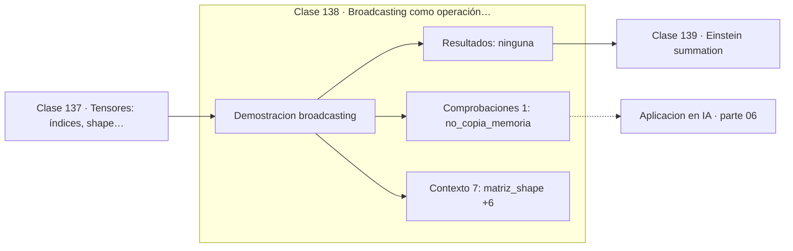

# 138 — Broadcasting como operación tensorial

> [⬅️ 137 Tensores: índices, shape y orden](../137-tensores-indices-shape-y-orden/README.md) · [📚 Parte 06](../README.md) · [🏠 Programa](../../../README.md) · [139 Einstein summation ➡️](../139-einstein-summation/README.md)

**Parte:** 06 — Álgebra lineal II: descomposiciones y tensores · **Nivel:** `intermedio-avanzado` · **Horas estimadas:** 4
**Motor:** `engines.part06` · **Demostración:** `broadcasting` · **Clase 18 de 20** de la parte

---

## 🎯 Propósito

**Broadcasting alinea shapes por la derecha y estira las dimensiones de tamaño 1 sin copiar memoria.**

Cambio de base, autovalores, diagonalización, LU, QR, mínimos cuadrados, SVD, pseudoinversa, PCA y álgebra tensorial.

## ✅ Resultados de aprendizaje

Al terminar podrás:

1. Explicar **Broadcasting como operación tensorial** con lenguaje cotidiano y con notación matemática.
2. Resolver un caso pequeño a mano y anticipar el orden de magnitud del resultado.
3. Ejecutar y modificar `lab.py`, que corre la demostración `broadcasting`.
4. Interpretar las 8 salidas del laboratorio y decir qué comprueba cada una.
5. Detectar el error típico de esta parte: confundir el orden de los índices al reordenar un tensor.

## 🧩 Fórmulas de la clase

```text
las dimensiones se alinean por la derecha
compatibles si son iguales o alguna vale 1
(2,3) + (3,) → (2,3);  (2,3) + (2,1) → (2,3)
```

## 🗺️ Ubicación en el programa



## 📖 Fundamentos

Broadcasting es la regla que permite operar arrays de shapes distintos sin escribir
bucles ni replicar datos. Las dimensiones se alinean por la derecha y se consideran
compatibles si coinciden o si una de ellas vale 1; en ese caso, la de tamaño 1 se
«estira» conceptualmente.

La clave es que el estiramiento **no copia memoria**: la implementación recorre el array
pequeño repetidamente con stride cero. Por eso sumar un vector de sesgos a una matriz de
activaciones es prácticamente gratis, y por eso normalizar por columna no requiere
construir una matriz de medias.

Las reglas son estrictas y su violación produce uno de dos resultados. El bueno: un error
de shape que detiene el programa. El malo: una operación que «funciona» pero no es la
pretendida, típicamente por confundir `(n,)` con `(n,1)`. Un vector `(3,)` sumado a una
matriz `(3,3)` se suma por filas; si se quería por columnas, hay que escribir `(3,1)`
explícitamente.

Ese matiz es la fuente de un error clásico al calcular distancias o normalizaciones. La
defensa es anotar los shapes y usar `None`/`np.newaxis` de forma explícita en lugar de
confiar en que la regla haga lo esperado.

## 🧮 Ejemplo trabajado

Sumar una fila y una columna a la misma matriz.

```text
matriz  shape (2,3):  [[1,2,3],[4,5,6]]

+ fila  shape (3,):   [10,20,30]
  alinea por la derecha: (2,3) y (3,) → (2,3)
  resultado: [[11,22,33],[14,25,36]]      suma por filas

+ columna shape (2,1): [[100],[200]]
  (2,3) y (2,1) → (2,3)
  resultado: [[101,102,103],[204,205,206]]  suma por columnas

Incompatible: (2,3) + (2,) → error
```

## 🔬 Qué ejecuta el laboratorio

`broadcasting` — Broadcasting: reglas de compatibilidad de shapes.

| Grupo | Salidas |
|---|---|
| 🔢 Resultados numéricos (0) | — |
| ✅ Comprobaciones de invariante (1) | `no_copia_memoria` |

Las claves booleanas no son adorno: si alguna fuera `False`, el resultado numérico
no sería fiable aunque el programa terminase sin error.

```bash
python classes/part-06-algebra-lineal-ii-descomposiciones-y-tensores/138-broadcasting-como-operacion-tensorial/lab.py
compmath run 138
```

> [!TIP]
> Antes de ejecutar, **escribe tu predicción**. Un laboratorio que confirma lo que
> esperabas enseña tanto como uno que te contradice, pero solo si la predicción
> existía antes del resultado.

## ⚠️ Errores conceptuales frecuentes

1. Confundir shape (n,) con (n,1) y sumar en el eje equivocado.
2. Suponer que broadcasting copia memoria y evitarlo por rendimiento.
3. No anotar los shapes esperados en operaciones encadenadas.

## 🚀 Dónde se usa de verdad

Suma de sesgos, normalización por eje, cálculo de matrices de distancias, aplicación de
máscaras y prácticamente cualquier operación vectorizada.

## 🤖 Conexión con IA

LoRA factoriza matrices de bajo rango, la atención se define con productos tensoriales y la estabilidad del entrenamiento depende del espectro de los pesos.

## 📓 Notebooks

| Archivo | Para qué |
|---|---|
| [`notebook.ipynb`](notebook.ipynb) | recorrido guiado con la demostración ejecutada |
| [`notebook_student.ipynb`](notebook_student.ipynb) | versión con `TODO` para resolver |
| [`notebook_solution.ipynb`](notebook_solution.ipynb) | solución de referencia verificada |

## 📝 Evaluación

| Criterio | Peso |
|---|---:|
| Comprensión conceptual | 25 % |
| Resolución manual | 25 % |
| Implementación y verificación | 25 % |
| Interpretación y comunicación | 15 % |
| Conexión con aplicación real | 10 % |

Detalle y criterios de error crítico en [`assessment.md`](assessment.md).

## ❓ Preguntas de comprobación

1. ¿Cuál es la entrada, cuál la salida y qué unidades tienen?
2. ¿Qué operación domina el comportamiento del resultado?
3. ¿Qué caso extremo revelaría un error conceptual?
4. ¿Cómo verificarías el resultado por un método independiente?
5. ¿Dónde aparece esto en compresión?

Si necesitas releer el código para responderlas, la clase todavía no está superada.

## 📥 Entregable

`notebook_student.ipynb` resuelto más un párrafo que explique el resultado **sin citar
código**: qué entra, qué sale, qué invariante se comprueba y qué pasaría en un caso límite.

## 📚 Bibliografía de la clase

Esta clase enseña **Computación científica · Álgebra lineal**. Cada obra dice qué aporta aquí y cómo se comprobó su localizador:

- [NumPy: broadcasting](https://numpy.org/doc/stable/user/basics.broadcasting.html) — documentación de la herramienta que ejecuta el laboratorio · URL de la fuente primaria comprobada en NumPy developers (2026-08-19).
- [PyTorch: broadcasting semantics](https://pytorch.org/docs/stable/notes/broadcasting.html) — documentación de la herramienta que ejecuta el laboratorio · URL de la fuente primaria comprobada en PyTorch Foundation (2026-08-19).
- [Harris, C. et al. *Array programming with NumPy*. Nature, 2020](https://doi.org/10.1038/s41586-020-2649-2) — Computación científica: el tema de esta clase · DOI `10.1038/s41586-020-2649-2` verificado en Crossref (2026-08-20).

Bibliografía de todas las clases, con el porqué de cada obra, en [`docs/BIBLIOGRAPHY.md`](../../../docs/BIBLIOGRAPHY.md) · localizador y estado de cada obra en [`sources/bibliography.json`](../../../sources/bibliography.json).

## 📂 Material de la clase

[`intuition.md`](intuition.md) · [`theory.md`](theory.md) · [`derivation.md`](derivation.md) · [`exercises.md`](exercises.md) · [`assessment.md`](assessment.md) · [`where-is-this-used.md`](where-is-this-used.md) · [`lesson.yaml`](lesson.yaml)

---

> [⬅️ 137 Tensores: índices, shape y orden](../137-tensores-indices-shape-y-orden/README.md) · [📚 Parte 06](../README.md) · [🏠 Programa](../../../README.md) · [139 Einstein summation ➡️](../139-einstein-summation/README.md)
