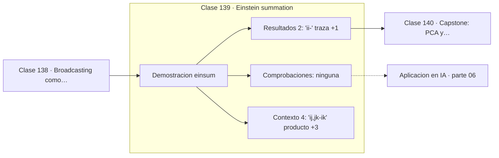

# 139 — Einstein summation

> [⬅️ 138 Broadcasting como operación tensorial](../138-broadcasting-como-operacion-tensorial/README.md) · [📚 Parte 06](../README.md) · [🏠 Programa](../../../README.md) · [140 Capstone: PCA y compresión de imágenes ➡️](../140-capstone-pca-y-compresion-de-imagenes/README.md)

**Parte:** 06 — Álgebra lineal II: descomposiciones y tensores · **Nivel:** `intermedio-avanzado` · **Horas estimadas:** 4
**Motor:** `engines.part06` · **Demostración:** `einsum` · **Clase 19 de 20** de la parte

---

## 🎯 Propósito

**En notación de Einstein los índices repetidos se suman, y una sola expresión cubre producto, traza y contracción.**

Cambio de base, autovalores, diagonalización, LU, QR, mínimos cuadrados, SVD, pseudoinversa, PCA y álgebra tensorial.

## ✅ Resultados de aprendizaje

Al terminar podrás:

1. Explicar **Einstein summation** con lenguaje cotidiano y con notación matemática.
2. Resolver un caso pequeño a mano y anticipar el orden de magnitud del resultado.
3. Ejecutar y modificar `lab.py`, que corre la demostración `einsum`.
4. Interpretar las 6 salidas del laboratorio y decir qué comprueba cada una.
5. Detectar el error típico de esta parte: aplicar pca sin centrar (ni escalar) los datos.

## 🧩 Fórmulas de la clase

```text
'ij,jk->ik'  producto matricial
'ii->'       traza
'ij,ij->'    producto de Frobenius
'ij->ji'     transposición
```

## 🗺️ Ubicación en el programa



## 📖 Fundamentos

La notación de Einstein, introducida en 1916 para simplificar la escritura de la
relatividad general, establece un convenio: los índices que aparecen repetidos se suman.
Con esa única regla, operaciones que en notación matricial requieren nombres distintos se
escriben de forma uniforme.

La implementación moderna, `einsum`, hace explícitos los índices de entrada y de salida.
`'ij,jk->ik'` dice: toma dos tensores con esos índices, suma sobre `j` —repetido— y deja
`i` y `k`. Eso es el producto matricial. Cambiar la cadena a `'ij,ij->'` da el producto
de Frobenius, y a `'ij->ji'`, la transpuesta.

Su ventaja práctica es doble. Primero, **legibilidad**: en operaciones con tensores de
orden 4 o 5 —habituales en atención multi-cabeza— la cadena de índices dice exactamente
qué se contrae con qué, mientras que una secuencia de `transpose`, `reshape` y `matmul`
no lo dice. Segundo, **optimización**: la implementación puede elegir el orden de
contracción más barato, igual que el orden de evaluación de la clase 111.

La atención escalada se escribe en una línea con einsum: `'bqd,bkd->bqk'` calcula todos
los productos punto entre consultas y claves de un lote. Leer esa cadena es leer la
operación.

## 🧮 Ejemplo trabajado

Cinco operaciones con la misma notación.

```text
A = [[1,2],[3,4]]      B = [[5,6],[7,8]]

'ij,jk->ik'  producto     [[19,22],[43,50]]
'ii->'       traza de A   5
'ij,ij->ij'  Hadamard     [[5,12],[21,32]]
'ij,ij->'    Frobenius    70
'ij->ji'     transpuesta  [[1,3],[2,4]]

Una sola notación para todas.
```

## 🔬 Qué ejecuta el laboratorio

`einsum` — Notación de Einstein: índices repetidos se suman.

| Grupo | Salidas |
|---|---|
| 🔢 Resultados numéricos (2) | `'ii->' (traza)`, `'ij,ij->' (Frobenius)` |
| ✅ Comprobaciones de invariante (0) | — |

Las claves booleanas no son adorno: si alguna fuera `False`, el resultado numérico
no sería fiable aunque el programa terminase sin error.

```bash
python classes/part-06-algebra-lineal-ii-descomposiciones-y-tensores/139-einstein-summation/lab.py
compmath run 139
```

> [!TIP]
> Antes de ejecutar, **escribe tu predicción**. Un laboratorio que confirma lo que
> esperabas enseña tanto como uno que te contradice, pero solo si la predicción
> existía antes del resultado.

## ⚠️ Errores conceptuales frecuentes

1. Repetir un índice que no se quiere sumar.
2. Olvidar declarar el orden de los índices de salida y obtener una transposición inesperada.
3. Usar einsum sin comprobar el resultado contra una implementación explícita.

## 🚀 Dónde se usa de verdad

Atención multi-cabeza, contracciones tensoriales, operaciones por lotes y cualquier
manipulación de tensores de orden alto.

## 🤖 Conexión con IA

LoRA factoriza matrices de bajo rango, la atención se define con productos tensoriales y la estabilidad del entrenamiento depende del espectro de los pesos.

## 📓 Notebooks

| Archivo | Para qué |
|---|---|
| [`notebook.ipynb`](notebook.ipynb) | recorrido guiado con la demostración ejecutada |
| [`notebook_student.ipynb`](notebook_student.ipynb) | versión con `TODO` para resolver |
| [`notebook_solution.ipynb`](notebook_solution.ipynb) | solución de referencia verificada |

## 📝 Evaluación

| Criterio | Peso |
|---|---:|
| Comprensión conceptual | 25 % |
| Resolución manual | 25 % |
| Implementación y verificación | 25 % |
| Interpretación y comunicación | 15 % |
| Conexión con aplicación real | 10 % |

Detalle y criterios de error crítico en [`assessment.md`](assessment.md).

## ❓ Preguntas de comprobación

1. ¿Cuál es la entrada, cuál la salida y qué unidades tienen?
2. ¿Qué operación domina el comportamiento del resultado?
3. ¿Qué caso extremo revelaría un error conceptual?
4. ¿Cómo verificarías el resultado por un método independiente?
5. ¿Dónde aparece esto en compresión?

Si necesitas releer el código para responderlas, la clase todavía no está superada.

## 📥 Entregable

`notebook_student.ipynb` resuelto más un párrafo que explique el resultado **sin citar
código**: qué entra, qué sale, qué invariante se comprueba y qué pasaría en un caso límite.

## 🔗 Referencias

- [NumPy: `einsum`](https://numpy.org/doc/stable/reference/generated/numpy.einsum.html) — *uso:* documentación de la herramienta que ejecuta el laboratorio en «Einstein summation».
- [Rocktäschel, T. *Einsum is All You Need*, 2018](https://rockt.ai/2018/04/30/einsum) — *uso:* exposición alternativa del tema en «Einstein summation».

Bibliografía completa de la parte en [`../../../docs/BIBLIOGRAPHY.md`](../../../docs/BIBLIOGRAPHY.md) · localizador verificable de cada obra en [`sources/bibliography.json`](../../../sources/bibliography.json).

## 📂 Material de la clase

[`intuition.md`](intuition.md) · [`theory.md`](theory.md) · [`derivation.md`](derivation.md) · [`exercises.md`](exercises.md) · [`assessment.md`](assessment.md) · [`where-is-this-used.md`](where-is-this-used.md) · [`lesson.yaml`](lesson.yaml)

---

> [⬅️ 138 Broadcasting como operación tensorial](../138-broadcasting-como-operacion-tensorial/README.md) · [📚 Parte 06](../README.md) · [🏠 Programa](../../../README.md) · [140 Capstone: PCA y compresión de imágenes ➡️](../140-capstone-pca-y-compresion-de-imagenes/README.md)
