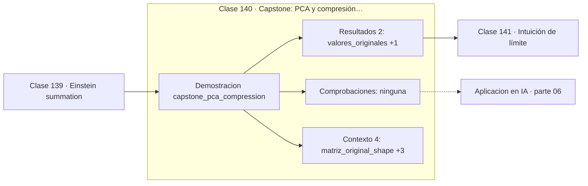

# 140 — Capstone: PCA y compresión de imágenes

> [⬅️ 139 Einstein summation](../139-einstein-summation/README.md) · [📚 Parte 06](../README.md) · [🏠 Programa](../../../README.md) · [141 Intuición de límite ➡️](../../part-07-calculo-diferencial-e-integral/141-intuicion-de-limite/README.md)

**Parte:** 06 — Álgebra lineal II: descomposiciones y tensores · **Nivel:** `intermedio-avanzado` · **Horas estimadas:** 4
**Motor:** `engines.part06` · **Demostración:** `capstone_pca_compression` · **Clase 20 de 20** de la parte

---

## 🎯 Propósito

**Comprimir con SVD es elegir cuántos valores singulares conservar y declarar el error que eso implica.**

Cambio de base, autovalores, diagonalización, LU, QR, mínimos cuadrados, SVD, pseudoinversa, PCA y álgebra tensorial.

## ✅ Resultados de aprendizaje

Al terminar podrás:

1. Explicar **Capstone: PCA y compresión de imágenes** con lenguaje cotidiano y con notación matemática.
2. Resolver un caso pequeño a mano y anticipar el orden de magnitud del resultado.
3. Ejecutar y modificar `lab.py`, que corre la demostración `capstone_pca_compression`.
4. Interpretar las 6 salidas del laboratorio y decir qué comprueba cada una.
5. Detectar el error típico de esta parte: interpretar autovalores complejos como error de cálculo.

## 🧩 Fórmulas de la clase

```text
almacenamiento de rango k: k(m + n + 1) frente a mn
error = √(Σᵢ₌ₖ₊₁ σᵢ²)
```

## 🗺️ Ubicación en el programa



## 📖 Fundamentos

El capstone aplica la truncación SVD a una matriz y mide, para cada rango, tres
cantidades: cuántos números hay que guardar, qué error se comete y qué fracción de la
energía se retiene. Ese informe es la forma honesta de presentar una compresión: no
«comprime bien», sino «con rango 2 el error de Frobenius es X y se retiene el Y % de la
energía».

La matriz del ejemplo está construida para que dos de sus filas sean múltiplos de un
mismo patrón, así que su **rango efectivo** es muy bajo y el primer valor singular
concentra casi toda la energía. Eso es lo que ocurre en datos reales: las imágenes
naturales, las matrices de valoraciones y las activaciones de una red tienen espectros
que decaen rápido.

El ahorro se calcula sin ambigüedad. Guardar `Aₖ` requiere las k columnas de `U`, los k
valores singulares y las k columnas de `V`: `k(m + n + 1)` números frente a `mn`. La
compresión es rentable cuando `k` es pequeño frente a `mn/(m+n)`.

La conexión con LoRA cierra la parte: en lugar de ajustar una matriz de pesos `W` de
millones de parámetros, se le suma un producto `BA` de rango muy bajo. La justificación
teórica es exactamente Eckart-Young: si la actualización necesaria tiene rango
intrínsecamente bajo, una aproximación de rango bajo la captura casi por completo.

## 🧮 Ejemplo trabajado

Informe de compresión de una matriz 4×4.

```text
valores singulares: 96.28, 1.87, 0.0004, 0.0000

rango  valores guardados  error Frobenius  energía retenida
  1           9              1.8734            99.98 %
  2          18              0.0004           100.00 %
  3          27              0.0000           100.00 %
  4          36              0.0000           100.00 %

matriz original: 16 valores
rango efectivo (σ > 1e−8): 3

Con rango 1 se guardan 9 números en lugar de 16
y se conserva el 99.98 % de la energía.
```

## 🔬 Qué ejecuta el laboratorio

`capstone_pca_compression` — Capstone: comprimir una matriz con SVD y medir la pérdida.

| Grupo | Salidas |
|---|---|
| 🔢 Resultados numéricos (2) | `valores_originales`, `rango_efectivo` |
| ✅ Comprobaciones de invariante (0) | — |

Las claves booleanas no son adorno: si alguna fuera `False`, el resultado numérico
no sería fiable aunque el programa terminase sin error.

```bash
python classes/part-06-algebra-lineal-ii-descomposiciones-y-tensores/140-capstone-pca-y-compresion-de-imagenes/lab.py
compmath run 140
```

> [!TIP]
> Antes de ejecutar, **escribe tu predicción**. Un laboratorio que confirma lo que
> esperabas enseña tanto como uno que te contradice, pero solo si la predicción
> existía antes del resultado.

## ⚠️ Errores conceptuales frecuentes

1. Reportar una compresión sin declarar el error cometido.
2. Elegir k por el número de componentes en lugar de por la energía retenida.
3. Suponer que un espectro que decae rápido garantiza que la aproximación sirve para la tarea concreta.

## 🚀 Dónde se usa de verdad

Compresión de imágenes y modelos, reducción de dimensionalidad, eliminación de ruido,
recomendación por factorización y LoRA.

## 🤖 Conexión con IA

LoRA factoriza matrices de bajo rango, la atención se define con productos tensoriales y la estabilidad del entrenamiento depende del espectro de los pesos.

## 📓 Notebooks

| Archivo | Para qué |
|---|---|
| [`notebook.ipynb`](notebook.ipynb) | recorrido guiado con la demostración ejecutada |
| [`notebook_student.ipynb`](notebook_student.ipynb) | versión con `TODO` para resolver |
| [`notebook_solution.ipynb`](notebook_solution.ipynb) | solución de referencia verificada |

## 📝 Evaluación

| Criterio | Peso |
|---|---:|
| Comprensión conceptual | 25 % |
| Resolución manual | 25 % |
| Implementación y verificación | 25 % |
| Interpretación y comunicación | 15 % |
| Conexión con aplicación real | 10 % |

Detalle y criterios de error crítico en [`assessment.md`](assessment.md).

## ❓ Preguntas de comprobación

1. ¿Cuál es la entrada, cuál la salida y qué unidades tienen?
2. ¿Qué operación domina el comportamiento del resultado?
3. ¿Qué caso extremo revelaría un error conceptual?
4. ¿Cómo verificarías el resultado por un método independiente?
5. ¿Dónde aparece esto en compresión?

Si necesitas releer el código para responderlas, la clase todavía no está superada.

## 📥 Entregable

`notebook_student.ipynb` resuelto más un párrafo que explique el resultado **sin citar
código**: qué entra, qué sale, qué invariante se comprueba y qué pasaría en un caso límite.

## 📚 Bibliografía de la clase

Esta clase enseña **Álgebra lineal · Álgebra lineal numérica**. Cada obra dice qué aporta aquí y cómo se comprobó su localizador:

- [Eckart, C.; Young, G. *The approximation of one matrix by another of lower rank*. Psychometrika, 1936](https://link.springer.com/article/10.1007/BF02288367) — Álgebra lineal y Álgebra lineal numérica: el tema de esta clase · DOI `10.1007/bf02288367` verificado en Crossref (2026-08-19).
- [Halko, Martinsson & Tropp. *Finding Structure with Randomness*. SIAM Review, 2011](https://epubs.siam.org/doi/10.1137/090771806) — Álgebra lineal numérica: el tema de esta clase · DOI `10.1137/090771806` verificado en Crossref (2026-08-19).

Bibliografía de todas las clases, con el porqué de cada obra, en [`docs/BIBLIOGRAPHY.md`](../../../docs/BIBLIOGRAPHY.md) · localizador y estado de cada obra en [`sources/bibliography.json`](../../../sources/bibliography.json).

## 📂 Material de la clase

[`intuition.md`](intuition.md) · [`theory.md`](theory.md) · [`derivation.md`](derivation.md) · [`exercises.md`](exercises.md) · [`assessment.md`](assessment.md) · [`where-is-this-used.md`](where-is-this-used.md) · [`lesson.yaml`](lesson.yaml)

---

> [⬅️ 139 Einstein summation](../139-einstein-summation/README.md) · [📚 Parte 06](../README.md) · [🏠 Programa](../../../README.md) · [141 Intuición de límite ➡️](../../part-07-calculo-diferencial-e-integral/141-intuicion-de-limite/README.md)
