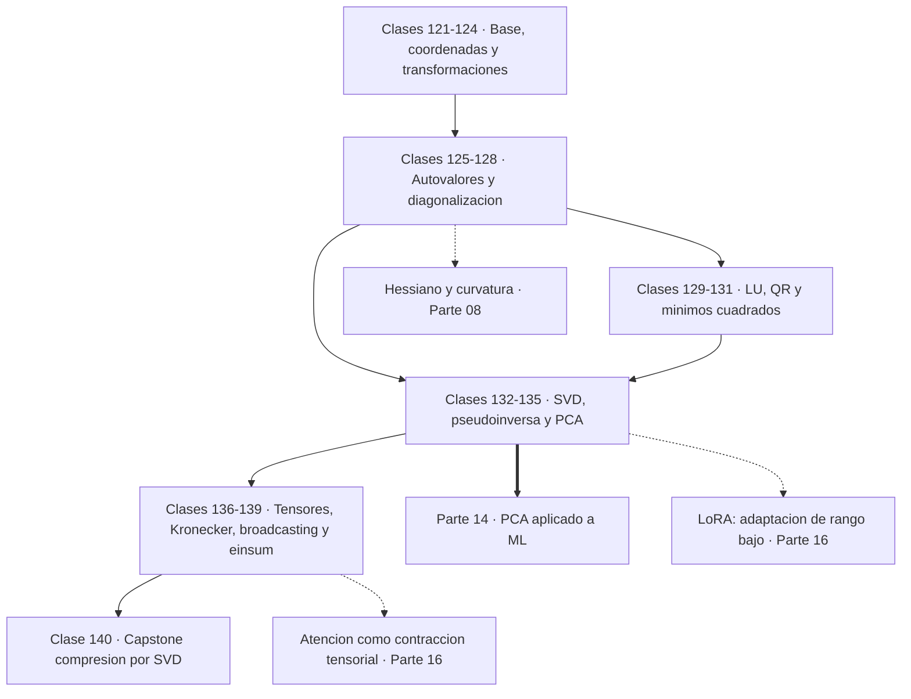

# 🔷 Parte 06 — Álgebra lineal II: descomposiciones y tensores

> [⬅️ Parte 05 — Álgebra lineal I: vectores y matrices](../part-05-algebra-lineal-i-vectores-y-matrices/README.md) · [🏠 Programa](../../README.md) · [📇 Catálogo](../README.md) · [Parte 07 — Cálculo diferencial e integral ➡️](../part-07-calculo-diferencial-e-integral/README.md)

**Nivel:** `intermedio-avanzado` · **Clases:** 20 · **Horas estimadas:** 80 · **Motor:** [`part06.py`](../../src/computational_math/engines/part06.py)

---

## 🎯 De qué trata esta parte

Cambio de base, autovalores, diagonalización, LU, QR, mínimos cuadrados, SVD, pseudoinversa, PCA y álgebra tensorial.

Si la parte 05 enseñó qué es una matriz, esta enseña a **desarmarla**. Una descomposición
escribe una matriz como producto de matrices más simples, y esa reescritura convierte
problemas difíciles en fáciles: resolver muchos sistemas, calcular potencias, comprimir
datos, encontrar direcciones principales o diagnosticar mal condicionamiento.

Las clases 121 a 124 preparan el terreno con el concepto que más cuesta y más rinde: **la
base es una elección**. Un vector no cambia al cambiar de base; lo que cambia es su lista
de coordenadas. La matriz `A' = P⁻¹AP` representa la misma transformación vista desde otra
base, y toda la teoría de autovalores consiste en buscar la base donde la transformación se
ve lo más simple posible.

Las clases 125 a 128 son autovalores y diagonalización. Un autovector es una dirección que
la transformación solo escala, y en esa base la matriz se convierte en diagonal: aplicarla
cien veces cuesta elevar números a la centésima, no multiplicar cien matrices. Las matrices
simétricas —que incluyen toda covarianza y todo Hessiano— son siempre diagonalizables con
base ortonormal, resultado conocido como teorema espectral.

Las clases 129 a 134 son las descomposiciones de trabajo: LU para resolver muchos sistemas,
QR para mínimos cuadrados estables, y **SVD**, que es la más general y la más útil. La SVD
existe para toda matriz, incluso rectangular y singular, y de ella se leen el rango, el
número de condición, la mejor aproximación de rango bajo y la pseudoinversa. Si hubiera que
quedarse con un solo resultado de álgebra lineal aplicada, sería la SVD.

El teorema de Eckart-Young, que la clase 133 comprueba numéricamente, dice algo muy fuerte:
truncar la SVD da la **mejor** aproximación posible de rango k, no una buena. Ese resultado
es el que fundamenta PCA, la compresión de imágenes, los sistemas de recomendación por
factorización y LoRA.

El cierre (135 a 139) conecta con la práctica moderna: PCA como SVD de datos centrados,
producto de Kronecker, tensores, broadcasting y notación de Einstein. Broadcasting y einsum
no son algoritmos nuevos: son **notación** para expresar operaciones tensoriales sin bucles,
y saber leerlos es requisito para leer código de deep learning.

## 🗺️ Mapa conceptual



## 🧠 Ideas centrales

- Diagonalizar es elegir la base donde la transformación solo escala.
- La SVD existe para toda matriz, incluso no cuadrada y singular.
- PCA es la SVD de los datos centrados: no hay magia estadística adicional.
- El número de condición es el cociente entre el mayor y el menor valor singular.
- Broadcasting y einsum son notación, no algoritmos nuevos.

## 🤖 Por qué importa en IA

> [!IMPORTANT]
> LoRA factoriza matrices de bajo rango, la atención se define con productos tensoriales y la estabilidad del entrenamiento depende del espectro de los pesos.

## ⚠️ Errores frecuentes de esta parte

- Aplicar PCA sin centrar (ni escalar) los datos.
- Interpretar autovalores complejos como error de cálculo.
- Confundir el orden de los índices al reordenar un tensor.

## 🧭 Secuencia de la parte

```mermaid
flowchart LR
    subgraph B1["Bloque 1"]
        direction TB
        L121["121 · Bases y coordenadas"]
        L122["122 · Cambio de base"]
        L123["123 · Transformaciones lineales"]
        L124["124 · Núcleo e imagen"]
        L125["125 · Autovalores y autovectores"]
        L121 --> L122
        L122 --> L123
        L123 --> L124
        L124 --> L125
    end
    subgraph B2["Bloque 2"]
        direction TB
        L126["126 · Diagonalización"]
        L127["127 · Matrices positivas definidas"]
        L128["128 · Formas cuadráticas"]
        L129["129 · Descomposición LU"]
        L130["130 · Descomposición QR"]
        L126 --> L127
        L127 --> L128
        L128 --> L129
        L129 --> L130
    end
    subgraph B3["Bloque 3"]
        direction TB
        L131["131 · Mínimos cuadrados lineales"]
        L132["132 · SVD desde la intuición"]
        L133["133 · SVD y compresión"]
        L134["134 · Pseudoinversa de Moore-Penrose"]
        L135["135 · PCA desde álgebra lineal"]
        L131 --> L132
        L132 --> L133
        L133 --> L134
        L134 --> L135
    end
    subgraph B4["Bloque 4"]
        direction TB
        L136["136 · Producto de Kronecker"]
        L137["137 · Tensores: índices, shape y…"]
        L138["138 · Broadcasting como operación…"]
        L139["139 · Einstein summation"]
        L140["140 · Capstone: PCA y compresión…"]
        L136 --> L137
        L137 --> L138
        L138 --> L139
        L139 --> L140
    end
    L125 --> L126
    L130 --> L131
    L135 --> L136
```



## 📚 Las clases

| # | Clase | Demostración | Idea central |
|---|---|---|---|
| `121` | [Bases y coordenadas](121-bases-y-coordenadas/README.md) | `bases_coordinates` | Las coordenadas de un vector dependen de la base; el vector no. |
| `122` | [Cambio de base](122-cambio-de-base/README.md) | `change_of_basis` | A y P⁻¹AP representan la misma transformación en bases distintas y comparten sus invariantes. |
| `123` | [Transformaciones lineales](123-transformaciones-lineales/README.md) | `linear_transformations` | Una transformación es lineal si preserva sumas y escalados; sus columnas son las imágenes de la base. |
| `124` | [Núcleo e imagen](124-nucleo-e-imagen/README.md) | `kernel_image` | Lo que no llega a la imagen se pierde en el núcleo: rango más nulidad es el número de columnas. |
| `125` | [Autovalores y autovectores](125-autovalores-y-autovectores/README.md) | `eigen` | Un autovector es una dirección que la transformación solo escala; su factor es el autovalor. |
| `126` | [Diagonalización](126-diagonalizacion/README.md) | `diagonalization` | Diagonalizar es elegir la base donde la transformación solo escala, y ahí las potencias son triviales. |
| `127` | [Matrices positivas definidas](127-matrices-positivas-definidas/README.md) | `positive_definite` | Definida positiva significa todos los autovalores positivos, y equivale a que xᵀAx sea siempre positivo. |
| `128` | [Formas cuadráticas](128-formas-cuadraticas/README.md) | `quadratic_forms` | Una forma cuadrática tiene curvas de nivel elípticas cuando su matriz es definida positiva, y los ejes son los autovectores. |
| `129` | [Descomposición LU](129-descomposicion-lu/README.md) | `lu_decomposition` | LU factoriza una vez y resuelve muchos sistemas: O(n³) una sola vez, O(n²) por cada b. |
| `130` | [Descomposición QR](130-descomposicion-qr/README.md) | `qr_decomposition` | QR produce una base ortonormal del espacio columna y es la vía estable para mínimos cuadrados. |
| `131` | [Mínimos cuadrados lineales](131-minimos-cuadrados-lineales/README.md) | `least_squares` | Mínimos cuadrados es la proyección de b sobre el espacio columna, y su residuo es ortogonal a él. |
| `132` | [SVD desde la intuición](132-svd-desde-la-intuicion/README.md) | `svd_intuition` | La SVD existe para toda matriz y de ella se leen rango, condición y estructura. |
| `133` | [SVD y compresión](133-svd-y-compresion/README.md) | `svd_compression` | Truncar la SVD da la mejor aproximación de rango k que existe, no una buena. |
| `134` | [Pseudoinversa de Moore-Penrose](134-pseudoinversa-de-moore-penrose/README.md) | `pseudoinverse` | La pseudoinversa generaliza la inversa y da la solución de mínima norma. |
| `135` | [PCA desde álgebra lineal](135-pca-desde-algebra-lineal/README.md) | `pca` | PCA es la autodescomposición de la covarianza, y equivale a la SVD de los datos centrados. |
| `136` | [Producto de Kronecker](136-producto-de-kronecker/README.md) | `kronecker` | El producto de Kronecker construye matrices en bloques cuyo rango es el producto de los rangos. |
| `137` | [Tensores: índices, shape y orden](137-tensores-indices-shape-y-orden/README.md) | `tensors` | El orden de un tensor es su número de índices; el shape y el orden de aplanado determinan cómo se recorre. |
| `138` | [Broadcasting como operación tensorial](138-broadcasting-como-operacion-tensorial/README.md) | `broadcasting` | Broadcasting alinea shapes por la derecha y estira las dimensiones de tamaño 1 sin copiar memoria. |
| `139` | [Einstein summation](139-einstein-summation/README.md) | `einsum` | En notación de Einstein los índices repetidos se suman, y una sola expresión cubre producto, traza y contracción. |
| `140` | [Capstone: PCA y compresión de imágenes](140-capstone-pca-y-compresion-de-imagenes/README.md) | `capstone_pca_compression` | Comprimir con SVD es elegir cuántos valores singulares conservar y declarar el error que eso implica. |

## 📖 Glosario de la parte (20 términos)

Definiciones precisas en [`GLOSARIO.md`](GLOSARIO.md).

## 🧰 Stack de referencia

`math`, `numpy (opcional)`

Los laboratorios se ejecutan con biblioteca estándar; estas herramientas aparecen
como contraste profesional, no como requisito.

## 🧪 Ejecutar toda la parte

```bash
compmath run --part 06
compmath catalog --part 06
```

## 📊 Evaluación de la parte

| Componente | Peso |
|---|---:|
| Clases y ejercicios | 40 % |
| Laboratorios y notebooks | 25 % |
| Explicación oral o escrita | 15 % |
| Capstone ([140](140-capstone-pca-y-compresion-de-imagenes/README.md)) | 20 % |

## 📖 Bibliografía

- Golub, G.; Van Loan, C. *Matrix Computations*. 4ª ed., Johns Hopkins, 2013.
- Trefethen, L. N.; Bau, D. *Numerical Linear Algebra*. SIAM, 1997.
- Kolda, T.; Bader, B. *Tensor Decompositions and Applications*. SIAM Review, 2009.

---

> [⬅️ Parte 05 — Álgebra lineal I: vectores y matrices](../part-05-algebra-lineal-i-vectores-y-matrices/README.md) · [🏠 Programa](../../README.md) · [📇 Catálogo](../README.md) · [Parte 07 — Cálculo diferencial e integral ➡️](../part-07-calculo-diferencial-e-integral/README.md)
