# 🔷 Parte 06 — Álgebra lineal II: descomposiciones y tensores

> [⬅️ Parte 05 — Álgebra lineal I: vectores y matrices](../part-05-algebra-lineal-i-vectores-y-matrices/README.md) · [🏠 Programa](../../README.md) · [📇 Catálogo](../README.md) · [Parte 07 — Cálculo diferencial e integral ➡️](../part-07-calculo-diferencial-e-integral/README.md)

**Nivel:** `intermedio-avanzado` · **Clases:** 20 · **Horas estimadas:** 80 · **Motor:** [`part06.py`](../../src/computational_math/engines/part06.py)

---

## 🎯 De qué trata esta parte

Cambio de base, autovalores, diagonalización, LU, QR, mínimos cuadrados, SVD, pseudoinversa, PCA y álgebra tensorial.

## 🧠 Ideas centrales

- Diagonalizar es elegir la base donde la transformación solo escala.
- La SVD existe para toda matriz, incluso no cuadrada y singular.
- PCA es la SVD de los datos centrados: no hay magia estadística adicional.
- El número de condición es el cociente entre el mayor y el menor valor singular.
- Broadcasting y einsum son notación, no algoritmos nuevos.

## 🤖 Por qué importa en IA

> [!IMPORTANT]
> LoRA factoriza matrices de bajo rango, la atención se define con productos tensoriales y la estabilidad del entrenamiento depende del espectro de los pesos.

## ⚠️ Errores frecuentes de esta parte

- Aplicar PCA sin centrar (ni escalar) los datos.
- Interpretar autovalores complejos como error de cálculo.
- Confundir el orden de los índices al reordenar un tensor.

## 🧭 Secuencia de la parte

```mermaid
flowchart LR
    subgraph B1["Bloque 1"]
        direction TB
        L121["121<br/>Bases y coordenadas"]
        L122["122<br/>Cambio de base"]
        L123["123<br/>Transformaciones<br/>lineales"]
        L124["124<br/>Núcleo e imagen"]
        L125["125<br/>Autovalores y<br/>autovectores"]
        L121 --> L122
        L122 --> L123
        L123 --> L124
        L124 --> L125
    end
    subgraph B2["Bloque 2"]
        direction TB
        L126["126<br/>Diagonalización"]
        L127["127<br/>Matrices positivas<br/>definidas"]
        L128["128<br/>Formas cuadráticas"]
        L129["129<br/>Descomposición LU"]
        L130["130<br/>Descomposición QR"]
        L126 --> L127
        L127 --> L128
        L128 --> L129
        L129 --> L130
    end
    subgraph B3["Bloque 3"]
        direction TB
        L131["131<br/>Mínimos cuadrados<br/>lineales"]
        L132["132<br/>SVD desde la intuición"]
        L133["133<br/>SVD y compresión"]
        L134["134<br/>Pseudoinversa de<br/>Moore-Penrose"]
        L135["135<br/>PCA desde álgebra lineal"]
        L131 --> L132
        L132 --> L133
        L133 --> L134
        L134 --> L135
    end
    subgraph B4["Bloque 4"]
        direction TB
        L136["136<br/>Producto de Kronecker"]
        L137["137<br/>Tensores: índices, shape<br/>y orden"]
        L138["138<br/>Broadcasting como<br/>operación tensorial"]
        L139["139<br/>Einstein summation"]
        L140["140<br/>Capstone: PCA y<br/>compresión de imágenes"]
        L136 --> L137
        L137 --> L138
        L138 --> L139
        L139 --> L140
    end
    L125 --> L126
    L130 --> L131
    L135 --> L136
```



## 📚 Las clases

| # | Clase | Demostración | Idea central |
|---|---|---|---|
| `121` | [Bases y coordenadas](121-bases-y-coordenadas/README.md) | `bases_coordinates` | Las coordenadas dependen de la base elegida. |
| `122` | [Cambio de base](122-cambio-de-base/README.md) | `change_of_basis` | Matriz de cambio de base y su inversa. |
| `123` | [Transformaciones lineales](123-transformaciones-lineales/README.md) | `linear_transformations` | Una transformación lineal preserva sumas y escalados. |
| `124` | [Núcleo e imagen](124-nucleo-e-imagen/README.md) | `kernel_image` | Núcleo, imagen y teorema del rango-nulidad. |
| `125` | [Autovalores y autovectores](125-autovalores-y-autovectores/README.md) | `eigen` | Autovalores: direcciones que la transformación solo escala. |
| `126` | [Diagonalización](126-diagonalizacion/README.md) | `diagonalization` | A = PDP⁻¹: la base donde la transformación solo escala. |
| `127` | [Matrices positivas definidas](127-matrices-positivas-definidas/README.md) | `positive_definite` | Definida positiva: todos los autovalores positivos, xᵀAx > 0. |
| `128` | [Formas cuadráticas](128-formas-cuadraticas/README.md) | `quadratic_forms` | La forma cuadrática xᵀAx y sus curvas de nivel. |
| `129` | [Descomposición LU](129-descomposicion-lu/README.md) | `lu_decomposition` | LU: factorizar una vez, resolver muchos sistemas. |
| `130` | [Descomposición QR](130-descomposicion-qr/README.md) | `qr_decomposition` | QR por Gram-Schmidt: base ortonormal del espacio columna. |
| `131` | [Mínimos cuadrados lineales](131-minimos-cuadrados-lineales/README.md) | `least_squares` | Mínimos cuadrados por ecuaciones normales. |
| `132` | [SVD desde la intuición](132-svd-desde-la-intuicion/README.md) | `svd_intuition` | SVD: rotar, escalar, rotar. Existe siempre. |
| `133` | [SVD y compresión](133-svd-y-compresion/README.md) | `svd_compression` | Aproximación de rango 1 y energía retenida. |
| `134` | [Pseudoinversa de Moore-Penrose](134-pseudoinversa-de-moore-penrose/README.md) | `pseudoinverse` | Pseudoinversa de Moore-Penrose para sistemas sobredeterminados. |
| `135` | [PCA desde álgebra lineal](135-pca-desde-algebra-lineal/README.md) | `pca` | PCA como autodescomposición de la covarianza. |
| `136` | [Producto de Kronecker](136-producto-de-kronecker/README.md) | `kronecker` | Producto de Kronecker: estructura en bloques. |
| `137` | [Tensores: índices, shape y orden](137-tensores-indices-shape-y-orden/README.md) | `tensors` | Orden, shape y reordenamiento de índices. |
| `138` | [Broadcasting como operación tensorial](138-broadcasting-como-operacion-tensorial/README.md) | `broadcasting` | Broadcasting: reglas de compatibilidad de shapes. |
| `139` | [Einstein summation](139-einstein-summation/README.md) | `einsum` | Notación de Einstein: índices repetidos se suman. |
| `140` | [Capstone: PCA y compresión de imágenes](140-capstone-pca-y-compresion-de-imagenes/README.md) | `capstone_pca_compression` | Capstone: comprimir una matriz con SVD y medir la pérdida. |

## 🧰 Stack de referencia

`math`, `numpy (opcional)`

Los laboratorios se ejecutan con biblioteca estándar; estas herramientas aparecen
como contraste profesional, no como requisito.

## 🧪 Ejecutar toda la parte

```bash
compmath run --part 06
compmath catalog --part 06
```

## 📊 Evaluación de la parte

| Componente | Peso |
|---|---:|
| Clases y ejercicios | 40 % |
| Laboratorios y notebooks | 25 % |
| Explicación oral o escrita | 15 % |
| Capstone ([140](140-capstone-pca-y-compresion-de-imagenes/README.md)) | 20 % |

## 📖 Bibliografía

- Golub, G.; Van Loan, C. *Matrix Computations*. 4ª ed., Johns Hopkins, 2013.
- Trefethen, L. N.; Bau, D. *Numerical Linear Algebra*. SIAM, 1997.
- Kolda, T.; Bader, B. *Tensor Decompositions and Applications*. SIAM Review, 2009.

---

> [⬅️ Parte 05 — Álgebra lineal I: vectores y matrices](../part-05-algebra-lineal-i-vectores-y-matrices/README.md) · [🏠 Programa](../../README.md) · [📇 Catálogo](../README.md) · [Parte 07 — Cálculo diferencial e integral ➡️](../part-07-calculo-diferencial-e-integral/README.md)
