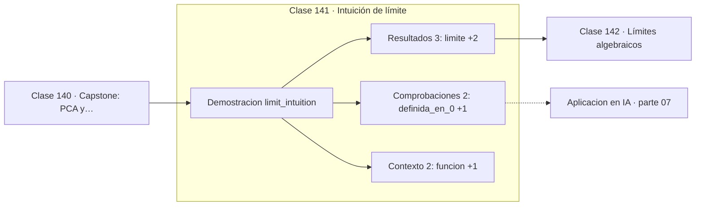

# 141 — Intuición de límite

> [⬅️ 140 Capstone: PCA y compresión de imágenes](../../part-06-algebra-lineal-ii-descomposiciones-y-tensores/140-capstone-pca-y-compresion-de-imagenes/README.md) · [📚 Parte 07](../README.md) · [🏠 Programa](../../../README.md) · [142 Límites algebraicos ➡️](../142-limites-algebraicos/README.md)

**Parte:** 07 — Cálculo diferencial e integral · **Nivel:** `universitario` · **Horas estimadas:** 4
**Motor:** `engines.part07` · **Demostración:** `limit_intuition` · **Clase 1 de 20** de la parte

---

## 🎯 Propósito

**Una función puede no estar definida en un punto y tener límite perfectamente definido en él.**

Límite, continuidad, derivada, reglas de derivación, Taylor, optimización de una variable, integral definida y teorema fundamental del cálculo.

## ✅ Resultados de aprendizaje

Al terminar podrás:

1. Explicar **Intuición de límite** con lenguaje cotidiano y con notación matemática.
2. Resolver un caso pequeño a mano y anticipar el orden de magnitud del resultado.
3. Ejecutar y modificar `lab.py`, que corre la demostración `limit_intuition`.
4. Interpretar las 7 salidas del laboratorio y decir qué comprueba cada una.
5. Detectar el error típico de esta parte: usar diferencias finitas con h demasiado pequeño y amplificar el error de redondeo.

## 🧩 Fórmulas de la clase

```text
lím(x→0) sin(x)/x = 1
el límite existe si los laterales coinciden
```

## 🗺️ Ubicación en el programa



## 📖 Fundamentos

El límite responde a una pregunta que la evaluación directa no puede: ¿a qué valor se
acerca `f(x)` cuando `x` se acerca a `a`, **sin llegar nunca**? Esa exclusión del punto
es la clave: el límite no depende de `f(a)`, y por eso existe aunque la función no esté
definida allí.

`sin(x)/x` en cero es el ejemplo canónico. Sustituir da `0/0`, que no es un número. Pero
al acercarse, los valores tienden inequívocamente a 1, y ese límite es el que hace que
la derivada del seno sea el coseno. Toda la trigonometría del cálculo descansa en él.

La definición formal —para todo ε existe un δ— tiene el orden de cuantificadores de la
clase 083 y no es un capricho: δ puede depender de ε, y en la mayoría de los casos
depende. Cambiar el orden daría la definición de continuidad uniforme, una condición
estrictamente más fuerte.

Para que el límite exista, los **límites laterales** deben coincidir. Una función con un
salto tiene ambos laterales pero distintos, y por tanto no tiene límite en ese punto.
Comprobar los dos lados numéricamente, como hace el laboratorio, es la forma práctica de
detectar discontinuidades.

## 🧮 Ejemplo trabajado

Acercarse a cero por ambos lados.

```text
f(x) = sin(x)/x       (no definida en x = 0)

x        f(x)
1.0      0.841471
0.1      0.998334
0.01     0.999983
0.001    0.99999983
1e−6     0.9999999999998

límite = 1
error en 1e−6: 1.67e−13

Por la izquierda: f(−1e−6) = 0.9999999999998
Los laterales coinciden → el límite existe    ✓
```

## 🔬 Qué ejecuta el laboratorio

`limit_intuition` — sin(x)/x cuando x→0: indeterminado en el punto, definido en el límite.

| Grupo | Salidas |
|---|---|
| 🔢 Resultados numéricos (3) | `limite`, `error_en_1e-6`, `por_la_izquierda` |
| ✅ Comprobaciones de invariante (2) | `definida_en_0`, `limites_laterales_coinciden` |

Las claves booleanas no son adorno: si alguna fuera `False`, el resultado numérico
no sería fiable aunque el programa terminase sin error.

```bash
python classes/part-07-calculo-diferencial-e-integral/141-intuicion-de-limite/lab.py
compmath run 141
```

> [!TIP]
> Antes de ejecutar, **escribe tu predicción**. Un laboratorio que confirma lo que
> esperabas enseña tanto como uno que te contradice, pero solo si la predicción
> existía antes del resultado.

## ⚠️ Errores conceptuales frecuentes

1. Concluir que no hay límite porque la función no está definida en el punto.
2. Comprobar el límite por un solo lado.
3. Usar valores de x demasiado pequeños y confundir el límite con el error de redondeo.

## 🚀 Dónde se usa de verdad

Definición de derivada e integral, análisis de convergencia de sucesiones y series,
comportamiento asintótico de algoritmos y estabilidad de métodos numéricos.

## 🤖 Conexión con IA

Sin regla de la cadena no hay entrenamiento por gradiente; sin Taylor no hay métodos de segundo orden ni análisis de convergencia.

## 📓 Notebooks

| Archivo | Para qué |
|---|---|
| [`notebook.ipynb`](notebook.ipynb) | recorrido guiado con la demostración ejecutada |
| [`notebook_student.ipynb`](notebook_student.ipynb) | versión con `TODO` para resolver |
| [`notebook_solution.ipynb`](notebook_solution.ipynb) | solución de referencia verificada |

## 📝 Evaluación

| Criterio | Peso |
|---|---:|
| Comprensión conceptual | 25 % |
| Resolución manual | 25 % |
| Implementación y verificación | 25 % |
| Interpretación y comunicación | 15 % |
| Conexión con aplicación real | 10 % |

Detalle y criterios de error crítico en [`assessment.md`](assessment.md).

## ❓ Preguntas de comprobación

1. ¿Cuál es la entrada, cuál la salida y qué unidades tienen?
2. ¿Qué operación domina el comportamiento del resultado?
3. ¿Qué caso extremo revelaría un error conceptual?
4. ¿Cómo verificarías el resultado por un método independiente?
5. ¿Dónde aparece esto en física?

Si necesitas releer el código para responderlas, la clase todavía no está superada.

## 📥 Entregable

`notebook_student.ipynb` resuelto más un párrafo que explique el resultado **sin citar
código**: qué entra, qué sale, qué invariante se comprueba y qué pasaría en un caso límite.

## 📚 Bibliografía de la clase

Esta clase enseña **Cálculo · Análisis matemático**. Cada obra dice qué aporta aquí y cómo se comprobó su localizador:

- [Spivak, M. *Calculus*, 4ª ed., Publish or Perish, 2008, cap. 5](https://www.mathpop.com/calculus) — Análisis matemático y Cálculo: el tema de esta clase · ISBN-13 `9780914098911` verificado en International ISBN Agency (2026-08-19).
- [Apostol, T. *Calculus*, vol. 1, 2ª ed., Wiley, 1967](https://www.wiley.com/en-us/Calculus%2C+Volume+1%2C+2nd+Edition-p-9780471000051) — Análisis matemático y Cálculo: el tema de esta clase · ISBN-13 `9780471000051` verificado en International ISBN Agency (2026-08-19).

Bibliografía de todas las clases, con el porqué de cada obra, en [`docs/BIBLIOGRAPHY.md`](../../../docs/BIBLIOGRAPHY.md) · localizador y estado de cada obra en [`sources/bibliography.json`](../../../sources/bibliography.json).

## 📂 Material de la clase

[`intuition.md`](intuition.md) · [`theory.md`](theory.md) · [`derivation.md`](derivation.md) · [`exercises.md`](exercises.md) · [`assessment.md`](assessment.md) · [`where-is-this-used.md`](where-is-this-used.md) · [`lesson.yaml`](lesson.yaml)

---

> [⬅️ 140 Capstone: PCA y compresión de imágenes](../../part-06-algebra-lineal-ii-descomposiciones-y-tensores/140-capstone-pca-y-compresion-de-imagenes/README.md) · [📚 Parte 07](../README.md) · [🏠 Programa](../../../README.md) · [142 Límites algebraicos ➡️](../142-limites-algebraicos/README.md)
