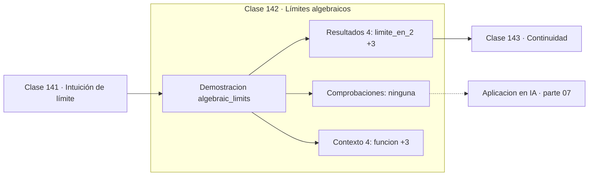

# 142 — Límites algebraicos

> [⬅️ 141 Intuición de límite](../141-intuicion-de-limite/README.md) · [📚 Parte 07](../README.md) · [🏠 Programa](../../../README.md) · [143 Continuidad ➡️](../143-continuidad/README.md)

**Parte:** 07 — Cálculo diferencial e integral · **Nivel:** `universitario` · **Horas estimadas:** 4
**Motor:** `engines.part07` · **Demostración:** `algebraic_limits` · **Clase 2 de 20** de la parte

---

## 🎯 Propósito

**Una indeterminación es una propiedad de la expresión, no del límite: casi siempre se resuelve reescribiéndola.**

Límite, continuidad, derivada, reglas de derivación, Taylor, optimización de una variable, integral definida y teorema fundamental del cálculo.

## ✅ Resultados de aprendizaje

Al terminar podrás:

1. Explicar **Límites algebraicos** con lenguaje cotidiano y con notación matemática.
2. Resolver un caso pequeño a mano y anticipar el orden de magnitud del resultado.
3. Ejecutar y modificar `lab.py`, que corre la demostración `algebraic_limits`.
4. Interpretar las 8 salidas del laboratorio y decir qué comprueba cada una.
5. Detectar el error típico de esta parte: derivar en un punto donde la función no es continua.

## 🧩 Fórmulas de la clase

```text
(x²−4)/(x−2) = x+2  para x ≠ 2
lím(x→2) = 4
```

## 🗺️ Ubicación en el programa



## 📖 Fundamentos

Formas como `0/0` o `∞/∞` se llaman indeterminadas porque no determinan el límite: hay
ejemplos con esa forma cuyo límite es 0, otros con límite infinito y otros con
cualquier valor intermedio. La forma no basta; hay que analizar la expresión concreta.

La técnica básica es **reescribir**. En `(x²−4)/(x−2)`, factorizar el numerador permite
cancelar el factor `(x−2)`, que era el causante de la indeterminación. La función
resultante, `x+2`, coincide con la original en todos los puntos salvo en `x = 2`, donde
la original no existe. Como el límite ignora el punto, el límite de ambas es el mismo.

Ese es el patrón general: la indeterminación aparece porque la expresión escrita esconde
una cancelación. Racionalizar, factorizar, dividir por la potencia dominante o usar una
identidad son las técnicas habituales. Cuando ninguna funciona, L'Hôpital deriva
numerador y denominador por separado —pero conviene usarla como último recurso, porque
oculta la estructura del problema.

Hay una conexión directa con la parte 01: la cancelación catastrófica (clase 032) es el
equivalente numérico de esta situación. La expresión `√(x²+1) − x` no es indeterminada
en el sentido analítico, pero sufre el mismo problema estructural —una resta que anula
dígitos— y se resuelve con la misma técnica: reescribirla.

## 🧮 Ejemplo trabajado

Resolver una indeterminación 0/0 por factorización.

```text
f(x) = (x² − 4)/(x − 2)

En x = 2:  (4−4)/(2−2) = 0/0        indeterminado

Factorizar: (x−2)(x+2)/(x−2) = x+2   para x ≠ 2

lím(x→2) f(x) = 4

Comprobación numérica:
  f(2.0001) = 4.0001
  f(1.9999) = 3.9999
  error respecto a 4: 1e−4          ✓
```

## 🔬 Qué ejecuta el laboratorio

`algebraic_limits` — Indeterminación 0/0 resuelta por factorización.

| Grupo | Salidas |
|---|---|
| 🔢 Resultados numéricos (4) | `limite_en_2`, `f(2.0001)`, `f(1.9999)`, `error` |
| ✅ Comprobaciones de invariante (0) | — |

Las claves booleanas no son adorno: si alguna fuera `False`, el resultado numérico
no sería fiable aunque el programa terminase sin error.

```bash
python classes/part-07-calculo-diferencial-e-integral/142-limites-algebraicos/lab.py
compmath run 142
```

> [!TIP]
> Antes de ejecutar, **escribe tu predicción**. Un laboratorio que confirma lo que
> esperabas enseña tanto como uno que te contradice, pero solo si la predicción
> existía antes del resultado.

## ⚠️ Errores conceptuales frecuentes

1. Concluir que 0/0 significa que el límite no existe.
2. Cancelar el factor sin advertir que la función original sigue sin estar definida en el punto.
3. Aplicar L'Hôpital a formas que no son indeterminadas.

## 🚀 Dónde se usa de verdad

Cálculo de derivadas por definición, análisis asintótico y reescritura de expresiones
numéricamente inestables.

## 🤖 Conexión con IA

Sin regla de la cadena no hay entrenamiento por gradiente; sin Taylor no hay métodos de segundo orden ni análisis de convergencia.

## 📓 Notebooks

| Archivo | Para qué |
|---|---|
| [`notebook.ipynb`](notebook.ipynb) | recorrido guiado con la demostración ejecutada |
| [`notebook_student.ipynb`](notebook_student.ipynb) | versión con `TODO` para resolver |
| [`notebook_solution.ipynb`](notebook_solution.ipynb) | solución de referencia verificada |

## 📝 Evaluación

| Criterio | Peso |
|---|---:|
| Comprensión conceptual | 25 % |
| Resolución manual | 25 % |
| Implementación y verificación | 25 % |
| Interpretación y comunicación | 15 % |
| Conexión con aplicación real | 10 % |

Detalle y criterios de error crítico en [`assessment.md`](assessment.md).

## ❓ Preguntas de comprobación

1. ¿Cuál es la entrada, cuál la salida y qué unidades tienen?
2. ¿Qué operación domina el comportamiento del resultado?
3. ¿Qué caso extremo revelaría un error conceptual?
4. ¿Cómo verificarías el resultado por un método independiente?
5. ¿Dónde aparece esto en física?

Si necesitas releer el código para responderlas, la clase todavía no está superada.

## 📥 Entregable

`notebook_student.ipynb` resuelto más un párrafo que explique el resultado **sin citar
código**: qué entra, qué sale, qué invariante se comprueba y qué pasaría en un caso límite.

## 🔗 Referencias

- [Spivak, M. *Calculus*, 4ª ed., 2008](https://www.mathpop.com/calculus) — *uso:* exposición alternativa del tema en «Límites algebraicos».
- [Higham, N. J. *Accuracy and Stability of Numerical Algorithms*, 2ª ed., SIAM, 2002](https://epubs.siam.org/doi/book/10.1137/1.9780898718027) — *uso:* desarrollo formal del tema en «Límites algebraicos».

Bibliografía completa de la parte en [`../../../docs/BIBLIOGRAPHY.md`](../../../docs/BIBLIOGRAPHY.md) · localizador verificable de cada obra en [`sources/bibliography.json`](../../../sources/bibliography.json).

## 📂 Material de la clase

[`intuition.md`](intuition.md) · [`theory.md`](theory.md) · [`derivation.md`](derivation.md) · [`exercises.md`](exercises.md) · [`assessment.md`](assessment.md) · [`where-is-this-used.md`](where-is-this-used.md) · [`lesson.yaml`](lesson.yaml)

---

> [⬅️ 141 Intuición de límite](../141-intuicion-de-limite/README.md) · [📚 Parte 07](../README.md) · [🏠 Programa](../../../README.md) · [143 Continuidad ➡️](../143-continuidad/README.md)
