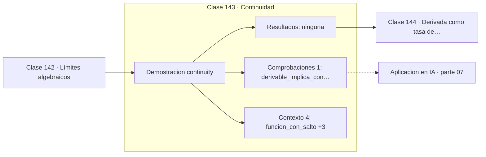

# 143 — Continuidad

> [⬅️ 142 Límites algebraicos](../142-limites-algebraicos/README.md) · [📚 Parte 07](../README.md) · [🏠 Programa](../../../README.md) · [144 Derivada como tasa de cambio ➡️](../144-derivada-como-tasa-de-cambio/README.md)

**Parte:** 07 — Cálculo diferencial e integral · **Nivel:** `universitario` · **Horas estimadas:** 4
**Motor:** `engines.part07` · **Demostración:** `continuity` · **Clase 3 de 20** de la parte

---

## 🎯 Propósito

**Continuidad exige tres condiciones; ser continua no implica ser derivable.**

Límite, continuidad, derivada, reglas de derivación, Taylor, optimización de una variable, integral definida y teorema fundamental del cálculo.

## ✅ Resultados de aprendizaje

Al terminar podrás:

1. Explicar **Continuidad** con lenguaje cotidiano y con notación matemática.
2. Resolver un caso pequeño a mano y anticipar el orden de magnitud del resultado.
3. Ejecutar y modificar `lab.py`, que corre la demostración `continuity`.
4. Interpretar las 5 salidas del laboratorio y decir qué comprueba cada una.
5. Detectar el error típico de esta parte: confundir punto crítico con extremo global.

## 🧩 Fórmulas de la clase

```text
f continua en a ⟺ f(a) existe, lím f existe, y coinciden
derivable ⟹ continua, pero no al revés
```

## 🗺️ Ubicación en el programa



## 📖 Fundamentos

La continuidad es la ausencia de saltos, y su definición formal descompone esa idea en
tres requisitos: que la función esté definida en el punto, que el límite exista y que
ambos coincidan. Que sean tres y no uno permite clasificar las discontinuidades según
cuál falla.

Una discontinuidad **removible** es aquella en la que el límite existe pero no coincide
con el valor (o el valor no existe). Se «arregla» redefiniendo la función en ese punto,
de ahí el nombre. Una discontinuidad **de salto** tiene límites laterales distintos y no
se puede arreglar de ninguna forma.

La implicación «derivable implica continua» es cierta y su recíproca es falsa. `|x|` es
continua en cero y no derivable, porque las pendientes laterales son −1 y +1. Ese
contraejemplo tiene consecuencias prácticas: ReLU (clase 059) es exactamente ese caso, y
su no derivabilidad en cero se resuelve por convenio.

Weierstrass construyó en 1872 una función continua en todo punto y derivable en ninguno,
demostrando que la intuición geométrica —«una curva sin saltos tiene tangente casi
siempre»— es falsa. Las trayectorias del movimiento browniano tienen esa misma
propiedad, hecho relevante en la parte 17 al tratar ecuaciones diferenciales
estocásticas.

## 🧮 Ejemplo trabajado

Dos discontinuidades y una no derivabilidad.

```text
Salto:      f(x) = 0 si x<1, 1 si x≥1
  lím izquierda = 0,  lím derecha = 1
  no coinciden → no continua                ✗

Removible:  g(x) = (x²−1)/(x−1) con g(1) = 5
  límite = 2,  valor asignado = 5
  no coinciden → no continua                ✗
  se arregla redefiniendo g(1) = 2          ✓

Continua no derivable: |x| en 0
  continua                                  ✓
  pendiente izquierda −1, derecha +1        ✗ no derivable
```

## 🔬 Qué ejecuta el laboratorio

`continuity` — Los tres requisitos de continuidad en un punto.

| Grupo | Salidas |
|---|---|
| 🔢 Resultados numéricos (0) | — |
| ✅ Comprobaciones de invariante (1) | `derivable_implica_continua` |

Las claves booleanas no son adorno: si alguna fuera `False`, el resultado numérico
no sería fiable aunque el programa terminase sin error.

```bash
python classes/part-07-calculo-diferencial-e-integral/143-continuidad/lab.py
compmath run 143
```

> [!TIP]
> Antes de ejecutar, **escribe tu predicción**. Un laboratorio que confirma lo que
> esperabas enseña tanto como uno que te contradice, pero solo si la predicción
> existía antes del resultado.

## ⚠️ Errores conceptuales frecuentes

1. Comprobar solo el límite y no el valor de la función en el punto.
2. Deducir derivabilidad a partir de continuidad.
3. Suponer que toda discontinuidad se puede eliminar redefiniendo la función.

## 🚀 Dónde se usa de verdad

Validez de teoremas que exigen continuidad, activaciones no derivables como ReLU,
funciones de pérdida por tramos y detección de saltos en series temporales.

## 🤖 Conexión con IA

Sin regla de la cadena no hay entrenamiento por gradiente; sin Taylor no hay métodos de segundo orden ni análisis de convergencia.

## 📓 Notebooks

| Archivo | Para qué |
|---|---|
| [`notebook.ipynb`](notebook.ipynb) | recorrido guiado con la demostración ejecutada |
| [`notebook_student.ipynb`](notebook_student.ipynb) | versión con `TODO` para resolver |
| [`notebook_solution.ipynb`](notebook_solution.ipynb) | solución de referencia verificada |

## 📝 Evaluación

| Criterio | Peso |
|---|---:|
| Comprensión conceptual | 25 % |
| Resolución manual | 25 % |
| Implementación y verificación | 25 % |
| Interpretación y comunicación | 15 % |
| Conexión con aplicación real | 10 % |

Detalle y criterios de error crítico en [`assessment.md`](assessment.md).

## ❓ Preguntas de comprobación

1. ¿Cuál es la entrada, cuál la salida y qué unidades tienen?
2. ¿Qué operación domina el comportamiento del resultado?
3. ¿Qué caso extremo revelaría un error conceptual?
4. ¿Cómo verificarías el resultado por un método independiente?
5. ¿Dónde aparece esto en física?

Si necesitas releer el código para responderlas, la clase todavía no está superada.

## 📥 Entregable

`notebook_student.ipynb` resuelto más un párrafo que explique el resultado **sin citar
código**: qué entra, qué sale, qué invariante se comprueba y qué pasaría en un caso límite.

## 🔗 Referencias

- [Spivak, M. *Calculus*, 4ª ed., 2008, cap. 6](https://www.mathpop.com/calculus)
- [Weierstrass function — Wolfram MathWorld](https://mathworld.wolfram.com/WeierstrassFunction.html)

Bibliografía completa de la parte en [`../../../docs/BIBLIOGRAPHY.md`](../../../docs/BIBLIOGRAPHY.md).

## 📂 Material de la clase

[`intuition.md`](intuition.md) · [`theory.md`](theory.md) · [`derivation.md`](derivation.md) · [`exercises.md`](exercises.md) · [`assessment.md`](assessment.md) · [`where-is-this-used.md`](where-is-this-used.md) · [`lesson.yaml`](lesson.yaml)

---

> [⬅️ 142 Límites algebraicos](../142-limites-algebraicos/README.md) · [📚 Parte 07](../README.md) · [🏠 Programa](../../../README.md) · [144 Derivada como tasa de cambio ➡️](../144-derivada-como-tasa-de-cambio/README.md)
