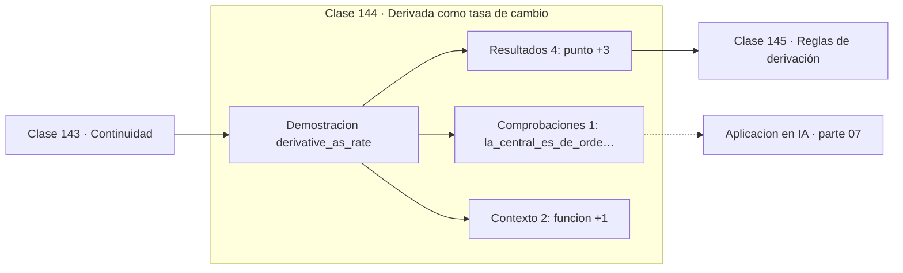

# 144 — Derivada como tasa de cambio

> [⬅️ 143 Continuidad](../143-continuidad/README.md) · [📚 Parte 07](../README.md) · [🏠 Programa](../../../README.md) · [145 Reglas de derivación ➡️](../145-reglas-de-derivacion/README.md)

**Parte:** 07 — Cálculo diferencial e integral · **Nivel:** `universitario` · **Horas estimadas:** 4
**Motor:** `engines.part07` · **Demostración:** `derivative_as_rate` · **Clase 4 de 20** de la parte

---

## 🎯 Propósito

**La derivada es la pendiente de la mejor recta que aproxima la función cerca de un punto.**

Límite, continuidad, derivada, reglas de derivación, Taylor, optimización de una variable, integral definida y teorema fundamental del cálculo.

## ✅ Resultados de aprendizaje

Al terminar podrás:

1. Explicar **Derivada como tasa de cambio** con lenguaje cotidiano y con notación matemática.
2. Resolver un caso pequeño a mano y anticipar el orden de magnitud del resultado.
3. Ejecutar y modificar `lab.py`, que corre la demostración `derivative_as_rate`.
4. Interpretar las 7 salidas del laboratorio y decir qué comprueba cada una.
5. Detectar el error típico de esta parte: usar diferencias finitas con h demasiado pequeño y amplificar el error de redondeo.

## 🧩 Fórmulas de la clase

```text
f'(x) = lím(h→0) (f(x+h) − f(x))/h
diferencia central: (f(x+h) − f(x−h))/2h, error O(h²)
```

## 🗺️ Ubicación en el programa



## 📖 Fundamentos

La derivada nace de una pregunta física —¿cuál es la velocidad instantánea?— y se
resuelve con un límite: la pendiente de la secante entre dos puntos, cuando esos puntos
se juntan. El resultado es la pendiente de la **tangente**, y esa recta es la mejor
aproximación lineal de la función cerca del punto.

Esa lectura, «mejor aproximación lineal», es más útil que «pendiente» porque se
generaliza. En varias variables, la derivada es el gradiente y define el plano tangente
(clase 166); en funciones vectoriales, es el Jacobiano. Siempre es lo mismo: el objeto
lineal que mejor aproxima localmente.

Numéricamente, la diferencia **central** es superior a la adelantada. Su error es
`O(h²)` en lugar de `O(h)`, porque los términos de orden impar del desarrollo de Taylor
se cancelan. Con `h = 10⁻⁶`, la central da unos 12 dígitos correctos y la adelantada
unos 6.

Pero reducir `h` indefinidamente no mejora: por debajo de cierto valor, el error de
redondeo de la resta —cancelación catastrófica, clase 032— domina sobre el error de
truncamiento. Existe un `h` óptimo, aproximadamente `√ε ≈ 1.5·10⁻⁸` para la central, y
la clase 221 lo mide.

## 🧮 Ejemplo trabajado

Derivada de x² en x = 3 por varios caminos.

```text
cociente incremental (f(3+h)−f(3))/h:
  h = 1.0     →  7.0
  h = 0.1     →  6.1
  h = 0.01    →  6.01
  h = 1e−4    →  6.0001

derivada exacta (2x): 6.0
diferencia central con h = 1e−6: 6.0000000000
error de la central: 8.8e−11

La central es dos órdenes mejor que la adelantada.
```

## 🔬 Qué ejecuta el laboratorio

`derivative_as_rate` — Derivada como límite del cociente incremental.

| Grupo | Salidas |
|---|---|
| 🔢 Resultados numéricos (4) | `punto`, `derivada_exacta_2x`, `diferencia_central`, `error_central` |
| ✅ Comprobaciones de invariante (1) | `la_central_es_de_orden_h²` |

Las claves booleanas no son adorno: si alguna fuera `False`, el resultado numérico
no sería fiable aunque el programa terminase sin error.

```bash
python classes/part-07-calculo-diferencial-e-integral/144-derivada-como-tasa-de-cambio/lab.py
compmath run 144
```

> [!TIP]
> Antes de ejecutar, **escribe tu predicción**. Un laboratorio que confirma lo que
> esperabas enseña tanto como uno que te contradice, pero solo si la predicción
> existía antes del resultado.

## ⚠️ Errores conceptuales frecuentes

1. Usar h demasiado pequeño y amplificar el error de redondeo.
2. Usar la diferencia adelantada cuando la central cuesta lo mismo y es mejor.
3. Derivar en un punto donde la función no es continua.

## 🚀 Dónde se usa de verdad

Verificación de gradientes analíticos (gradient checking), análisis de sensibilidad,
métodos numéricos y cualquier cálculo de tasa instantánea de cambio.

## 🤖 Conexión con IA

Sin regla de la cadena no hay entrenamiento por gradiente; sin Taylor no hay métodos de segundo orden ni análisis de convergencia.

## 📓 Notebooks

| Archivo | Para qué |
|---|---|
| [`notebook.ipynb`](notebook.ipynb) | recorrido guiado con la demostración ejecutada |
| [`notebook_student.ipynb`](notebook_student.ipynb) | versión con `TODO` para resolver |
| [`notebook_solution.ipynb`](notebook_solution.ipynb) | solución de referencia verificada |

## 📝 Evaluación

| Criterio | Peso |
|---|---:|
| Comprensión conceptual | 25 % |
| Resolución manual | 25 % |
| Implementación y verificación | 25 % |
| Interpretación y comunicación | 15 % |
| Conexión con aplicación real | 10 % |

Detalle y criterios de error crítico en [`assessment.md`](assessment.md).

## ❓ Preguntas de comprobación

1. ¿Cuál es la entrada, cuál la salida y qué unidades tienen?
2. ¿Qué operación domina el comportamiento del resultado?
3. ¿Qué caso extremo revelaría un error conceptual?
4. ¿Cómo verificarías el resultado por un método independiente?
5. ¿Dónde aparece esto en física?

Si necesitas releer el código para responderlas, la clase todavía no está superada.

## 📥 Entregable

`notebook_student.ipynb` resuelto más un párrafo que explique el resultado **sin citar
código**: qué entra, qué sale, qué invariante se comprueba y qué pasaría en un caso límite.

## 📚 Bibliografía de la clase

Esta clase enseña **Cálculo · Análisis matemático**. Cada obra dice qué aporta aquí y cómo se comprobó su localizador:

- [Spivak, M. *Calculus*, 4ª ed., 2008, cap. 9](https://www.mathpop.com/calculus) — Análisis matemático y Cálculo: el tema de esta clase · ISBN-13 `9780914098911` verificado en International ISBN Agency (2026-08-19).
- [Nocedal & Wright. *Numerical Optimization*, 2ª ed., Springer, 2006, cap. 8](https://link.springer.com/book/10.1007/978-0-387-40065-5) — Métodos numéricos y Optimización: conexión declarada de esta parte · ISBN-13 `9780387400655` verificado en International ISBN Agency (2026-08-19).

Bibliografía de todas las clases, con el porqué de cada obra, en [`docs/BIBLIOGRAPHY.md`](../../../docs/BIBLIOGRAPHY.md) · localizador y estado de cada obra en [`sources/bibliography.json`](../../../sources/bibliography.json).

## 📂 Material de la clase

[`intuition.md`](intuition.md) · [`theory.md`](theory.md) · [`derivation.md`](derivation.md) · [`exercises.md`](exercises.md) · [`assessment.md`](assessment.md) · [`where-is-this-used.md`](where-is-this-used.md) · [`lesson.yaml`](lesson.yaml)

---

> [⬅️ 143 Continuidad](../143-continuidad/README.md) · [📚 Parte 07](../README.md) · [🏠 Programa](../../../README.md) · [145 Reglas de derivación ➡️](../145-reglas-de-derivacion/README.md)
