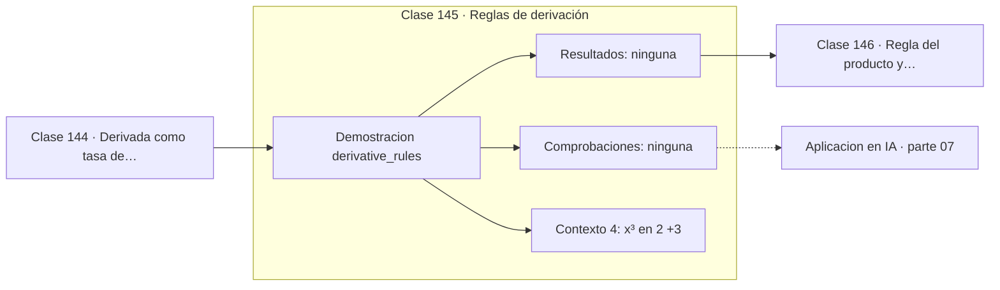

# 145 — Reglas de derivación

> [⬅️ 144 Derivada como tasa de cambio](../144-derivada-como-tasa-de-cambio/README.md) · [📚 Parte 07](../README.md) · [🏠 Programa](../../../README.md) · [146 Regla del producto y cociente ➡️](../146-regla-del-producto-y-cociente/README.md)

**Parte:** 07 — Cálculo diferencial e integral · **Nivel:** `universitario` · **Horas estimadas:** 4
**Motor:** `engines.part07` · **Demostración:** `derivative_rules` · **Clase 5 de 20** de la parte

---

## 🎯 Propósito

**Las reglas de derivación se deducen del límite una vez y se aplican mecánicamente después.**

Límite, continuidad, derivada, reglas de derivación, Taylor, optimización de una variable, integral definida y teorema fundamental del cálculo.

## ✅ Resultados de aprendizaje

Al terminar podrás:

1. Explicar **Reglas de derivación** con lenguaje cotidiano y con notación matemática.
2. Resolver un caso pequeño a mano y anticipar el orden de magnitud del resultado.
3. Ejecutar y modificar `lab.py`, que corre la demostración `derivative_rules`.
4. Interpretar las 4 salidas del laboratorio y decir qué comprueba cada una.
5. Detectar el error típico de esta parte: derivar en un punto donde la función no es continua.

## 🧩 Fórmulas de la clase

```text
(xⁿ)' = n·xⁿ⁻¹
(f + g)' = f' + g'
(c·f)' = c·f'
(c)' = 0
```

## 🗺️ Ubicación en el programa



## 📖 Fundamentos

Las reglas básicas convierten la derivación en un procedimiento mecánico. Cada una se
demuestra una vez desde la definición por límite y luego se aplica sin volver a pensar
en límites, que es exactamente el propósito de tener reglas.

La **linealidad** —la derivada de una suma es la suma de las derivadas, y las constantes
salen fuera— es la propiedad que hace que la derivación sea un operador lineal. Eso
importa más de lo que parece: permite derivar término a término cualquier polinomio,
cualquier serie de potencias y cualquier combinación lineal de funciones.

La regla de la potencia, `(xⁿ)' = n·xⁿ⁻¹`, vale para todo exponente real, no solo
natural. Su demostración para exponentes naturales usa el binomio de Newton; para
exponentes reales necesita la definición exponencial de la clase 148.

La derivada de una constante es cero, y esa es la razón por la que la antiderivada no es
única (clase 155): sumar cualquier constante no cambia la derivada. En optimización, ese
hecho significa que desplazar la función objetivo verticalmente no cambia dónde está su
mínimo, propiedad que se usa para estabilizar cálculos.

## 🧮 Ejemplo trabajado

Cuatro derivadas verificadas numéricamente.

```text
función        punto   numérica    analítica   coinciden
x³              2      12.000000   3x² = 12       ✓
5x              7       5.000000   5              ✓
x³ + 5x         2      17.000000   3x²+5 = 17     ✓
constante 4     1       0.000000   0              ✓

Linealidad verificada:
  (x³ + 5x)' = (x³)' + (5x)' = 12 + 5 = 17       ✓
```

## 🔬 Qué ejecuta el laboratorio

`derivative_rules` — Reglas de potencia, suma y constante verificadas numéricamente.

| Grupo | Salidas |
|---|---|
| 🔢 Resultados numéricos (0) | — |
| ✅ Comprobaciones de invariante (0) | — |

Las claves booleanas no son adorno: si alguna fuera `False`, el resultado numérico
no sería fiable aunque el programa terminase sin error.

```bash
python classes/part-07-calculo-diferencial-e-integral/145-reglas-de-derivacion/lab.py
compmath run 145
```

> [!TIP]
> Antes de ejecutar, **escribe tu predicción**. Un laboratorio que confirma lo que
> esperabas enseña tanto como uno que te contradice, pero solo si la predicción
> existía antes del resultado.

## ⚠️ Errores conceptuales frecuentes

1. Aplicar la regla de la potencia a exponentes que dependen de x: (xˣ)' no es x·xˣ⁻¹.
2. Suponer que la derivada de un producto es el producto de las derivadas.
3. Olvidar que la derivada de una constante es cero, no la constante.

## 🚀 Dónde se usa de verdad

Derivación de polinomios y modelos lineales, cálculo de gradientes analíticos y
verificación de implementaciones de autodiferenciación.

## 🤖 Conexión con IA

Sin regla de la cadena no hay entrenamiento por gradiente; sin Taylor no hay métodos de segundo orden ni análisis de convergencia.

## 📓 Notebooks

| Archivo | Para qué |
|---|---|
| [`notebook.ipynb`](notebook.ipynb) | recorrido guiado con la demostración ejecutada |
| [`notebook_student.ipynb`](notebook_student.ipynb) | versión con `TODO` para resolver |
| [`notebook_solution.ipynb`](notebook_solution.ipynb) | solución de referencia verificada |

## 📝 Evaluación

| Criterio | Peso |
|---|---:|
| Comprensión conceptual | 25 % |
| Resolución manual | 25 % |
| Implementación y verificación | 25 % |
| Interpretación y comunicación | 15 % |
| Conexión con aplicación real | 10 % |

Detalle y criterios de error crítico en [`assessment.md`](assessment.md).

## ❓ Preguntas de comprobación

1. ¿Cuál es la entrada, cuál la salida y qué unidades tienen?
2. ¿Qué operación domina el comportamiento del resultado?
3. ¿Qué caso extremo revelaría un error conceptual?
4. ¿Cómo verificarías el resultado por un método independiente?
5. ¿Dónde aparece esto en física?

Si necesitas releer el código para responderlas, la clase todavía no está superada.

## 📥 Entregable

`notebook_student.ipynb` resuelto más un párrafo que explique el resultado **sin citar
código**: qué entra, qué sale, qué invariante se comprueba y qué pasaría en un caso límite.

## 📚 Bibliografía de la clase

Esta clase enseña **Cálculo · Análisis matemático**. Cada obra dice qué aporta aquí y cómo se comprobó su localizador:

- [Spivak, M. *Calculus*, 4ª ed., 2008, cap. 10](https://www.mathpop.com/calculus) — Análisis matemático y Cálculo: el tema de esta clase · ISBN-13 `9780914098911` verificado en International ISBN Agency (2026-08-19).
- [Stewart, J. *Calculus*, 8ª ed., Cengage, 2015](https://www.cengage.com/c/calculus-8e-stewart/) — Cálculo: el tema de esta clase · ISBN-13 `9781285740621` verificado en International ISBN Agency (2026-08-19).

Bibliografía de todas las clases, con el porqué de cada obra, en [`docs/BIBLIOGRAPHY.md`](../../../docs/BIBLIOGRAPHY.md) · localizador y estado de cada obra en [`sources/bibliography.json`](../../../sources/bibliography.json).

## 📂 Material de la clase

[`intuition.md`](intuition.md) · [`theory.md`](theory.md) · [`derivation.md`](derivation.md) · [`exercises.md`](exercises.md) · [`assessment.md`](assessment.md) · [`where-is-this-used.md`](where-is-this-used.md) · [`lesson.yaml`](lesson.yaml)

---

> [⬅️ 144 Derivada como tasa de cambio](../144-derivada-como-tasa-de-cambio/README.md) · [📚 Parte 07](../README.md) · [🏠 Programa](../../../README.md) · [146 Regla del producto y cociente ➡️](../146-regla-del-producto-y-cociente/README.md)
