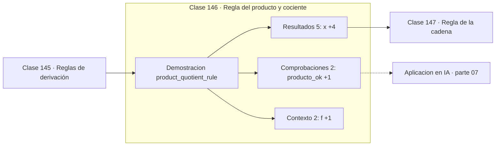

# 146 — Regla del producto y cociente

> [⬅️ 145 Reglas de derivación](../145-reglas-de-derivacion/README.md) · [📚 Parte 07](../README.md) · [🏠 Programa](../../../README.md) · [147 Regla de la cadena ➡️](../147-regla-de-la-cadena/README.md)

**Parte:** 07 — Cálculo diferencial e integral · **Nivel:** `universitario` · **Horas estimadas:** 4
**Motor:** `engines.part07` · **Demostración:** `product_quotient_rule` · **Clase 6 de 20** de la parte

---

## 🎯 Propósito

**La derivada de un producto no es el producto de las derivadas.**

Límite, continuidad, derivada, reglas de derivación, Taylor, optimización de una variable, integral definida y teorema fundamental del cálculo.

## ✅ Resultados de aprendizaje

Al terminar podrás:

1. Explicar **Regla del producto y cociente** con lenguaje cotidiano y con notación matemática.
2. Resolver un caso pequeño a mano y anticipar el orden de magnitud del resultado.
3. Ejecutar y modificar `lab.py`, que corre la demostración `product_quotient_rule`.
4. Interpretar las 9 salidas del laboratorio y decir qué comprueba cada una.
5. Detectar el error típico de esta parte: confundir punto crítico con extremo global.

## 🧩 Fórmulas de la clase

```text
(fg)' = f'g + fg'
(f/g)' = (f'g − fg')/g²
```

## 🗺️ Ubicación en el programa



## 📖 Fundamentos

La regla del producto es contraintuitiva la primera vez y su demostración explica por
qué: al incrementar `x`, cambian tanto `f` como `g`, y el cambio total del producto tiene
dos contribuciones —una por cada factor— más un término de segundo orden que se anula en
el límite.

Geométricamente, si `f` y `g` son los lados de un rectángulo, `fg` es su área. Al
incrementar ambos lados, el área crece en dos franjas —`f'g` y `fg'`— más una esquina
diminuta que es despreciable. Esa imagen hace la regla memorable sin memorizarla.

La regla del cociente se deduce de la del producto aplicada a `f · g⁻¹`, y su forma
—numerador con resta, denominador al cuadrado— hay que respetarla en el orden: `f'g − fg'`
y no al revés. Invertir el orden cambia el signo, error frecuente y silencioso.

En machine learning estas reglas aparecen cada vez que una función de pérdida es un
producto o un cociente de términos. La derivada de la softmax, del cociente de
verosimilitudes y de las puertas de una LSTM (clase 315) usan la del producto; la
derivada de la sigmoide, `σ' = σ(1−σ)`, se obtiene con la del cociente.

## 🧮 Ejemplo trabajado

Producto y cociente de x² y sin(x) en x = 1.3.

```text
f = x²,  g = sin(x),  x = 1.3

(fg)' por la regla:  2x·sin(x) + x²·cos(x)
                  =  2.5057 + 0.4518 = 2.9575
(fg)' numérica    =  2.9575                    ✓

(f/g)' por la regla: (2x·sin x − x²·cos x)/sin²x
                  =  2.2160
(f/g)' numérica    =  2.2160                   ✓

ERROR común: f'·g' = 2x·cos(x) = 0.6952  ✗ no es la derivada
```

## 🔬 Qué ejecuta el laboratorio

`product_quotient_rule` — Regla del producto y del cociente.

| Grupo | Salidas |
|---|---|
| 🔢 Resultados numéricos (5) | `x`, `(fg)'_numerica`, `(fg)'_regla`, `(f/g)'_numerica`, `(f/g)'_regla` |
| ✅ Comprobaciones de invariante (2) | `producto_ok`, `cociente_ok` |

Las claves booleanas no son adorno: si alguna fuera `False`, el resultado numérico
no sería fiable aunque el programa terminase sin error.

```bash
python classes/part-07-calculo-diferencial-e-integral/146-regla-del-producto-y-cociente/lab.py
compmath run 146
```

> [!TIP]
> Antes de ejecutar, **escribe tu predicción**. Un laboratorio que confirma lo que
> esperabas enseña tanto como uno que te contradice, pero solo si la predicción
> existía antes del resultado.

## ⚠️ Errores conceptuales frecuentes

1. Escribir (fg)' = f'g'.
2. Invertir el orden de la resta en la regla del cociente.
3. Olvidar elevar al cuadrado el denominador.

## 🚀 Dónde se usa de verdad

Derivada de la sigmoide y de la softmax, puertas de LSTM y GRU, cocientes de
verosimilitud y cualquier pérdida con términos multiplicativos.

## 🤖 Conexión con IA

Sin regla de la cadena no hay entrenamiento por gradiente; sin Taylor no hay métodos de segundo orden ni análisis de convergencia.

## 📓 Notebooks

| Archivo | Para qué |
|---|---|
| [`notebook.ipynb`](notebook.ipynb) | recorrido guiado con la demostración ejecutada |
| [`notebook_student.ipynb`](notebook_student.ipynb) | versión con `TODO` para resolver |
| [`notebook_solution.ipynb`](notebook_solution.ipynb) | solución de referencia verificada |

## 📝 Evaluación

| Criterio | Peso |
|---|---:|
| Comprensión conceptual | 25 % |
| Resolución manual | 25 % |
| Implementación y verificación | 25 % |
| Interpretación y comunicación | 15 % |
| Conexión con aplicación real | 10 % |

Detalle y criterios de error crítico en [`assessment.md`](assessment.md).

## ❓ Preguntas de comprobación

1. ¿Cuál es la entrada, cuál la salida y qué unidades tienen?
2. ¿Qué operación domina el comportamiento del resultado?
3. ¿Qué caso extremo revelaría un error conceptual?
4. ¿Cómo verificarías el resultado por un método independiente?
5. ¿Dónde aparece esto en física?

Si necesitas releer el código para responderlas, la clase todavía no está superada.

## 📥 Entregable

`notebook_student.ipynb` resuelto más un párrafo que explique el resultado **sin citar
código**: qué entra, qué sale, qué invariante se comprueba y qué pasaría en un caso límite.

## 📚 Bibliografía de la clase

Esta clase enseña **Cálculo · Análisis matemático**. Cada obra dice qué aporta aquí y cómo se comprobó su localizador:

- [Spivak, M. *Calculus*, 4ª ed., 2008](https://www.mathpop.com/calculus) — Análisis matemático y Cálculo: el tema de esta clase · ISBN-13 `9780914098911` verificado en International ISBN Agency (2026-08-19).
- [Petersen & Pedersen. *The Matrix Cookbook*, 2012](https://www.math.uwaterloo.ca/~hwolkowi/matrixcookbook.pdf) — Álgebra lineal y Cálculo multivariable y matricial: conexión declarada de esta parte · URL de la fuente primaria comprobada en www.math.uwaterloo.ca (2026-08-19).

Bibliografía de todas las clases, con el porqué de cada obra, en [`docs/BIBLIOGRAPHY.md`](../../../docs/BIBLIOGRAPHY.md) · localizador y estado de cada obra en [`sources/bibliography.json`](../../../sources/bibliography.json).

## 📂 Material de la clase

[`intuition.md`](intuition.md) · [`theory.md`](theory.md) · [`derivation.md`](derivation.md) · [`exercises.md`](exercises.md) · [`assessment.md`](assessment.md) · [`where-is-this-used.md`](where-is-this-used.md) · [`lesson.yaml`](lesson.yaml)

---

> [⬅️ 145 Reglas de derivación](../145-reglas-de-derivacion/README.md) · [📚 Parte 07](../README.md) · [🏠 Programa](../../../README.md) · [147 Regla de la cadena ➡️](../147-regla-de-la-cadena/README.md)
