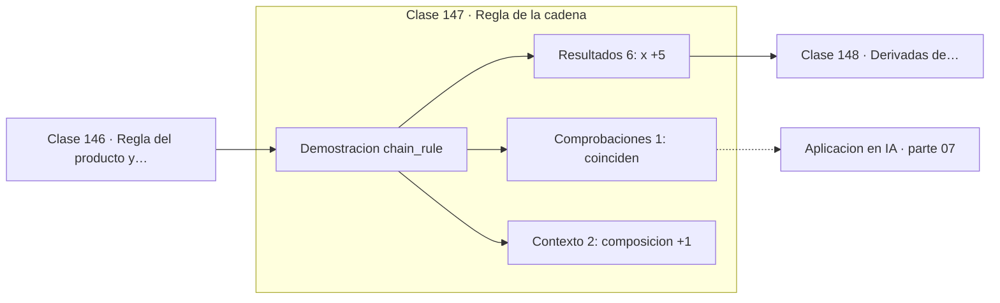

# 147 — Regla de la cadena

> [⬅️ 146 Regla del producto y cociente](../146-regla-del-producto-y-cociente/README.md) · [📚 Parte 07](../README.md) · [🏠 Programa](../../../README.md) · [148 Derivadas de exponenciales y logaritmos ➡️](../148-derivadas-de-exponenciales-y-logaritmos/README.md)

**Parte:** 07 — Cálculo diferencial e integral · **Nivel:** `universitario` · **Horas estimadas:** 4
**Motor:** `engines.part07` · **Demostración:** `chain_rule` · **Clase 7 de 20** de la parte

---

## 🎯 Propósito

**La regla de la cadena es el mecanismo completo de backpropagation: derivar una composición es multiplicar factores.**

Límite, continuidad, derivada, reglas de derivación, Taylor, optimización de una variable, integral definida y teorema fundamental del cálculo.

## ✅ Resultados de aprendizaje

Al terminar podrás:

1. Explicar **Regla de la cadena** con lenguaje cotidiano y con notación matemática.
2. Resolver un caso pequeño a mano y anticipar el orden de magnitud del resultado.
3. Ejecutar y modificar `lab.py`, que corre la demostración `chain_rule`.
4. Interpretar las 9 salidas del laboratorio y decir qué comprueba cada una.
5. Detectar el error típico de esta parte: usar diferencias finitas con h demasiado pequeño y amplificar el error de redondeo.

## 🧩 Fórmulas de la clase

```text
(f∘g)'(x) = f'(g(x)) · g'(x)
cadena de L funciones: producto de L derivadas
```

## 🗺️ Ubicación en el programa



## 📖 Fundamentos

La regla de la cadena dice que la derivada de una composición es el producto de las
derivadas de sus piezas, evaluadas en los puntos correctos. La intuición de tasas
encadenadas lo hace evidente: si `y` cambia 3 veces más rápido que `u`, y `u` cambia 2
veces más rápido que `x`, entonces `y` cambia 6 veces más rápido que `x`.

Esta clase es la más importante del programa para quien quiera entender deep learning.
Una red de L capas es una composición de L funciones (clase 057), así que su gradiente
respecto a los parámetros de la primera capa es un **producto de L factores**. Ese
producto explica de golpe tres fenómenos que suelen presentarse por separado:

Si cada factor es menor que 1, el producto tiende a cero exponencialmente: el gradiente
**se desvanece** y las primeras capas dejan de aprender (clase 314). Si cada factor es
mayor que 1, el producto diverge: el gradiente **explota**. Y como la derivada de ReLU
vale exactamente 1 en el semieje positivo, sustituir la sigmoide —cuya derivada máxima
es 0.25— por ReLU evita que el producto se atenúe.

La regla se generaliza a varias variables como una suma de productos sobre todos los
caminos del grafo de cómputo (clase 167), y su implementación eficiente en modo reverso
es la autodiferenciación (clase 179). Todo lo demás en el entrenamiento de una red es
ingeniería alrededor de esta regla.

## 🧮 Ejemplo trabajado

Derivar sin(x²+1) y una cadena de tres niveles.

```text
f(u) = sin(u),  g(x) = x²+1,  x = 1.5

g(x) = 3.25
df/du en g(x) = cos(3.25) = −0.9940
dg/dx = 2x = 3.0

producto: −0.9940 × 3.0 = −2.9821
derivada numérica:        −2.9821          ✓

Cadena de tres: e^(sin(x²)) en x = 0.8
  derivada = 2.0871

En una red de L capas: el gradiente es un producto de L factores.
```

## 🔬 Qué ejecuta el laboratorio

`chain_rule` — La regla de la cadena: el mecanismo entero de backpropagation.

| Grupo | Salidas |
|---|---|
| 🔢 Resultados numéricos (6) | `x`, `df/du_en_g(x)`, `dg/dx`, `producto_de_la_cadena`, `derivada_numerica`, `cadena_de_3_niveles` |
| ✅ Comprobaciones de invariante (1) | `coinciden` |

Las claves booleanas no son adorno: si alguna fuera `False`, el resultado numérico
no sería fiable aunque el programa terminase sin error.

```bash
python classes/part-07-calculo-diferencial-e-integral/147-regla-de-la-cadena/lab.py
compmath run 147
```

> [!TIP]
> Antes de ejecutar, **escribe tu predicción**. Un laboratorio que confirma lo que
> esperabas enseña tanto como uno que te contradice, pero solo si la predicción
> existía antes del resultado.

## ⚠️ Errores conceptuales frecuentes

1. Evaluar f' en x en lugar de en g(x).
2. Olvidar multiplicar por la derivada interna.
3. No reconocer que una expresión es una composición y derivarla como si fuera simple.

## 🚀 Dónde se usa de verdad

Backpropagation, autodiferenciación, cambio de variable en integrales, propagación de
incertidumbre y análisis de gradientes que se desvanecen o explotan.

## 🤖 Conexión con IA

Sin regla de la cadena no hay entrenamiento por gradiente; sin Taylor no hay métodos de segundo orden ni análisis de convergencia.

## 📓 Notebooks

| Archivo | Para qué |
|---|---|
| [`notebook.ipynb`](notebook.ipynb) | recorrido guiado con la demostración ejecutada |
| [`notebook_student.ipynb`](notebook_student.ipynb) | versión con `TODO` para resolver |
| [`notebook_solution.ipynb`](notebook_solution.ipynb) | solución de referencia verificada |

## 📝 Evaluación

| Criterio | Peso |
|---|---:|
| Comprensión conceptual | 25 % |
| Resolución manual | 25 % |
| Implementación y verificación | 25 % |
| Interpretación y comunicación | 15 % |
| Conexión con aplicación real | 10 % |

Detalle y criterios de error crítico en [`assessment.md`](assessment.md).

## ❓ Preguntas de comprobación

1. ¿Cuál es la entrada, cuál la salida y qué unidades tienen?
2. ¿Qué operación domina el comportamiento del resultado?
3. ¿Qué caso extremo revelaría un error conceptual?
4. ¿Cómo verificarías el resultado por un método independiente?
5. ¿Dónde aparece esto en física?

Si necesitas releer el código para responderlas, la clase todavía no está superada.

## 📥 Entregable

`notebook_student.ipynb` resuelto más un párrafo que explique el resultado **sin citar
código**: qué entra, qué sale, qué invariante se comprueba y qué pasaría en un caso límite.

## 🔗 Referencias

- [Rumelhart, Hinton & Williams. *Learning representations by back-propagating errors*. Nature, 1986](https://www.nature.com/articles/323533a0) — *uso:* obra de referencia consultada en «Regla de la cadena».
- [Goodfellow, Bengio & Courville. *Deep Learning*. MIT Press, 2016, cap. 6](https://www.deeplearningbook.org/) — *uso:* obra de referencia consultada en «Regla de la cadena».

Bibliografía completa de la parte en [`../../../docs/BIBLIOGRAPHY.md`](../../../docs/BIBLIOGRAPHY.md) · localizador verificable de cada obra en [`sources/bibliography.json`](../../../sources/bibliography.json).

## 📂 Material de la clase

[`intuition.md`](intuition.md) · [`theory.md`](theory.md) · [`derivation.md`](derivation.md) · [`exercises.md`](exercises.md) · [`assessment.md`](assessment.md) · [`where-is-this-used.md`](where-is-this-used.md) · [`lesson.yaml`](lesson.yaml)

---

> [⬅️ 146 Regla del producto y cociente](../146-regla-del-producto-y-cociente/README.md) · [📚 Parte 07](../README.md) · [🏠 Programa](../../../README.md) · [148 Derivadas de exponenciales y logaritmos ➡️](../148-derivadas-de-exponenciales-y-logaritmos/README.md)
