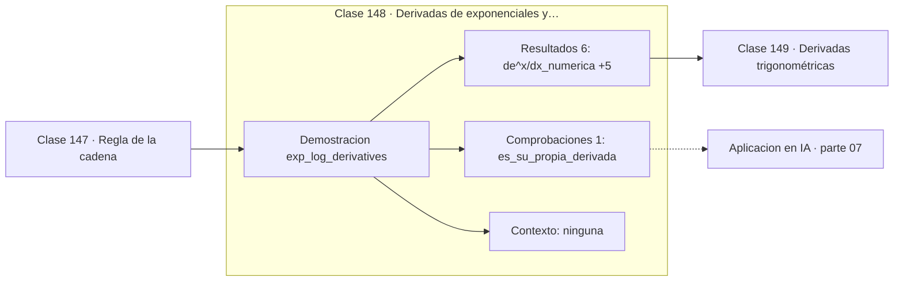

# 148 — Derivadas de exponenciales y logaritmos

> [⬅️ 147 Regla de la cadena](../147-regla-de-la-cadena/README.md) · [📚 Parte 07](../README.md) · [🏠 Programa](../../../README.md) · [149 Derivadas trigonométricas ➡️](../149-derivadas-trigonometricas/README.md)

**Parte:** 07 — Cálculo diferencial e integral · **Nivel:** `universitario` · **Horas estimadas:** 4
**Motor:** `engines.part07` · **Demostración:** `exp_log_derivatives` · **Clase 8 de 20** de la parte

---

## 🎯 Propósito

**e^x es la única función que es su propia derivada, y por eso e aparece en todas partes.**

Límite, continuidad, derivada, reglas de derivación, Taylor, optimización de una variable, integral definida y teorema fundamental del cálculo.

## ✅ Resultados de aprendizaje

Al terminar podrás:

1. Explicar **Derivadas de exponenciales y logaritmos** con lenguaje cotidiano y con notación matemática.
2. Resolver un caso pequeño a mano y anticipar el orden de magnitud del resultado.
3. Ejecutar y modificar `lab.py`, que corre la demostración `exp_log_derivatives`.
4. Interpretar las 7 salidas del laboratorio y decir qué comprueba cada una.
5. Detectar el error típico de esta parte: derivar en un punto donde la función no es continua.

## 🧩 Fórmulas de la clase

```text
(eˣ)' = eˣ
(ln x)' = 1/x
(aˣ)' = aˣ · ln a
```

## 🗺️ Ubicación en el programa



## 📖 Fundamentos

La función exponencial `e^x` tiene una propiedad que ninguna otra función no nula
comparte: es su propia derivada. Ese hecho **define** el número e, y es la razón por la
que aparece en toda ecuación que modele crecimiento proporcional a la cantidad presente.

Con otra base aparece un factor: `(aˣ)' = aˣ·ln a`. Solo cuando `a = e` ese factor vale
1. Es el mismo fenómeno que con los radianes (clase 062): existe una elección de unidad
o de base que elimina las constantes de conversión, y esa elección es la «natural».

La derivada del logaritmo, `1/x`, es igual de notable: una función trascendente cuya
derivada es una función racional simple. De ahí que `∫dx/x = ln|x|`, la única
excepción a la regla de integración de potencias.

En machine learning estas dos derivadas aparecen constantemente. La derivada de la
sigmoide se calcula con la de la exponencial; el gradiente de la cross-entropy, con la
del logaritmo; y la combinación de ambas produce la simplificación más elegante del
área: el gradiente de sigmoide más entropía cruzada es simplemente `(p − y)`, sin
términos residuales (clase 305).

## 🧮 Ejemplo trabajado

Las tres derivadas verificadas.

```text
x = 2

d(eˣ)/dx numérica = 7.389056
e²                = 7.389056                ✓ es su propia derivada

d(ln x)/dx numérica = 0.500000
1/x = 0.5                                   ✓

d(3ˣ)/dx numérica = 9.887511
3²·ln 3 = 9 × 1.098612 = 9.887511           ✓ aparece el factor ln a
```

## 🔬 Qué ejecuta el laboratorio

`exp_log_derivatives` — e^x es su propia derivada; log tiene derivada 1/x.

| Grupo | Salidas |
|---|---|
| 🔢 Resultados numéricos (6) | `d(e^x)/dx_numerica`, `e^x`, `d(ln x)/dx_numerica`, `1/x`, `d(a^x)/dx_con_a=3`, `a^x·ln(a)` |
| ✅ Comprobaciones de invariante (1) | `es_su_propia_derivada` |

Las claves booleanas no son adorno: si alguna fuera `False`, el resultado numérico
no sería fiable aunque el programa terminase sin error.

```bash
python classes/part-07-calculo-diferencial-e-integral/148-derivadas-de-exponenciales-y-logaritmos/lab.py
compmath run 148
```

> [!TIP]
> Antes de ejecutar, **escribe tu predicción**. Un laboratorio que confirma lo que
> esperabas enseña tanto como uno que te contradice, pero solo si la predicción
> existía antes del resultado.

## ⚠️ Errores conceptuales frecuentes

1. Escribir (aˣ)' = x·aˣ⁻¹: esa es la regla de la potencia, no de la exponencial.
2. Olvidar el factor ln a con bases distintas de e.
3. Derivar ln x sin restringir el dominio a x > 0.

## 🚀 Dónde se usa de verdad

Sigmoide y softmax, cross-entropy, decaimiento exponencial del learning rate, interés
compuesto y toda ecuación diferencial de crecimiento proporcional.

## 🤖 Conexión con IA

Sin regla de la cadena no hay entrenamiento por gradiente; sin Taylor no hay métodos de segundo orden ni análisis de convergencia.

## 📓 Notebooks

| Archivo | Para qué |
|---|---|
| [`notebook.ipynb`](notebook.ipynb) | recorrido guiado con la demostración ejecutada |
| [`notebook_student.ipynb`](notebook_student.ipynb) | versión con `TODO` para resolver |
| [`notebook_solution.ipynb`](notebook_solution.ipynb) | solución de referencia verificada |

## 📝 Evaluación

| Criterio | Peso |
|---|---:|
| Comprensión conceptual | 25 % |
| Resolución manual | 25 % |
| Implementación y verificación | 25 % |
| Interpretación y comunicación | 15 % |
| Conexión con aplicación real | 10 % |

Detalle y criterios de error crítico en [`assessment.md`](assessment.md).

## ❓ Preguntas de comprobación

1. ¿Cuál es la entrada, cuál la salida y qué unidades tienen?
2. ¿Qué operación domina el comportamiento del resultado?
3. ¿Qué caso extremo revelaría un error conceptual?
4. ¿Cómo verificarías el resultado por un método independiente?
5. ¿Dónde aparece esto en física?

Si necesitas releer el código para responderlas, la clase todavía no está superada.

## 📥 Entregable

`notebook_student.ipynb` resuelto más un párrafo que explique el resultado **sin citar
código**: qué entra, qué sale, qué invariante se comprueba y qué pasaría en un caso límite.

## 📚 Bibliografía de la clase

Esta clase enseña **Cálculo · Análisis matemático**. Cada obra dice qué aporta aquí y cómo se comprobó su localizador:

- [Spivak, M. *Calculus*, 4ª ed., 2008, cap. 18](https://www.mathpop.com/calculus) — Análisis matemático y Cálculo: el tema de esta clase · ISBN-13 `9780914098911` verificado en International ISBN Agency (2026-08-19).
- [Maor, E. *e: The Story of a Number*. Princeton University Press, 1994](https://press.princeton.edu/books/paperback/9780691168487/e-the-story-of-a-number) — Cálculo: el tema de esta clase · ISBN-13 `9780691168487` verificado en International ISBN Agency (2026-08-19).

Bibliografía de todas las clases, con el porqué de cada obra, en [`docs/BIBLIOGRAPHY.md`](../../../docs/BIBLIOGRAPHY.md) · localizador y estado de cada obra en [`sources/bibliography.json`](../../../sources/bibliography.json).

## 📂 Material de la clase

[`intuition.md`](intuition.md) · [`theory.md`](theory.md) · [`derivation.md`](derivation.md) · [`exercises.md`](exercises.md) · [`assessment.md`](assessment.md) · [`where-is-this-used.md`](where-is-this-used.md) · [`lesson.yaml`](lesson.yaml)

---

> [⬅️ 147 Regla de la cadena](../147-regla-de-la-cadena/README.md) · [📚 Parte 07](../README.md) · [🏠 Programa](../../../README.md) · [149 Derivadas trigonométricas ➡️](../149-derivadas-trigonometricas/README.md)
