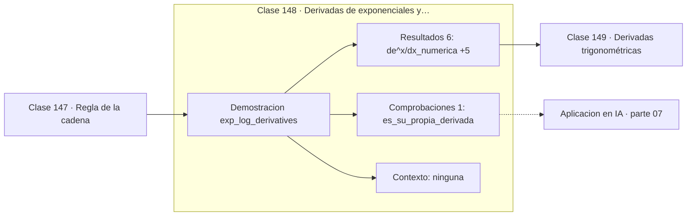

# 148 — Derivadas de exponenciales y logaritmos

> [⬅️ 147 Regla de la cadena](../147-regla-de-la-cadena/README.md) · [📚 Parte 07](../README.md) · [🏠 Programa](../../../README.md) · [149 Derivadas trigonométricas ➡️](../149-derivadas-trigonometricas/README.md)

**Parte:** 07 — Cálculo diferencial e integral · **Nivel:** `universitario` · **Horas estimadas:** 4
**Motor:** `engines.part07` · **Demostración:** `exp_log_derivatives` · **Clase 8 de 20** de la parte

---

## 🎯 Propósito

Límite, continuidad, derivada, reglas de derivación, Taylor, optimización de una variable, integral definida y teorema fundamental del cálculo.

Esta clase concreta ese objetivo sobre **Derivadas de exponenciales y logaritmos**: qué es, cómo se
calcula a mano, cómo se implementa sin ocultar el procedimiento y cómo se verifica
que el resultado es correcto y no solo plausible.

## ✅ Resultados de aprendizaje

Al terminar podrás:

1. Explicar **Derivadas de exponenciales y logaritmos** con lenguaje cotidiano y con notación matemática.
2. Resolver un caso pequeño a mano y anticipar el orden de magnitud del resultado.
3. Ejecutar y modificar `lab.py`, que corre la demostración `exp_log_derivatives`.
4. Interpretar las 7 salidas del laboratorio y decir qué comprueba cada una.
5. Detectar el error típico de esta parte: derivar en un punto donde la función no es continua.

## 🗺️ Ubicación en el programa



## 🧠 Idea rectora de la parte 07

> Taylor cambia una función difícil por un polinomio con error acotado.

## 🔬 Qué ejecuta el laboratorio

`exp_log_derivatives` — e^x es su propia derivada; log tiene derivada 1/x.

| Grupo | Salidas |
|---|---|
| 🔢 Resultados numéricos (6) | `d(e^x)/dx_numerica`, `e^x`, `d(ln x)/dx_numerica`, `1/x`, `d(a^x)/dx_con_a=3`, `a^x·ln(a)` |
| ✅ Comprobaciones de invariante (1) | `es_su_propia_derivada` |

Las claves booleanas no son adorno: si alguna fuera `False`, el resultado numérico
no sería fiable aunque el programa terminase sin error.

```bash
python classes/part-07-calculo-diferencial-e-integral/148-derivadas-de-exponenciales-y-logaritmos/lab.py
compmath run 148
```

> [!TIP]
> Antes de ejecutar, **escribe tu predicción**. Un laboratorio que confirma lo que
> esperabas enseña tanto como uno que te contradice, pero solo si la predicción
> existía antes del resultado.

## ⚠️ Errores frecuentes en esta parte

- Usar diferencias finitas con h demasiado pequeño y amplificar el error de redondeo.
- Derivar en un punto donde la función no es continua.
- Confundir punto crítico con extremo global.

## 🤖 Conexión con IA

Sin regla de la cadena no hay entrenamiento por gradiente; sin Taylor no hay métodos de segundo orden ni análisis de convergencia.

## 📓 Notebooks

| Archivo | Para qué |
|---|---|
| [`notebook.ipynb`](notebook.ipynb) | recorrido guiado con la demostración ejecutada |
| [`notebook_student.ipynb`](notebook_student.ipynb) | versión con `TODO` para resolver |
| [`notebook_solution.ipynb`](notebook_solution.ipynb) | solución de referencia verificada |

## 📝 Evaluación

| Criterio | Peso |
|---|---:|
| Comprensión conceptual | 25 % |
| Resolución manual | 25 % |
| Implementación y verificación | 25 % |
| Interpretación y comunicación | 15 % |
| Conexión con aplicación real | 10 % |

Detalle y criterios de error crítico en [`assessment.md`](assessment.md).

## ❓ Preguntas de comprobación

1. ¿Cuál es la entrada, cuál la salida y qué unidades tienen?
2. ¿Qué operación domina el comportamiento del resultado?
3. ¿Qué caso extremo revelaría un error conceptual?
4. ¿Cómo verificarías el resultado por un método independiente?
5. ¿Dónde aparece esto en física?

Si necesitas releer el código para responderlas, la clase todavía no está superada.

## 📥 Entregable

`notebook_student.ipynb` resuelto más un párrafo que explique el resultado **sin citar
código**: qué entra, qué sale, qué invariante se comprueba y qué pasaría en un caso límite.

## 🔗 Referencias

- Spivak, M. *Calculus*. 4ª ed., Publish or Perish, 2008.
- Apostol, T. *Calculus, Vol. 1*. 2ª ed., Wiley, 1967.
- Strang, G. *Calculus*. 3ª ed., Wellesley-Cambridge, 2017.

## 📂 Material de la clase

[`intuition.md`](intuition.md) · [`theory.md`](theory.md) · [`derivation.md`](derivation.md) · [`exercises.md`](exercises.md) · [`assessment.md`](assessment.md) · [`where-is-this-used.md`](where-is-this-used.md) · [`lesson.yaml`](lesson.yaml)

---

> [⬅️ 147 Regla de la cadena](../147-regla-de-la-cadena/README.md) · [📚 Parte 07](../README.md) · [🏠 Programa](../../../README.md) · [149 Derivadas trigonométricas ➡️](../149-derivadas-trigonometricas/README.md)
