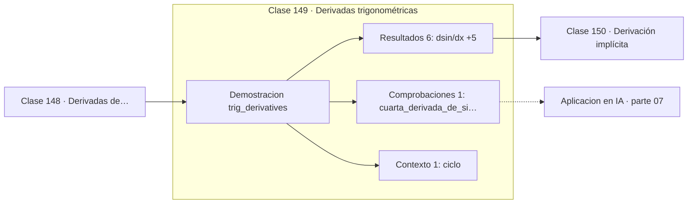

# 149 — Derivadas trigonométricas

> [⬅️ 148 Derivadas de exponenciales y logaritmos](../148-derivadas-de-exponenciales-y-logaritmos/README.md) · [📚 Parte 07](../README.md) · [🏠 Programa](../../../README.md) · [150 Derivación implícita ➡️](../150-derivacion-implicita/README.md)

**Parte:** 07 — Cálculo diferencial e integral · **Nivel:** `universitario` · **Horas estimadas:** 4
**Motor:** `engines.part07` · **Demostración:** `trig_derivatives` · **Clase 9 de 20** de la parte

---

## 🎯 Propósito

**Las derivadas trigonométricas forman un ciclo de periodo cuatro.**

Límite, continuidad, derivada, reglas de derivación, Taylor, optimización de una variable, integral definida y teorema fundamental del cálculo.

## ✅ Resultados de aprendizaje

Al terminar podrás:

1. Explicar **Derivadas trigonométricas** con lenguaje cotidiano y con notación matemática.
2. Resolver un caso pequeño a mano y anticipar el orden de magnitud del resultado.
3. Ejecutar y modificar `lab.py`, que corre la demostración `trig_derivatives`.
4. Interpretar las 8 salidas del laboratorio y decir qué comprueba cada una.
5. Detectar el error típico de esta parte: confundir punto crítico con extremo global.

## 🧩 Fórmulas de la clase

```text
(sin x)' = cos x
(cos x)' = −sin x
(tan x)' = sec²x = 1/cos²x
```

## 🗺️ Ubicación en el programa



## 📖 Fundamentos

Derivar el seno da el coseno, derivar el coseno da menos el seno, y repitiendo se vuelve
al principio tras cuatro pasos. Ese ciclo de periodo cuatro tiene una consecuencia
elegante: la cuarta derivada de `sin x` es `sin x`, igual que `e^x` es su propia primera
derivada.

Esa analogía no es casual. La fórmula de Euler, `e^(ix) = cos x + i·sin x`, unifica
ambas familias: las funciones trigonométricas son exponenciales de argumento imaginario.
Derivar `e^(ix)` multiplica por `i`, y multiplicar por `i` es girar 90° en el plano
complejo, que es exactamente el desplazamiento de fase entre seno y coseno.

El requisito ineludible es que el argumento esté en **radianes** (clase 062). En grados,
cada derivada arrastraría un factor `π/180`, y tras cuatro derivaciones el factor sería
`(π/180)⁴ ≈ 9·10⁻⁹`. Los errores de unidad angular no lanzan excepción: producen
resultados escalados por un factor que parece arbitrario.

La derivada de la tangente, `sec²x`, diverge donde el coseno se anula. Esa singularidad
es real y hay que manejarla: en robótica produce el «bloqueo de cardán», y en cualquier
cálculo con ángulos cerca de 90° conviene reformular usando seno y coseno directamente.

## 🧮 Ejemplo trabajado

El ciclo de derivadas en x = 0.7.

```text
d(sin)/dx  numérica = 0.764842   cos(0.7) = 0.764842    ✓
d(cos)/dx  numérica = −0.644218  −sin(0.7) = −0.644218  ✓
d(tan)/dx  numérica = 1.703879   sec²(0.7) = 1.703879   ✓

Ciclo:  sin → cos → −sin → −cos → sin
La cuarta derivada de sin es sin                        ✓

Requisito: argumento en RADIANES
```

## 🔬 Qué ejecuta el laboratorio

`trig_derivatives` — Derivadas trigonométricas y su ciclo de periodo 4.

| Grupo | Salidas |
|---|---|
| 🔢 Resultados numéricos (6) | `d(sin)/dx`, `cos(x)`, `d(cos)/dx`, `-sin(x)`, `d(tan)/dx`, `sec²(x)` |
| ✅ Comprobaciones de invariante (1) | `cuarta_derivada_de_sin_es_sin` |

Las claves booleanas no son adorno: si alguna fuera `False`, el resultado numérico
no sería fiable aunque el programa terminase sin error.

```bash
python classes/part-07-calculo-diferencial-e-integral/149-derivadas-trigonometricas/lab.py
compmath run 149
```

> [!TIP]
> Antes de ejecutar, **escribe tu predicción**. Un laboratorio que confirma lo que
> esperabas enseña tanto como uno que te contradice, pero solo si la predicción
> existía antes del resultado.

## ⚠️ Errores conceptuales frecuentes

1. Derivar funciones trigonométricas con el argumento en grados.
2. Olvidar el signo negativo en la derivada del coseno.
3. Evaluar la derivada de la tangente cerca de 90° sin controlar la singularidad.

## 🚀 Dónde se usa de verdad

Análisis de señales, positional encoding, oscilaciones y ondas, cinemática y cualquier
modelo periódico.

## 🤖 Conexión con IA

Sin regla de la cadena no hay entrenamiento por gradiente; sin Taylor no hay métodos de segundo orden ni análisis de convergencia.

## 📓 Notebooks

| Archivo | Para qué |
|---|---|
| [`notebook.ipynb`](notebook.ipynb) | recorrido guiado con la demostración ejecutada |
| [`notebook_student.ipynb`](notebook_student.ipynb) | versión con `TODO` para resolver |
| [`notebook_solution.ipynb`](notebook_solution.ipynb) | solución de referencia verificada |

## 📝 Evaluación

| Criterio | Peso |
|---|---:|
| Comprensión conceptual | 25 % |
| Resolución manual | 25 % |
| Implementación y verificación | 25 % |
| Interpretación y comunicación | 15 % |
| Conexión con aplicación real | 10 % |

Detalle y criterios de error crítico en [`assessment.md`](assessment.md).

## ❓ Preguntas de comprobación

1. ¿Cuál es la entrada, cuál la salida y qué unidades tienen?
2. ¿Qué operación domina el comportamiento del resultado?
3. ¿Qué caso extremo revelaría un error conceptual?
4. ¿Cómo verificarías el resultado por un método independiente?
5. ¿Dónde aparece esto en física?

Si necesitas releer el código para responderlas, la clase todavía no está superada.

## 📥 Entregable

`notebook_student.ipynb` resuelto más un párrafo que explique el resultado **sin citar
código**: qué entra, qué sale, qué invariante se comprueba y qué pasaría en un caso límite.

## 📚 Bibliografía de la clase

Esta clase enseña **Cálculo · Análisis matemático**. Cada obra dice qué aporta aquí y cómo se comprobó su localizador:

- [Spivak, M. *Calculus*, 4ª ed., 2008, cap. 15](https://www.mathpop.com/calculus) — Análisis matemático y Cálculo: el tema de esta clase · ISBN-13 `9780914098911` verificado en International ISBN Agency (2026-08-19).
- [Needham, T. *Visual Complex Analysis*. Oxford University Press, 1997](https://global.oup.com/academic/product/visual-complex-analysis-9780198534464) — Análisis matemático: el tema de esta clase · ISBN-13 `9780198534464` verificado en International ISBN Agency (2026-08-19).

Bibliografía de todas las clases, con el porqué de cada obra, en [`docs/BIBLIOGRAPHY.md`](../../../docs/BIBLIOGRAPHY.md) · localizador y estado de cada obra en [`sources/bibliography.json`](../../../sources/bibliography.json).

## 📂 Material de la clase

[`intuition.md`](intuition.md) · [`theory.md`](theory.md) · [`derivation.md`](derivation.md) · [`exercises.md`](exercises.md) · [`assessment.md`](assessment.md) · [`where-is-this-used.md`](where-is-this-used.md) · [`lesson.yaml`](lesson.yaml)

---

> [⬅️ 148 Derivadas de exponenciales y logaritmos](../148-derivadas-de-exponenciales-y-logaritmos/README.md) · [📚 Parte 07](../README.md) · [🏠 Programa](../../../README.md) · [150 Derivación implícita ➡️](../150-derivacion-implicita/README.md)
