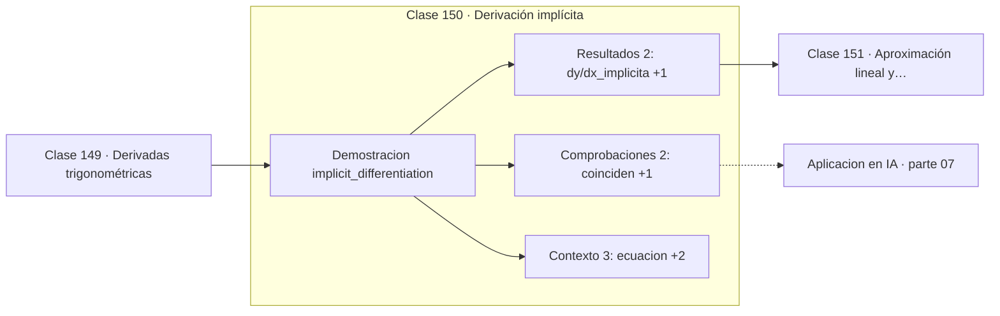

# 150 — Derivación implícita

> [⬅️ 149 Derivadas trigonométricas](../149-derivadas-trigonometricas/README.md) · [📚 Parte 07](../README.md) · [🏠 Programa](../../../README.md) · [151 Aproximación lineal y Taylor ➡️](../151-aproximacion-lineal-y-taylor/README.md)

**Parte:** 07 — Cálculo diferencial e integral · **Nivel:** `universitario` · **Horas estimadas:** 4
**Motor:** `engines.part07` · **Demostración:** `implicit_differentiation` · **Clase 10 de 20** de la parte

---

## 🎯 Propósito

**La derivación implícita permite derivar una relación sin despejar una variable en función de la otra.**

Límite, continuidad, derivada, reglas de derivación, Taylor, optimización de una variable, integral definida y teorema fundamental del cálculo.

## ✅ Resultados de aprendizaje

Al terminar podrás:

1. Explicar **Derivación implícita** con lenguaje cotidiano y con notación matemática.
2. Resolver un caso pequeño a mano y anticipar el orden de magnitud del resultado.
3. Ejecutar y modificar `lab.py`, que corre la demostración `implicit_differentiation`.
4. Interpretar las 7 salidas del laboratorio y decir qué comprueba cada una.
5. Detectar el error típico de esta parte: usar diferencias finitas con h demasiado pequeño y amplificar el error de redondeo.

## 🧩 Fórmulas de la clase

```text
x² + y² = r²  ⟹  dy/dx = −x/y
derivar ambos lados tratando y como función de x
```

## 🗺️ Ubicación en el programa



## 📖 Fundamentos

No toda relación entre `x` e `y` se puede despejar. `x² + y² = 25` define una
circunferencia, y despejar `y` obliga a elegir una de las dos ramas. La derivación
implícita evita el problema: se deriva la ecuación entera respecto a `x`, tratando `y`
como función de `x` y aplicando la regla de la cadena a cada término que la contenga.

Del término `y²` sale `2y·(dy/dx)`, y de ahí se despeja `dy/dx`. El resultado, `−x/y`,
depende de ambas coordenadas, lo que es coherente: la pendiente de la tangente a una
circunferencia depende de en qué punto se esté.

La verificación geométrica es bonita: la tangente a una circunferencia es perpendicular
al radio en ese punto. La pendiente del radio es `y/x` y la de la tangente es `−x/y`, y
su producto es −1, que es exactamente la condición de perpendicularidad de la clase 069.
El laboratorio comprueba esa relación.

La técnica se generaliza al caso multivariable como el teorema de la función implícita,
y aparece en machine learning en la **diferenciación implícita** de capas definidas como
la solución de un problema de optimización —modelos de equilibrio profundo, capas de
optimización diferenciables—, donde no hay fórmula explícita que derivar.

## 🧮 Ejemplo trabajado

Tangente a la circunferencia de radio 5 en (3,4).

```text
x² + y² = 25

Derivar: 2x + 2y·(dy/dx) = 0
Despejar: dy/dx = −x/y = −3/4 = −0.75

Verificación numérica con y = √(25−x²):
  dy/dx en x=3 → −0.750000                  ✓

Recta tangente: y − 4 = −0.75(x − 3)

Perpendicularidad con el radio:
  pendiente del radio = 4/3
  (−3/4)·(4/3) = −1                         ✓
```

## 🔬 Qué ejecuta el laboratorio

`implicit_differentiation` — Derivación implícita sobre la circunferencia x²+y²=25.

| Grupo | Salidas |
|---|---|
| 🔢 Resultados numéricos (2) | `dy/dx_implicita`, `dy/dx_numerica` |
| ✅ Comprobaciones de invariante (2) | `coinciden`, `tangente_perpendicular_al_radio` |

Las claves booleanas no son adorno: si alguna fuera `False`, el resultado numérico
no sería fiable aunque el programa terminase sin error.

```bash
python classes/part-07-calculo-diferencial-e-integral/150-derivacion-implicita/lab.py
compmath run 150
```

> [!TIP]
> Antes de ejecutar, **escribe tu predicción**. Un laboratorio que confirma lo que
> esperabas enseña tanto como uno que te contradice, pero solo si la predicción
> existía antes del resultado.

## ⚠️ Errores conceptuales frecuentes

1. Olvidar multiplicar por dy/dx al derivar términos que contienen y.
2. Despejar y antes de derivar cuando la relación no es una función.
3. Evaluar dy/dx en un punto donde y = 0: la tangente es vertical.

## 🚀 Dónde se usa de verdad

Curvas definidas implícitamente, teorema de la función implícita, capas de optimización
diferenciables y modelos de equilibrio profundo.

## 🤖 Conexión con IA

Sin regla de la cadena no hay entrenamiento por gradiente; sin Taylor no hay métodos de segundo orden ni análisis de convergencia.

## 📓 Notebooks

| Archivo | Para qué |
|---|---|
| [`notebook.ipynb`](notebook.ipynb) | recorrido guiado con la demostración ejecutada |
| [`notebook_student.ipynb`](notebook_student.ipynb) | versión con `TODO` para resolver |
| [`notebook_solution.ipynb`](notebook_solution.ipynb) | solución de referencia verificada |

## 📝 Evaluación

| Criterio | Peso |
|---|---:|
| Comprensión conceptual | 25 % |
| Resolución manual | 25 % |
| Implementación y verificación | 25 % |
| Interpretación y comunicación | 15 % |
| Conexión con aplicación real | 10 % |

Detalle y criterios de error crítico en [`assessment.md`](assessment.md).

## ❓ Preguntas de comprobación

1. ¿Cuál es la entrada, cuál la salida y qué unidades tienen?
2. ¿Qué operación domina el comportamiento del resultado?
3. ¿Qué caso extremo revelaría un error conceptual?
4. ¿Cómo verificarías el resultado por un método independiente?
5. ¿Dónde aparece esto en física?

Si necesitas releer el código para responderlas, la clase todavía no está superada.

## 📥 Entregable

`notebook_student.ipynb` resuelto más un párrafo que explique el resultado **sin citar
código**: qué entra, qué sale, qué invariante se comprueba y qué pasaría en un caso límite.

## 📚 Bibliografía de la clase

Esta clase enseña **Cálculo · Análisis matemático**. Cada obra dice qué aporta aquí y cómo se comprobó su localizador:

- [Spivak, M. *Calculus*, 4ª ed., 2008](https://www.mathpop.com/calculus) — Análisis matemático y Cálculo: el tema de esta clase · ISBN-13 `9780914098911` verificado en International ISBN Agency (2026-08-19).
- [Bai, Kolter & Koltun. *Deep Equilibrium Models*. NeurIPS, 2019](https://arxiv.org/abs/1909.01377) — Deep learning y Ecuaciones diferenciales: conexión declarada de esta parte · DOI `10.48550/arxiv.1909.01377` verificado en DataCite (2026-08-19).

Bibliografía de todas las clases, con el porqué de cada obra, en [`docs/BIBLIOGRAPHY.md`](../../../docs/BIBLIOGRAPHY.md) · localizador y estado de cada obra en [`sources/bibliography.json`](../../../sources/bibliography.json).

## 📂 Material de la clase

[`intuition.md`](intuition.md) · [`theory.md`](theory.md) · [`derivation.md`](derivation.md) · [`exercises.md`](exercises.md) · [`assessment.md`](assessment.md) · [`where-is-this-used.md`](where-is-this-used.md) · [`lesson.yaml`](lesson.yaml)

---

> [⬅️ 149 Derivadas trigonométricas](../149-derivadas-trigonometricas/README.md) · [📚 Parte 07](../README.md) · [🏠 Programa](../../../README.md) · [151 Aproximación lineal y Taylor ➡️](../151-aproximacion-lineal-y-taylor/README.md)
