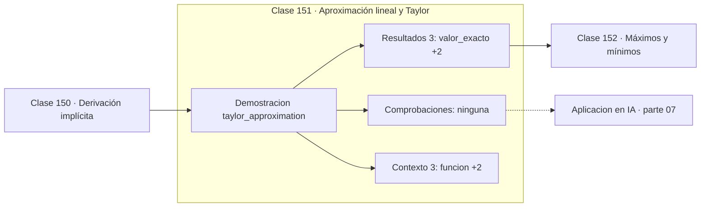

# 151 — Aproximación lineal y Taylor

> [⬅️ 150 Derivación implícita](../150-derivacion-implicita/README.md) · [📚 Parte 07](../README.md) · [🏠 Programa](../../../README.md) · [152 Máximos y mínimos ➡️](../152-maximos-y-minimos/README.md)

**Parte:** 07 — Cálculo diferencial e integral · **Nivel:** `universitario` · **Horas estimadas:** 4
**Motor:** `engines.part07` · **Demostración:** `taylor_approximation` · **Clase 11 de 20** de la parte

---

## 🎯 Propósito

**Taylor cambia una función difícil por un polinomio con error acotado por el primer término omitido.**

Límite, continuidad, derivada, reglas de derivación, Taylor, optimización de una variable, integral definida y teorema fundamental del cálculo.

## ✅ Resultados de aprendizaje

Al terminar podrás:

1. Explicar **Aproximación lineal y Taylor** con lenguaje cotidiano y con notación matemática.
2. Resolver un caso pequeño a mano y anticipar el orden de magnitud del resultado.
3. Ejecutar y modificar `lab.py`, que corre la demostración `taylor_approximation`.
4. Interpretar las 6 salidas del laboratorio y decir qué comprueba cada una.
5. Detectar el error típico de esta parte: derivar en un punto donde la función no es continua.

## 🧩 Fórmulas de la clase

```text
f(x) ≈ Σ f⁽ⁿ⁾(a)(x−a)ⁿ/n!
error del grado n ≤ máx|f⁽ⁿ⁺¹⁾|·|x−a|ⁿ⁺¹/(n+1)!
aproximación lineal: f(a) + f'(a)(x−a)
```

## 🗺️ Ubicación en el programa



## 📖 Fundamentos

La serie de Taylor aproxima una función por un polinomio construido con sus derivadas en
un punto. El grado 1 es la recta tangente; el grado 2 añade curvatura; cada grado
adicional captura más estructura local. Y lo más útil: el error está **acotado**, no
solo es «pequeño».

Esa cota es lo que convierte la aproximación en una herramienta rigurosa. Saber que el
error del polinomio de grado n no supera `máx|f⁽ⁿ⁺¹⁾|·|x−a|ⁿ⁺¹/(n+1)!` permite decidir
cuántos términos hacen falta para una precisión dada, en lugar de añadir términos hasta
que «parezca suficiente».

Taylor es el motor de buena parte del análisis numérico. El orden de error de la
diferencia central (clase 144), el de la regla del trapecio (clase 229) y el del método
de Euler (clase 236) se deducen todos truncando un desarrollo de Taylor y contando
potencias de `h`. Cuando la parte 11 diga «error O(h²)», estará diciendo «el desarrollo
de Taylor se truncó tras el término lineal».

En optimización, el desarrollo de segundo orden es lo que da el método de Newton: se
aproxima la función por una parábola y se salta a su vértice. Y en machine learning, la
linealización de primer orden es la que justifica que un paso pequeño en dirección
contraria al gradiente reduzca la función.

## 🧮 Ejemplo trabajado

Aproximar e^0.5 con polinomios de grado creciente.

```text
valor exacto: 1.6487212707

grado  aproximación      error
  0    1.0000000000      6.49e−01
  1    1.5000000000      1.49e−01
  2    1.6250000000      2.37e−02
  3    1.6458333333      2.89e−03
  4    1.6484375000      2.84e−04
  5    1.6486979167      2.34e−05

Cota teórica del error de grado 5:
  e^0.5 · 0.5⁶/6! = 3.58e−05      ✓ acota el error real
```

## 🔬 Qué ejecuta el laboratorio

`taylor_approximation` — Taylor de e^x en 0: el error cae con el grado.

| Grupo | Salidas |
|---|---|
| 🔢 Resultados numéricos (3) | `valor_exacto`, `aproximacion_lineal`, `cota_de_error_grado_5` |
| ✅ Comprobaciones de invariante (0) | — |

Las claves booleanas no son adorno: si alguna fuera `False`, el resultado numérico
no sería fiable aunque el programa terminase sin error.

```bash
python classes/part-07-calculo-diferencial-e-integral/151-aproximacion-lineal-y-taylor/lab.py
compmath run 151
```

> [!TIP]
> Antes de ejecutar, **escribe tu predicción**. Un laboratorio que confirma lo que
> esperabas enseña tanto como uno que te contradice, pero solo si la predicción
> existía antes del resultado.

## ⚠️ Errores conceptuales frecuentes

1. Usar Taylor lejos del punto de desarrollo sin comprobar la cota de error.
2. Suponer que añadir términos siempre mejora: fuera del radio de convergencia, empeora.
3. Olvidar el factorial en el denominador.

## 🚀 Dónde se usa de verdad

Métodos numéricos y sus órdenes de error, método de Newton, linealización de modelos,
análisis de convergencia y funciones especiales en bibliotecas matemáticas.

## 🤖 Conexión con IA

Sin regla de la cadena no hay entrenamiento por gradiente; sin Taylor no hay métodos de segundo orden ni análisis de convergencia.

## 📓 Notebooks

| Archivo | Para qué |
|---|---|
| [`notebook.ipynb`](notebook.ipynb) | recorrido guiado con la demostración ejecutada |
| [`notebook_student.ipynb`](notebook_student.ipynb) | versión con `TODO` para resolver |
| [`notebook_solution.ipynb`](notebook_solution.ipynb) | solución de referencia verificada |

## 📝 Evaluación

| Criterio | Peso |
|---|---:|
| Comprensión conceptual | 25 % |
| Resolución manual | 25 % |
| Implementación y verificación | 25 % |
| Interpretación y comunicación | 15 % |
| Conexión con aplicación real | 10 % |

Detalle y criterios de error crítico en [`assessment.md`](assessment.md).

## ❓ Preguntas de comprobación

1. ¿Cuál es la entrada, cuál la salida y qué unidades tienen?
2. ¿Qué operación domina el comportamiento del resultado?
3. ¿Qué caso extremo revelaría un error conceptual?
4. ¿Cómo verificarías el resultado por un método independiente?
5. ¿Dónde aparece esto en física?

Si necesitas releer el código para responderlas, la clase todavía no está superada.

## 📥 Entregable

`notebook_student.ipynb` resuelto más un párrafo que explique el resultado **sin citar
código**: qué entra, qué sale, qué invariante se comprueba y qué pasaría en un caso límite.

## 🔗 Referencias

- [Spivak, M. *Calculus*, 4ª ed., 2008, cap. 20](https://www.mathpop.com/calculus) — *uso:* exposición alternativa del tema en «Aproximación lineal y Taylor».
- [Nocedal & Wright. *Numerical Optimization*, 2ª ed., Springer, 2006](https://link.springer.com/book/10.1007/978-0-387-40065-5) — *uso:* desarrollo formal del tema en «Aproximación lineal y Taylor».

Bibliografía completa de la parte en [`../../../docs/BIBLIOGRAPHY.md`](../../../docs/BIBLIOGRAPHY.md) · localizador verificable de cada obra en [`sources/bibliography.json`](../../../sources/bibliography.json).

## 📂 Material de la clase

[`intuition.md`](intuition.md) · [`theory.md`](theory.md) · [`derivation.md`](derivation.md) · [`exercises.md`](exercises.md) · [`assessment.md`](assessment.md) · [`where-is-this-used.md`](where-is-this-used.md) · [`lesson.yaml`](lesson.yaml)

---

> [⬅️ 150 Derivación implícita](../150-derivacion-implicita/README.md) · [📚 Parte 07](../README.md) · [🏠 Programa](../../../README.md) · [152 Máximos y mínimos ➡️](../152-maximos-y-minimos/README.md)
