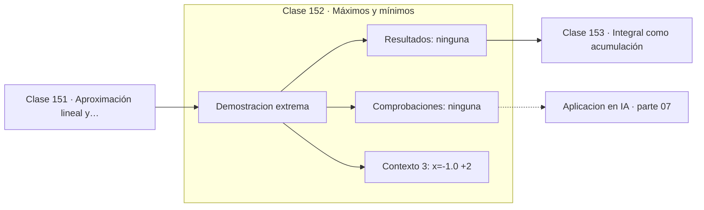

# 152 — Máximos y mínimos

> [⬅️ 151 Aproximación lineal y Taylor](../151-aproximacion-lineal-y-taylor/README.md) · [📚 Parte 07](../README.md) · [🏠 Programa](../../../README.md) · [153 Integral como acumulación ➡️](../153-integral-como-acumulacion/README.md)

**Parte:** 07 — Cálculo diferencial e integral · **Nivel:** `universitario` · **Horas estimadas:** 4
**Motor:** `engines.part07` · **Demostración:** `extrema` · **Clase 12 de 20** de la parte

---

## 🎯 Propósito

**La derivada nula señala un punto crítico; el signo de la segunda derivada decide de qué tipo es.**

Límite, continuidad, derivada, reglas de derivación, Taylor, optimización de una variable, integral definida y teorema fundamental del cálculo.

## ✅ Resultados de aprendizaje

Al terminar podrás:

1. Explicar **Máximos y mínimos** con lenguaje cotidiano y con notación matemática.
2. Resolver un caso pequeño a mano y anticipar el orden de magnitud del resultado.
3. Ejecutar y modificar `lab.py`, que corre la demostración `extrema`.
4. Interpretar las 3 salidas del laboratorio y decir qué comprueba cada una.
5. Detectar el error típico de esta parte: confundir punto crítico con extremo global.

## 🧩 Fórmulas de la clase

```text
condición de primer orden: f'(x) = 0
f''(x) > 0 ⟹ mínimo local; f''(x) < 0 ⟹ máximo local
f''(x) = 0 ⟹ el criterio no decide
```

## 🗺️ Ubicación en el programa



## 📖 Fundamentos

Los extremos locales de una función derivable ocurren donde la derivada se anula, porque
en un máximo o un mínimo la tangente es horizontal. Esa es la **condición de primer
orden**, y es necesaria pero no suficiente: `x³` tiene derivada nula en cero y no tiene
ahí ni máximo ni mínimo.

La segunda derivada resuelve la ambigüedad en la mayoría de los casos: positiva indica
que la función se curva hacia arriba (mínimo) y negativa que se curva hacia abajo
(máximo). Cuando vale cero, el criterio no decide y hay que examinar derivadas superiores
o el comportamiento a ambos lados.

Un punto crítico es **local**, no global. Encontrar todos los mínimos locales de una
función arbitraria es un problema difícil, y esa dificultad es exactamente la que hace
que el entrenamiento de redes neuronales sea un problema no convexo. En una función
convexa (clase 242), todo mínimo local es global y el problema se simplifica
radicalmente.

La generalización a varias variables sustituye `f' = 0` por `∇f = 0` y el signo de `f''`
por el carácter definido positivo del Hessiano (clase 169). La lógica no cambia: primera
derivada para localizar, segunda para clasificar.

## 🧮 Ejemplo trabajado

Puntos críticos de x³ − 3x.

```text
f(x) = x³ − 3x,   f'(x) = 3x² − 3

f'(x) = 0  →  x = ±1

x = −1:  f = 2,   f'' = 6x = −6 < 0  →  MÁXIMO local
x =  1:  f = −2,  f'' = 6  > 0       →  MÍNIMO local

Extremos globales en ℝ: no existen
  f no está acotada: f(x) → ±∞
```

## 🔬 Qué ejecuta el laboratorio

`extrema` — Máximos y mínimos por derivada y criterio de la segunda derivada.

| Grupo | Salidas |
|---|---|
| 🔢 Resultados numéricos (0) | — |
| ✅ Comprobaciones de invariante (0) | — |

Las claves booleanas no son adorno: si alguna fuera `False`, el resultado numérico
no sería fiable aunque el programa terminase sin error.

```bash
python classes/part-07-calculo-diferencial-e-integral/152-maximos-y-minimos/lab.py
compmath run 152
```

> [!TIP]
> Antes de ejecutar, **escribe tu predicción**. Un laboratorio que confirma lo que
> esperabas enseña tanto como uno que te contradice, pero solo si la predicción
> existía antes del resultado.

## ⚠️ Errores conceptuales frecuentes

1. Confundir punto crítico con extremo.
2. Olvidar comprobar la frontera del dominio al buscar extremos globales.
3. Concluir cuando f'' = 0 en lugar de examinar el entorno.

## 🚀 Dónde se usa de verdad

Optimización de una variable, condición de primer orden en la parte 12, ajuste de
hiperparámetros y análisis de curvas de aprendizaje.

## 🤖 Conexión con IA

Sin regla de la cadena no hay entrenamiento por gradiente; sin Taylor no hay métodos de segundo orden ni análisis de convergencia.

## 📓 Notebooks

| Archivo | Para qué |
|---|---|
| [`notebook.ipynb`](notebook.ipynb) | recorrido guiado con la demostración ejecutada |
| [`notebook_student.ipynb`](notebook_student.ipynb) | versión con `TODO` para resolver |
| [`notebook_solution.ipynb`](notebook_solution.ipynb) | solución de referencia verificada |

## 📝 Evaluación

| Criterio | Peso |
|---|---:|
| Comprensión conceptual | 25 % |
| Resolución manual | 25 % |
| Implementación y verificación | 25 % |
| Interpretación y comunicación | 15 % |
| Conexión con aplicación real | 10 % |

Detalle y criterios de error crítico en [`assessment.md`](assessment.md).

## ❓ Preguntas de comprobación

1. ¿Cuál es la entrada, cuál la salida y qué unidades tienen?
2. ¿Qué operación domina el comportamiento del resultado?
3. ¿Qué caso extremo revelaría un error conceptual?
4. ¿Cómo verificarías el resultado por un método independiente?
5. ¿Dónde aparece esto en física?

Si necesitas releer el código para responderlas, la clase todavía no está superada.

## 📥 Entregable

`notebook_student.ipynb` resuelto más un párrafo que explique el resultado **sin citar
código**: qué entra, qué sale, qué invariante se comprueba y qué pasaría en un caso límite.

## 🔗 Referencias

- [Nocedal & Wright. *Numerical Optimization*, 2ª ed., Springer, 2006, cap. 2](https://link.springer.com/book/10.1007/978-0-387-40065-5) — *uso:* desarrollo formal del tema en «Máximos y mínimos».
- [Spivak, M. *Calculus*, 4ª ed., 2008, cap. 11](https://www.mathpop.com/calculus) — *uso:* exposición alternativa del tema en «Máximos y mínimos».

Bibliografía completa de la parte en [`../../../docs/BIBLIOGRAPHY.md`](../../../docs/BIBLIOGRAPHY.md) · localizador verificable de cada obra en [`sources/bibliography.json`](../../../sources/bibliography.json).

## 📂 Material de la clase

[`intuition.md`](intuition.md) · [`theory.md`](theory.md) · [`derivation.md`](derivation.md) · [`exercises.md`](exercises.md) · [`assessment.md`](assessment.md) · [`where-is-this-used.md`](where-is-this-used.md) · [`lesson.yaml`](lesson.yaml)

---

> [⬅️ 151 Aproximación lineal y Taylor](../151-aproximacion-lineal-y-taylor/README.md) · [📚 Parte 07](../README.md) · [🏠 Programa](../../../README.md) · [153 Integral como acumulación ➡️](../153-integral-como-acumulacion/README.md)
