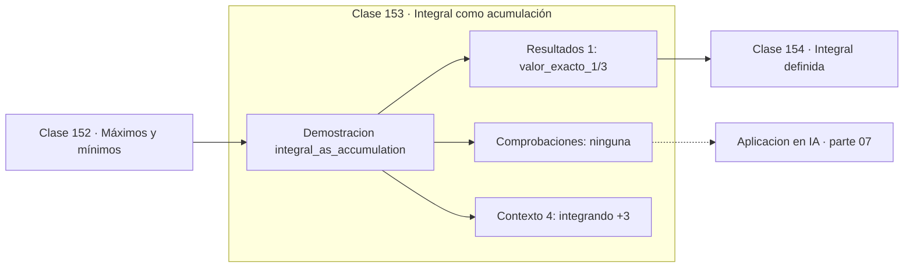

# 153 — Integral como acumulación

> [⬅️ 152 Máximos y mínimos](../152-maximos-y-minimos/README.md) · [📚 Parte 07](../README.md) · [🏠 Programa](../../../README.md) · [154 Integral definida ➡️](../154-integral-definida/README.md)

**Parte:** 07 — Cálculo diferencial e integral · **Nivel:** `universitario` · **Horas estimadas:** 4
**Motor:** `engines.part07` · **Demostración:** `integral_as_accumulation` · **Clase 13 de 20** de la parte

---

## 🎯 Propósito

**La integral es el límite de sumas de rectángulos, y la regla del punto medio converge como O(h²).**

Límite, continuidad, derivada, reglas de derivación, Taylor, optimización de una variable, integral definida y teorema fundamental del cálculo.

## ✅ Resultados de aprendizaje

Al terminar podrás:

1. Explicar **Integral como acumulación** con lenguaje cotidiano y con notación matemática.
2. Resolver un caso pequeño a mano y anticipar el orden de magnitud del resultado.
3. Ejecutar y modificar `lab.py`, que corre la demostración `integral_as_accumulation`.
4. Interpretar las 5 salidas del laboratorio y decir qué comprueba cada una.
5. Detectar el error típico de esta parte: usar diferencias finitas con h demasiado pequeño y amplificar el error de redondeo.

## 🧩 Fórmulas de la clase

```text
∫f ≈ Σ f(xᵢ*)·Δx
punto medio: error O(h²)
```

## 🗺️ Ubicación en el programa



## 📖 Fundamentos

Integrar es acumular. La suma de Riemann aproxima el área bajo una curva con rectángulos,
y al refinar la partición esa suma converge a la integral. La definición formal exige que
el límite sea el mismo independientemente de cómo se elija el punto de evaluación dentro
de cada subintervalo, y esa independencia es lo que define a las funciones integrables.

La **elección del punto** afecta a la velocidad de convergencia aunque no al límite.
Evaluar en el extremo izquierdo o derecho da error `O(h)`; evaluar en el **punto medio**
da `O(h²)`, porque los errores por exceso y por defecto se compensan en cada
subintervalo. Es una mejora gratuita: el mismo número de evaluaciones, un orden más de
precisión.

Esa cancelación por simetría es la misma idea que hace superior la diferencia central
(clase 144). Aparece una y otra vez en análisis numérico: **aprovechar la simetría para
cancelar términos de error de orden impar**.

Riemann formalizó esta construcción en 1854. Lebesgue la generalizó en 1902 con una
integral que maneja funciones mucho más patológicas y que es la base de la teoría de la
probabilidad moderna. Para las funciones de este programa, ambas coinciden.

## 🧮 Ejemplo trabajado

Integrar x² en [0,1] por punto medio.

```text
valor exacto: 1/3 = 0.333333...

n      suma           error
4      0.33203125     1.30e−03
16     0.33325195     8.14e−05
64     0.33333206     5.09e−06
256    0.33333333     3.18e−07

Al cuadruplicar n, el error se divide por 16 → O(h²)   ✓
```

## 🔬 Qué ejecuta el laboratorio

`integral_as_accumulation` — Sumas de Riemann convergiendo a la integral.

| Grupo | Salidas |
|---|---|
| 🔢 Resultados numéricos (1) | `valor_exacto_1/3` |
| ✅ Comprobaciones de invariante (0) | — |

Las claves booleanas no son adorno: si alguna fuera `False`, el resultado numérico
no sería fiable aunque el programa terminase sin error.

```bash
python classes/part-07-calculo-diferencial-e-integral/153-integral-como-acumulacion/lab.py
compmath run 153
```

> [!TIP]
> Antes de ejecutar, **escribe tu predicción**. Un laboratorio que confirma lo que
> esperabas enseña tanto como uno que te contradice, pero solo si la predicción
> existía antes del resultado.

## ⚠️ Errores conceptuales frecuentes

1. Usar el extremo del intervalo cuando el punto medio cuesta lo mismo y converge mejor.
2. Suponer que más subintervalos siempre mejoran: el error de redondeo acaba dominando.
3. Aplicar sumas de Riemann a funciones con singularidades sin tratarlas.

## 🚀 Dónde se usa de verdad

Cuadratura numérica, cálculo de probabilidades por integración, acumulación de señales y
cualquier magnitud que se obtenga sumando contribuciones infinitesimales.

## 🤖 Conexión con IA

Sin regla de la cadena no hay entrenamiento por gradiente; sin Taylor no hay métodos de segundo orden ni análisis de convergencia.

## 📓 Notebooks

| Archivo | Para qué |
|---|---|
| [`notebook.ipynb`](notebook.ipynb) | recorrido guiado con la demostración ejecutada |
| [`notebook_student.ipynb`](notebook_student.ipynb) | versión con `TODO` para resolver |
| [`notebook_solution.ipynb`](notebook_solution.ipynb) | solución de referencia verificada |

## 📝 Evaluación

| Criterio | Peso |
|---|---:|
| Comprensión conceptual | 25 % |
| Resolución manual | 25 % |
| Implementación y verificación | 25 % |
| Interpretación y comunicación | 15 % |
| Conexión con aplicación real | 10 % |

Detalle y criterios de error crítico en [`assessment.md`](assessment.md).

## ❓ Preguntas de comprobación

1. ¿Cuál es la entrada, cuál la salida y qué unidades tienen?
2. ¿Qué operación domina el comportamiento del resultado?
3. ¿Qué caso extremo revelaría un error conceptual?
4. ¿Cómo verificarías el resultado por un método independiente?
5. ¿Dónde aparece esto en física?

Si necesitas releer el código para responderlas, la clase todavía no está superada.

## 📥 Entregable

`notebook_student.ipynb` resuelto más un párrafo que explique el resultado **sin citar
código**: qué entra, qué sale, qué invariante se comprueba y qué pasaría en un caso límite.

## 🔗 Referencias

- [Apostol, T. *Calculus*, vol. 1, 2ª ed., Wiley, 1967](https://www.wiley.com/en-us/Calculus%2C+Volume+1%2C+2nd+Edition-p-9780471000051) — *uso:* desarrollo formal del tema en «Integral como acumulación».
- [Press, W. et al. *Numerical Recipes*, 3ª ed., Cambridge, 2007, cap. 4](https://numerical.recipes/) — *uso:* obra de referencia consultada en «Integral como acumulación».

Bibliografía completa de la parte en [`../../../docs/BIBLIOGRAPHY.md`](../../../docs/BIBLIOGRAPHY.md) · localizador verificable de cada obra en [`sources/bibliography.json`](../../../sources/bibliography.json).

## 📂 Material de la clase

[`intuition.md`](intuition.md) · [`theory.md`](theory.md) · [`derivation.md`](derivation.md) · [`exercises.md`](exercises.md) · [`assessment.md`](assessment.md) · [`where-is-this-used.md`](where-is-this-used.md) · [`lesson.yaml`](lesson.yaml)

---

> [⬅️ 152 Máximos y mínimos](../152-maximos-y-minimos/README.md) · [📚 Parte 07](../README.md) · [🏠 Programa](../../../README.md) · [154 Integral definida ➡️](../154-integral-definida/README.md)
