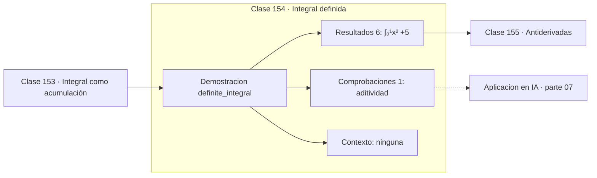

# 154 — Integral definida

> [⬅️ 153 Integral como acumulación](../153-integral-como-acumulacion/README.md) · [📚 Parte 07](../README.md) · [🏠 Programa](../../../README.md) · [155 Antiderivadas ➡️](../155-antiderivadas/README.md)

**Parte:** 07 — Cálculo diferencial e integral · **Nivel:** `universitario` · **Horas estimadas:** 4
**Motor:** `engines.part07` · **Demostración:** `definite_integral` · **Clase 14 de 20** de la parte

---

## 🎯 Propósito

**La integral definida es aditiva en el intervalo y cambia de signo al invertir la orientación.**

Límite, continuidad, derivada, reglas de derivación, Taylor, optimización de una variable, integral definida y teorema fundamental del cálculo.

## ✅ Resultados de aprendizaje

Al terminar podrás:

1. Explicar **Integral definida** con lenguaje cotidiano y con notación matemática.
2. Resolver un caso pequeño a mano y anticipar el orden de magnitud del resultado.
3. Ejecutar y modificar `lab.py`, que corre la demostración `definite_integral`.
4. Interpretar las 7 salidas del laboratorio y decir qué comprueba cada una.
5. Detectar el error típico de esta parte: derivar en un punto donde la función no es continua.

## 🧩 Fórmulas de la clase

```text
∫ₐᵇ + ∫_b^c = ∫ₐ^c
∫ₐᵇ = −∫_bₐ
valor medio = (1/(b−a))·∫ₐᵇ f
```

## 🗺️ Ubicación en el programa



## 📖 Fundamentos

La integral definida representa el área con **signo**: las regiones bajo el eje cuentan
negativo. Esa convención es la que permite que la integral de una función que oscila
alrededor de cero sea pequeña, y es la que hace consistente el teorema fundamental.

Las propiedades estructurales son tres. La **aditividad** en el intervalo permite partir
un dominio en trozos y sumar. La **orientación** invierte el signo al intercambiar los
límites, lo que hace que `∫ₐᵃ = 0` sea consistente. Y la **linealidad** permite integrar
término a término, igual que se derivaba.

El **valor medio** de una función en un intervalo es su integral dividida por la
longitud, y es la altura del rectángulo con la misma área. El teorema del valor medio
integral garantiza que la función alcanza ese valor en algún punto del intervalo, si es
continua.

Esa noción es la que conecta con probabilidad: la esperanza de una variable aleatoria
continua es la integral de `x·f(x)`, es decir, un promedio ponderado por la densidad. Y
es la que aparece en machine learning como el promedio de una pérdida sobre una
distribución, que en la práctica se estima con Monte Carlo (clase 198).

## 🧮 Ejemplo trabajado

Propiedades de la integral de x².

```text
∫₀¹ x² = 0.333333
∫₁² x² = 2.333333
∫₀² x² = 2.666667

Aditividad: 0.333333 + 2.333333 = 2.666667      ✓

Orientación: ∫₁⁰ x² = −0.333333                 ✓
Intervalo nulo: ∫₀⁰ x² = 0                      ✓

Valor medio en [0,2]: 2.666667/2 = 1.333333
```

## 🔬 Qué ejecuta el laboratorio

`definite_integral` — Propiedades de la integral definida.

| Grupo | Salidas |
|---|---|
| 🔢 Resultados numéricos (6) | `∫₀¹x²`, `∫₁²x²`, `∫₀²x²`, `∫₁⁰x² (orientación)`, `∫₀⁰x²`, `valor_medio_en_[0,2]` |
| ✅ Comprobaciones de invariante (1) | `aditividad` |

Las claves booleanas no son adorno: si alguna fuera `False`, el resultado numérico
no sería fiable aunque el programa terminase sin error.

```bash
python classes/part-07-calculo-diferencial-e-integral/154-integral-definida/lab.py
compmath run 154
```

> [!TIP]
> Antes de ejecutar, **escribe tu predicción**. Un laboratorio que confirma lo que
> esperabas enseña tanto como uno que te contradice, pero solo si la predicción
> existía antes del resultado.

## ⚠️ Errores conceptuales frecuentes

1. Olvidar el signo al intercambiar los límites de integración.
2. Interpretar la integral como área geométrica cuando la función toma valores negativos.
3. Confundir el valor medio de la función con la media de sus valores en unos puntos.

## 🚀 Dónde se usa de verdad

Esperanza de variables continuas, trabajo y energía en física, acumulación de métricas y
área bajo la curva ROC.

## 🤖 Conexión con IA

Sin regla de la cadena no hay entrenamiento por gradiente; sin Taylor no hay métodos de segundo orden ni análisis de convergencia.

## 📓 Notebooks

| Archivo | Para qué |
|---|---|
| [`notebook.ipynb`](notebook.ipynb) | recorrido guiado con la demostración ejecutada |
| [`notebook_student.ipynb`](notebook_student.ipynb) | versión con `TODO` para resolver |
| [`notebook_solution.ipynb`](notebook_solution.ipynb) | solución de referencia verificada |

## 📝 Evaluación

| Criterio | Peso |
|---|---:|
| Comprensión conceptual | 25 % |
| Resolución manual | 25 % |
| Implementación y verificación | 25 % |
| Interpretación y comunicación | 15 % |
| Conexión con aplicación real | 10 % |

Detalle y criterios de error crítico en [`assessment.md`](assessment.md).

## ❓ Preguntas de comprobación

1. ¿Cuál es la entrada, cuál la salida y qué unidades tienen?
2. ¿Qué operación domina el comportamiento del resultado?
3. ¿Qué caso extremo revelaría un error conceptual?
4. ¿Cómo verificarías el resultado por un método independiente?
5. ¿Dónde aparece esto en física?

Si necesitas releer el código para responderlas, la clase todavía no está superada.

## 📥 Entregable

`notebook_student.ipynb` resuelto más un párrafo que explique el resultado **sin citar
código**: qué entra, qué sale, qué invariante se comprueba y qué pasaría en un caso límite.

## 📚 Bibliografía de la clase

Esta clase enseña **Cálculo · Análisis matemático**. Cada obra dice qué aporta aquí y cómo se comprobó su localizador:

- [Apostol, T. *Calculus*, vol. 1, 2ª ed., Wiley, 1967](https://www.wiley.com/en-us/Calculus%2C+Volume+1%2C+2nd+Edition-p-9780471000051) — Análisis matemático y Cálculo: el tema de esta clase · ISBN-13 `9780471000051` verificado en International ISBN Agency (2026-08-19).
- [Spivak, M. *Calculus*, 4ª ed., 2008, cap. 13](https://www.mathpop.com/calculus) — Análisis matemático y Cálculo: el tema de esta clase · ISBN-13 `9780914098911` verificado en International ISBN Agency (2026-08-19).

Bibliografía de todas las clases, con el porqué de cada obra, en [`docs/BIBLIOGRAPHY.md`](../../../docs/BIBLIOGRAPHY.md) · localizador y estado de cada obra en [`sources/bibliography.json`](../../../sources/bibliography.json).

## 📂 Material de la clase

[`intuition.md`](intuition.md) · [`theory.md`](theory.md) · [`derivation.md`](derivation.md) · [`exercises.md`](exercises.md) · [`assessment.md`](assessment.md) · [`where-is-this-used.md`](where-is-this-used.md) · [`lesson.yaml`](lesson.yaml)

---

> [⬅️ 153 Integral como acumulación](../153-integral-como-acumulacion/README.md) · [📚 Parte 07](../README.md) · [🏠 Programa](../../../README.md) · [155 Antiderivadas ➡️](../155-antiderivadas/README.md)
