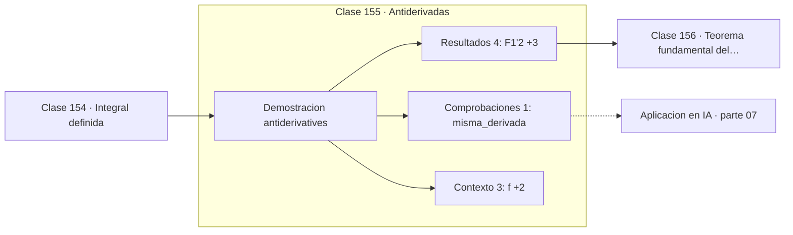

# 155 — Antiderivadas

> [⬅️ 154 Integral definida](../154-integral-definida/README.md) · [📚 Parte 07](../README.md) · [🏠 Programa](../../../README.md) · [156 Teorema fundamental del cálculo ➡️](../156-teorema-fundamental-del-calculo/README.md)

**Parte:** 07 — Cálculo diferencial e integral · **Nivel:** `universitario` · **Horas estimadas:** 4
**Motor:** `engines.part07` · **Demostración:** `antiderivatives` · **Clase 15 de 20** de la parte

---

## 🎯 Propósito

**La antiderivada está determinada salvo una constante, y esa constante desaparece en la integral definida.**

Límite, continuidad, derivada, reglas de derivación, Taylor, optimización de una variable, integral definida y teorema fundamental del cálculo.

## ✅ Resultados de aprendizaje

Al terminar podrás:

1. Explicar **Antiderivadas** con lenguaje cotidiano y con notación matemática.
2. Resolver un caso pequeño a mano y anticipar el orden de magnitud del resultado.
3. Ejecutar y modificar `lab.py`, que corre la demostración `antiderivatives`.
4. Interpretar las 8 salidas del laboratorio y decir qué comprueba cada una.
5. Detectar el error típico de esta parte: confundir punto crítico con extremo global.

## 🧩 Fórmulas de la clase

```text
F' = f  ⟹  (F + C)' = f
∫ₐᵇ f = F(b) − F(a),  independiente de C
```

## 🗺️ Ubicación en el programa



## 📖 Fundamentos

Una antiderivada de `f` es cualquier función cuya derivada sea `f`. Como la derivada de
una constante es cero (clase 145), sumar cualquier constante a una antiderivada da otra
antiderivada. La familia completa es `F(x) + C`, y esa `C` es la razón por la que la
integral indefinida se escribe siempre con ella.

En la integral **definida** la constante desaparece: al restar `F(b) − F(a)`, las
constantes se cancelan. Por eso el valor de una integral definida no depende de qué
antiderivada se elija, resultado que parece obvio y que conviene comprobar una vez.

Encontrar antiderivadas es sustancialmente más difícil que derivar. Derivar es un
procedimiento mecánico que siempre termina; integrar requiere reconocer patrones, y hay
funciones elementales cuya antiderivada **no** es elemental. `e^(-x²)` es el caso más
famoso: su integral define la función error `erf`, que no se puede escribir con
funciones elementales.

Ese hecho —demostrado por Liouville en el siglo XIX— es la razón de ser de la integración
numérica. No es que no sepamos calcular la integral: es que se ha demostrado que no
existe forma cerrada elemental. La probabilidad normal acumulada es precisamente uno de
esos casos.

## 🧮 Ejemplo trabajado

Dos antiderivadas de x² y su integral definida.

```text
F₁(x) = x³/3
F₂(x) = x³/3 + 7

F₁'(2) = 4.0                                 ✓
F₂'(2) = 4.0                                 ✓ misma derivada

diferencia constante: F₂ − F₁ = 7

Integral definida en [1,3]:
  con F₁: 9 − 1/3 = 8.6667
  con F₂: 16 − 7.3333 = 8.6667              ✓ la constante se cancela
```

## 🔬 Qué ejecuta el laboratorio

`antiderivatives` — La antiderivada no es única: difiere en una constante.

| Grupo | Salidas |
|---|---|
| 🔢 Resultados numéricos (4) | `F1'(2)`, `F2'(2)`, `diferencia_constante`, `la_constante_desaparece_en_la_definida` |
| ✅ Comprobaciones de invariante (1) | `misma_derivada` |

Las claves booleanas no son adorno: si alguna fuera `False`, el resultado numérico
no sería fiable aunque el programa terminase sin error.

```bash
python classes/part-07-calculo-diferencial-e-integral/155-antiderivadas/lab.py
compmath run 155
```

> [!TIP]
> Antes de ejecutar, **escribe tu predicción**. Un laboratorio que confirma lo que
> esperabas enseña tanto como uno que te contradice, pero solo si la predicción
> existía antes del resultado.

## ⚠️ Errores conceptuales frecuentes

1. Omitir la constante de integración en una integral indefinida.
2. Suponer que toda función elemental tiene antiderivada elemental.
3. Usar antiderivadas distintas para los dos límites de una integral definida.

## 🚀 Dónde se usa de verdad

Resolución de ecuaciones diferenciales, cálculo de probabilidades acumuladas y
reconstrucción de una magnitud a partir de su tasa de cambio.

## 🤖 Conexión con IA

Sin regla de la cadena no hay entrenamiento por gradiente; sin Taylor no hay métodos de segundo orden ni análisis de convergencia.

## 📓 Notebooks

| Archivo | Para qué |
|---|---|
| [`notebook.ipynb`](notebook.ipynb) | recorrido guiado con la demostración ejecutada |
| [`notebook_student.ipynb`](notebook_student.ipynb) | versión con `TODO` para resolver |
| [`notebook_solution.ipynb`](notebook_solution.ipynb) | solución de referencia verificada |

## 📝 Evaluación

| Criterio | Peso |
|---|---:|
| Comprensión conceptual | 25 % |
| Resolución manual | 25 % |
| Implementación y verificación | 25 % |
| Interpretación y comunicación | 15 % |
| Conexión con aplicación real | 10 % |

Detalle y criterios de error crítico en [`assessment.md`](assessment.md).

## ❓ Preguntas de comprobación

1. ¿Cuál es la entrada, cuál la salida y qué unidades tienen?
2. ¿Qué operación domina el comportamiento del resultado?
3. ¿Qué caso extremo revelaría un error conceptual?
4. ¿Cómo verificarías el resultado por un método independiente?
5. ¿Dónde aparece esto en física?

Si necesitas releer el código para responderlas, la clase todavía no está superada.

## 📥 Entregable

`notebook_student.ipynb` resuelto más un párrafo que explique el resultado **sin citar
código**: qué entra, qué sale, qué invariante se comprueba y qué pasaría en un caso límite.

## 🔗 Referencias

- [Liouville's theorem on elementary integrals — Wolfram MathWorld](https://mathworld.wolfram.com/LiouvillesTheorem.html) — *uso:* exposición alternativa del tema en «Antiderivadas».
- [Spivak, M. *Calculus*, 4ª ed., 2008, cap. 14](https://www.mathpop.com/calculus) — *uso:* exposición alternativa del tema en «Antiderivadas».

Bibliografía completa de la parte en [`../../../docs/BIBLIOGRAPHY.md`](../../../docs/BIBLIOGRAPHY.md) · localizador verificable de cada obra en [`sources/bibliography.json`](../../../sources/bibliography.json).

## 📂 Material de la clase

[`intuition.md`](intuition.md) · [`theory.md`](theory.md) · [`derivation.md`](derivation.md) · [`exercises.md`](exercises.md) · [`assessment.md`](assessment.md) · [`where-is-this-used.md`](where-is-this-used.md) · [`lesson.yaml`](lesson.yaml)

---

> [⬅️ 154 Integral definida](../154-integral-definida/README.md) · [📚 Parte 07](../README.md) · [🏠 Programa](../../../README.md) · [156 Teorema fundamental del cálculo ➡️](../156-teorema-fundamental-del-calculo/README.md)
