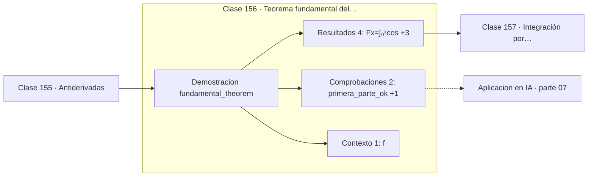

# 156 — Teorema fundamental del cálculo

> [⬅️ 155 Antiderivadas](../155-antiderivadas/README.md) · [📚 Parte 07](../README.md) · [🏠 Programa](../../../README.md) · [157 Integración por sustitución ➡️](../157-integracion-por-sustitucion/README.md)

**Parte:** 07 — Cálculo diferencial e integral · **Nivel:** `universitario` · **Horas estimadas:** 4
**Motor:** `engines.part07` · **Demostración:** `fundamental_theorem` · **Clase 16 de 20** de la parte

---

## 🎯 Propósito

**Derivar e integrar son operaciones inversas: ese es el teorema que da nombre al cálculo.**

Límite, continuidad, derivada, reglas de derivación, Taylor, optimización de una variable, integral definida y teorema fundamental del cálculo.

## ✅ Resultados de aprendizaje

Al terminar podrás:

1. Explicar **Teorema fundamental del cálculo** con lenguaje cotidiano y con notación matemática.
2. Resolver un caso pequeño a mano y anticipar el orden de magnitud del resultado.
3. Ejecutar y modificar `lab.py`, que corre la demostración `fundamental_theorem`.
4. Interpretar las 7 salidas del laboratorio y decir qué comprueba cada una.
5. Detectar el error típico de esta parte: usar diferencias finitas con h demasiado pequeño y amplificar el error de redondeo.

## 🧩 Fórmulas de la clase

```text
d/dx ∫ₐˣ f(t)dt = f(x)
∫ₐᵇ f = F(b) − F(a)  con F' = f
```

## 🗺️ Ubicación en el programa



## 📖 Fundamentos

El teorema fundamental del cálculo conecta dos problemas que nacieron completamente
separados: el de la tangente —resuelto con derivadas— y el del área —resuelto con
integrales—. Su enunciado es que son inversos, y esa unificación es el logro central de
Newton y Leibniz.

La **primera parte** dice que la función área, `F(x) = ∫ₐˣ f`, tiene derivada `f`.
Intuitivamente: al mover el extremo derecho un poquito, el área crece en una franja de
altura `f(x)` y anchura infinitesimal. La segunda parte convierte ese resultado en un
método de cálculo: para integrar, basta encontrar una antiderivada y evaluarla en los
extremos.

El impacto práctico es difícil de exagerar. Sin el teorema, cada integral exigiría un
límite de sumas; con él, muchas se resuelven en una línea. Es la diferencia entre
calcular áreas una por una y tener un método general.

El laboratorio comprueba ambas partes numéricamente con `cos`, cuya antiderivada es
`sin`: integra `cos` desde cero hasta `x` y verifica que da `sin(x)`, y luego deriva esa
integral y verifica que devuelve `cos(x)`. Que ambas comprobaciones pasen es la
confirmación ejecutable del teorema.

## 🧮 Ejemplo trabajado

Verificar las dos partes con cos.

```text
Primera parte: F(x) = ∫₀ˣ cos(t)dt

  F(1.2) numérica = 0.932039
  sin(1.2)        = 0.932039              ✓

Segunda parte: dF/dx debe ser cos(x)

  dF/dx en 1.2 (numérica) = 0.362358
  cos(1.2)                = 0.362358      ✓

Derivar deshace integrar.
```

## 🔬 Qué ejecuta el laboratorio

`fundamental_theorem` — Teorema fundamental: derivar deshace integrar.

| Grupo | Salidas |
|---|---|
| 🔢 Resultados numéricos (4) | `F(x)=∫₀ˣcos`, `sin(x)`, `dF/dx_numerica`, `f(x)` |
| ✅ Comprobaciones de invariante (2) | `primera_parte_ok`, `segunda_parte_ok` |

Las claves booleanas no son adorno: si alguna fuera `False`, el resultado numérico
no sería fiable aunque el programa terminase sin error.

```bash
python classes/part-07-calculo-diferencial-e-integral/156-teorema-fundamental-del-calculo/lab.py
compmath run 156
```

> [!TIP]
> Antes de ejecutar, **escribe tu predicción**. Un laboratorio que confirma lo que
> esperabas enseña tanto como uno que te contradice, pero solo si la predicción
> existía antes del resultado.

## ⚠️ Errores conceptuales frecuentes

1. Aplicar el teorema a funciones discontinuas en el intervalo.
2. Confundir la variable de integración con el límite superior.
3. Olvidar que la primera parte exige que f sea continua.

## 🚀 Dónde se usa de verdad

Cálculo de integrales en forma cerrada, resolución de ecuaciones diferenciales, relación
entre función de densidad y función de distribución acumulada.

## 🤖 Conexión con IA

Sin regla de la cadena no hay entrenamiento por gradiente; sin Taylor no hay métodos de segundo orden ni análisis de convergencia.

## 📓 Notebooks

| Archivo | Para qué |
|---|---|
| [`notebook.ipynb`](notebook.ipynb) | recorrido guiado con la demostración ejecutada |
| [`notebook_student.ipynb`](notebook_student.ipynb) | versión con `TODO` para resolver |
| [`notebook_solution.ipynb`](notebook_solution.ipynb) | solución de referencia verificada |

## 📝 Evaluación

| Criterio | Peso |
|---|---:|
| Comprensión conceptual | 25 % |
| Resolución manual | 25 % |
| Implementación y verificación | 25 % |
| Interpretación y comunicación | 15 % |
| Conexión con aplicación real | 10 % |

Detalle y criterios de error crítico en [`assessment.md`](assessment.md).

## ❓ Preguntas de comprobación

1. ¿Cuál es la entrada, cuál la salida y qué unidades tienen?
2. ¿Qué operación domina el comportamiento del resultado?
3. ¿Qué caso extremo revelaría un error conceptual?
4. ¿Cómo verificarías el resultado por un método independiente?
5. ¿Dónde aparece esto en física?

Si necesitas releer el código para responderlas, la clase todavía no está superada.

## 📥 Entregable

`notebook_student.ipynb` resuelto más un párrafo que explique el resultado **sin citar
código**: qué entra, qué sale, qué invariante se comprueba y qué pasaría en un caso límite.

## 🔗 Referencias

- [Apostol, T. *Calculus*, vol. 1, 2ª ed., Wiley, 1967](https://www.wiley.com/en-us/Calculus%2C+Volume+1%2C+2nd+Edition-p-9780471000051) — *uso:* desarrollo formal del tema en «Teorema fundamental del cálculo».
- [Spivak, M. *Calculus*, 4ª ed., 2008, cap. 14](https://www.mathpop.com/calculus) — *uso:* exposición alternativa del tema en «Teorema fundamental del cálculo».

Bibliografía completa de la parte en [`../../../docs/BIBLIOGRAPHY.md`](../../../docs/BIBLIOGRAPHY.md) · localizador verificable de cada obra en [`sources/bibliography.json`](../../../sources/bibliography.json).

## 📂 Material de la clase

[`intuition.md`](intuition.md) · [`theory.md`](theory.md) · [`derivation.md`](derivation.md) · [`exercises.md`](exercises.md) · [`assessment.md`](assessment.md) · [`where-is-this-used.md`](where-is-this-used.md) · [`lesson.yaml`](lesson.yaml)

---

> [⬅️ 155 Antiderivadas](../155-antiderivadas/README.md) · [📚 Parte 07](../README.md) · [🏠 Programa](../../../README.md) · [157 Integración por sustitución ➡️](../157-integracion-por-sustitucion/README.md)
