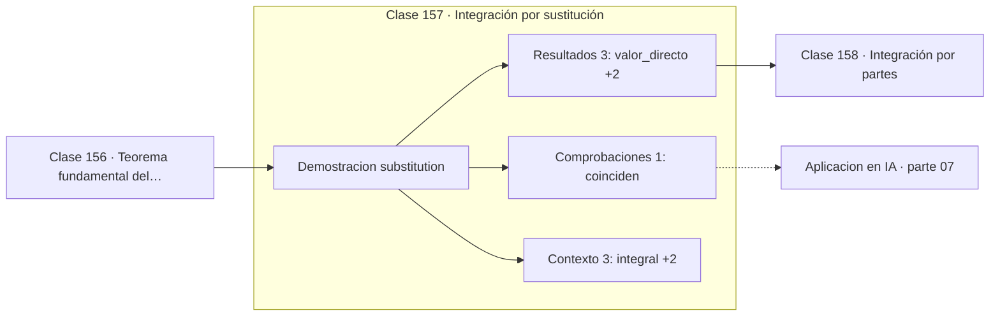

# 157 — Integración por sustitución

> [⬅️ 156 Teorema fundamental del cálculo](../156-teorema-fundamental-del-calculo/README.md) · [📚 Parte 07](../README.md) · [🏠 Programa](../../../README.md) · [158 Integración por partes ➡️](../158-integracion-por-partes/README.md)

**Parte:** 07 — Cálculo diferencial e integral · **Nivel:** `universitario` · **Horas estimadas:** 4
**Motor:** `engines.part07` · **Demostración:** `substitution` · **Clase 17 de 20** de la parte

---

## 🎯 Propósito

**La sustitución es la regla de la cadena leída al revés.**

Límite, continuidad, derivada, reglas de derivación, Taylor, optimización de una variable, integral definida y teorema fundamental del cálculo.

## ✅ Resultados de aprendizaje

Al terminar podrás:

1. Explicar **Integración por sustitución** con lenguaje cotidiano y con notación matemática.
2. Resolver un caso pequeño a mano y anticipar el orden de magnitud del resultado.
3. Ejecutar y modificar `lab.py`, que corre la demostración `substitution`.
4. Interpretar las 7 salidas del laboratorio y decir qué comprueba cada una.
5. Detectar el error típico de esta parte: derivar en un punto donde la función no es continua.

## 🧩 Fórmulas de la clase

```text
∫f(g(x))·g'(x)dx = ∫f(u)du  con u = g(x)
los límites también se transforman
```

## 🗺️ Ubicación en el programa



## 📖 Fundamentos

Integrar por sustitución consiste en reconocer que el integrando tiene la forma
`f(g(x))·g'(x)`, que es exactamente lo que produce derivar `F(g(x))` por la regla de la
cadena. Al identificar `u = g(x)`, la integral se convierte en `∫f(u)du`, que suele ser
inmediata.

La señal para aplicarla es la presencia de una función y de su derivada como factor. En
`∫2x·cos(x²)dx`, el `2x` es la derivada de `x²`, así que la sustitución `u = x²` cierra
el problema. Reconocer ese patrón es la habilidad que hay que entrenar.

En integrales **definidas** hay que transformar también los límites, y ese es el error
más frecuente: cambiar la variable sin cambiar el intervalo. La alternativa es deshacer
la sustitución antes de evaluar, pero transformar los límites es más limpio y menos
propenso a error.

En probabilidad, la sustitución es el **cambio de variable** de una densidad, y allí
aparece el jacobiano como factor de corrección (clase 075). Esa corrección es la que
hace que la densidad transformada siga integrando a 1, y es el mecanismo central de los
normalizing flows.

## 🧮 Ejemplo trabajado

Integrar 2x·cos(x²) de 0 a 1.

```text
Reconocer: la derivada de x² es 2x, que está presente

Sustitución: u = x²,  du = 2x dx
Límites: x=0 → u=0,   x=1 → u=1

∫₀¹ 2x·cos(x²)dx = ∫₀¹ cos(u)du = sin(1) = 0.841471

Verificación numérica directa: 0.841471       ✓
```

## 🔬 Qué ejecuta el laboratorio

`substitution` — Integración por sustitución: la regla de la cadena al revés.

| Grupo | Salidas |
|---|---|
| 🔢 Resultados numéricos (3) | `valor_directo`, `valor_sustituido`, `valor_analitico_sin(1)` |
| ✅ Comprobaciones de invariante (1) | `coinciden` |

Las claves booleanas no son adorno: si alguna fuera `False`, el resultado numérico
no sería fiable aunque el programa terminase sin error.

```bash
python classes/part-07-calculo-diferencial-e-integral/157-integracion-por-sustitucion/lab.py
compmath run 157
```

> [!TIP]
> Antes de ejecutar, **escribe tu predicción**. Un laboratorio que confirma lo que
> esperabas enseña tanto como uno que te contradice, pero solo si la predicción
> existía antes del resultado.

## ⚠️ Errores conceptuales frecuentes

1. Cambiar la variable sin transformar los límites en una integral definida.
2. Olvidar el factor du = g'(x)dx.
3. Aplicar la sustitución cuando la derivada de g no está presente en el integrando.

## 🚀 Dónde se usa de verdad

Cambio de variable en densidades de probabilidad, normalizing flows, simplificación de
integrales y reparametrización en inferencia variacional.

## 🤖 Conexión con IA

Sin regla de la cadena no hay entrenamiento por gradiente; sin Taylor no hay métodos de segundo orden ni análisis de convergencia.

## 📓 Notebooks

| Archivo | Para qué |
|---|---|
| [`notebook.ipynb`](notebook.ipynb) | recorrido guiado con la demostración ejecutada |
| [`notebook_student.ipynb`](notebook_student.ipynb) | versión con `TODO` para resolver |
| [`notebook_solution.ipynb`](notebook_solution.ipynb) | solución de referencia verificada |

## 📝 Evaluación

| Criterio | Peso |
|---|---:|
| Comprensión conceptual | 25 % |
| Resolución manual | 25 % |
| Implementación y verificación | 25 % |
| Interpretación y comunicación | 15 % |
| Conexión con aplicación real | 10 % |

Detalle y criterios de error crítico en [`assessment.md`](assessment.md).

## ❓ Preguntas de comprobación

1. ¿Cuál es la entrada, cuál la salida y qué unidades tienen?
2. ¿Qué operación domina el comportamiento del resultado?
3. ¿Qué caso extremo revelaría un error conceptual?
4. ¿Cómo verificarías el resultado por un método independiente?
5. ¿Dónde aparece esto en física?

Si necesitas releer el código para responderlas, la clase todavía no está superada.

## 📥 Entregable

`notebook_student.ipynb` resuelto más un párrafo que explique el resultado **sin citar
código**: qué entra, qué sale, qué invariante se comprueba y qué pasaría en un caso límite.

## 🔗 Referencias

- [Spivak, M. *Calculus*, 4ª ed., 2008, cap. 19](https://www.mathpop.com/calculus) — *uso:* exposición alternativa del tema en «Integración por sustitución».
- [Papamakarios, G. et al. *Normalizing Flows for Probabilistic Modeling and Inference*. JMLR, 2021](https://jmlr.org/papers/v22/19-1028.html) — *uso:* obra de referencia consultada en «Integración por sustitución».

Bibliografía completa de la parte en [`../../../docs/BIBLIOGRAPHY.md`](../../../docs/BIBLIOGRAPHY.md) · localizador verificable de cada obra en [`sources/bibliography.json`](../../../sources/bibliography.json).

## 📂 Material de la clase

[`intuition.md`](intuition.md) · [`theory.md`](theory.md) · [`derivation.md`](derivation.md) · [`exercises.md`](exercises.md) · [`assessment.md`](assessment.md) · [`where-is-this-used.md`](where-is-this-used.md) · [`lesson.yaml`](lesson.yaml)

---

> [⬅️ 156 Teorema fundamental del cálculo](../156-teorema-fundamental-del-calculo/README.md) · [📚 Parte 07](../README.md) · [🏠 Programa](../../../README.md) · [158 Integración por partes ➡️](../158-integracion-por-partes/README.md)
