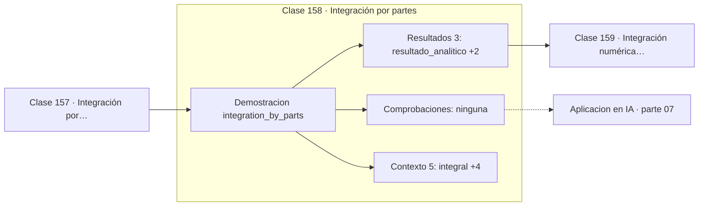

# 158 — Integración por partes

> [⬅️ 157 Integración por sustitución](../157-integracion-por-sustitucion/README.md) · [📚 Parte 07](../README.md) · [🏠 Programa](../../../README.md) · [159 Integración numérica introductoria ➡️](../159-integracion-numerica-introductoria/README.md)

**Parte:** 07 — Cálculo diferencial e integral · **Nivel:** `universitario` · **Horas estimadas:** 4
**Motor:** `engines.part07` · **Demostración:** `integration_by_parts` · **Clase 18 de 20** de la parte

---

## 🎯 Propósito

**La integración por partes es la regla del producto leída al revés.**

Límite, continuidad, derivada, reglas de derivación, Taylor, optimización de una variable, integral definida y teorema fundamental del cálculo.

## ✅ Resultados de aprendizaje

Al terminar podrás:

1. Explicar **Integración por partes** con lenguaje cotidiano y con notación matemática.
2. Resolver un caso pequeño a mano y anticipar el orden de magnitud del resultado.
3. Ejecutar y modificar `lab.py`, que corre la demostración `integration_by_parts`.
4. Interpretar las 8 salidas del laboratorio y decir qué comprueba cada una.
5. Detectar el error típico de esta parte: confundir punto crítico con extremo global.

## 🧩 Fórmulas de la clase

```text
∫u dv = uv − ∫v du
criterio LIATE para elegir u
```

## 🗺️ Ubicación en el programa



## 📖 Fundamentos

Integrar por partes se obtiene integrando la regla del producto y despejando. Su
utilidad es transformar una integral difícil en otra más fácil, cambiando cuál de los dos
factores se deriva y cuál se integra.

La elección de `u` determina si el método ayuda o empeora. El criterio **LIATE**
—logarítmica, inversa trigonométrica, algebraica, trigonométrica, exponencial— ordena
qué tipo de función conviene elegir como `u`, y funciona en la mayoría de los casos
escolares. La lógica es elegir como `u` lo que se simplifica al derivar.

En `∫x·eˣdx`, elegir `u = x` hace que `du = dx` desaparezca el polinomio, dejando
`∫eˣdx`, inmediata. Elegir al revés produciría `x²/2·eˣ`, que es peor. La misma integral
con un polinomio de grado n requiere aplicar el método n veces.

Hay un caso elegante que conviene conocer: al integrar por partes dos veces `∫eˣ·sin x dx`,
reaparece la integral original, y despejarla algebraicamente da el resultado. Es un truco
que muestra que la integración es más creativa que la derivación.

## 🧮 Ejemplo trabajado

Integrar x·eˣ de 0 a 1.

```text
Elegir u = x  (algebraica, se simplifica al derivar)
       dv = eˣdx

du = dx,  v = eˣ

∫x·eˣdx = x·eˣ − ∫eˣdx = x·eˣ − eˣ

Evaluar en [0,1]:
  (1·e − e) − (0 − 1) = 0 + 1 = 1

Verificación numérica: 1.0000000            ✓
error: 1.4e−09
```

## 🔬 Qué ejecuta el laboratorio

`integration_by_parts` — Integración por partes: la regla del producto al revés.

| Grupo | Salidas |
|---|---|
| 🔢 Resultados numéricos (3) | `resultado_analitico`, `resultado_numerico`, `error` |
| ✅ Comprobaciones de invariante (0) | — |

Las claves booleanas no son adorno: si alguna fuera `False`, el resultado numérico
no sería fiable aunque el programa terminase sin error.

```bash
python classes/part-07-calculo-diferencial-e-integral/158-integracion-por-partes/lab.py
compmath run 158
```

> [!TIP]
> Antes de ejecutar, **escribe tu predicción**. Un laboratorio que confirma lo que
> esperabas enseña tanto como uno que te contradice, pero solo si la predicción
> existía antes del resultado.

## ⚠️ Errores conceptuales frecuentes

1. Elegir u de forma que la nueva integral sea más difícil que la original.
2. Olvidar el signo menos delante de la segunda integral.
3. No evaluar el término uv en los límites en una integral definida.

## 🚀 Dónde se usa de verdad

Cálculo de momentos de distribuciones, transformadas de Laplace y Fourier, y deducción
de fórmulas de recurrencia para integrales.

## 🤖 Conexión con IA

Sin regla de la cadena no hay entrenamiento por gradiente; sin Taylor no hay métodos de segundo orden ni análisis de convergencia.

## 📓 Notebooks

| Archivo | Para qué |
|---|---|
| [`notebook.ipynb`](notebook.ipynb) | recorrido guiado con la demostración ejecutada |
| [`notebook_student.ipynb`](notebook_student.ipynb) | versión con `TODO` para resolver |
| [`notebook_solution.ipynb`](notebook_solution.ipynb) | solución de referencia verificada |

## 📝 Evaluación

| Criterio | Peso |
|---|---:|
| Comprensión conceptual | 25 % |
| Resolución manual | 25 % |
| Implementación y verificación | 25 % |
| Interpretación y comunicación | 15 % |
| Conexión con aplicación real | 10 % |

Detalle y criterios de error crítico en [`assessment.md`](assessment.md).

## ❓ Preguntas de comprobación

1. ¿Cuál es la entrada, cuál la salida y qué unidades tienen?
2. ¿Qué operación domina el comportamiento del resultado?
3. ¿Qué caso extremo revelaría un error conceptual?
4. ¿Cómo verificarías el resultado por un método independiente?
5. ¿Dónde aparece esto en física?

Si necesitas releer el código para responderlas, la clase todavía no está superada.

## 📥 Entregable

`notebook_student.ipynb` resuelto más un párrafo que explique el resultado **sin citar
código**: qué entra, qué sale, qué invariante se comprueba y qué pasaría en un caso límite.

## 📚 Bibliografía de la clase

Esta clase enseña **Cálculo · Análisis matemático**. Cada obra dice qué aporta aquí y cómo se comprobó su localizador:

- [Spivak, M. *Calculus*, 4ª ed., 2008, cap. 19](https://www.mathpop.com/calculus) — Análisis matemático y Cálculo: el tema de esta clase · ISBN-13 `9780914098911` verificado en International ISBN Agency (2026-08-19).
- [Stewart, J. *Calculus*, 8ª ed., Cengage, 2015, cap. 7](https://www.cengage.com/c/calculus-8e-stewart/) — Cálculo: el tema de esta clase · ISBN-13 `9781285740621` verificado en International ISBN Agency (2026-08-19).

Bibliografía de todas las clases, con el porqué de cada obra, en [`docs/BIBLIOGRAPHY.md`](../../../docs/BIBLIOGRAPHY.md) · localizador y estado de cada obra en [`sources/bibliography.json`](../../../sources/bibliography.json).

## 📂 Material de la clase

[`intuition.md`](intuition.md) · [`theory.md`](theory.md) · [`derivation.md`](derivation.md) · [`exercises.md`](exercises.md) · [`assessment.md`](assessment.md) · [`where-is-this-used.md`](where-is-this-used.md) · [`lesson.yaml`](lesson.yaml)

---

> [⬅️ 157 Integración por sustitución](../157-integracion-por-sustitucion/README.md) · [📚 Parte 07](../README.md) · [🏠 Programa](../../../README.md) · [159 Integración numérica introductoria ➡️](../159-integracion-numerica-introductoria/README.md)
