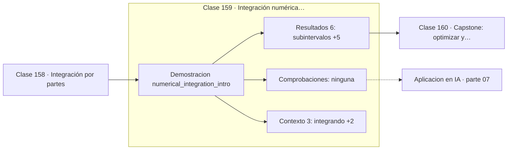

# 159 — Integración numérica introductoria

> [⬅️ 158 Integración por partes](../158-integracion-por-partes/README.md) · [📚 Parte 07](../README.md) · [🏠 Programa](../../../README.md) · [160 Capstone: optimizar y acumular una señal ➡️](../160-capstone-optimizar-y-acumular-una-senal/README.md)

**Parte:** 07 — Cálculo diferencial e integral · **Nivel:** `universitario` · **Horas estimadas:** 4
**Motor:** `engines.part07` · **Demostración:** `numerical_integration_intro` · **Clase 19 de 20** de la parte

---

## 🎯 Propósito

**El orden de convergencia dice cómo cae el error al refinar: trapecio es O(h²) y Simpson O(h⁴).**

Límite, continuidad, derivada, reglas de derivación, Taylor, optimización de una variable, integral definida y teorema fundamental del cálculo.

## ✅ Resultados de aprendizaje

Al terminar podrás:

1. Explicar **Integración numérica introductoria** con lenguaje cotidiano y con notación matemática.
2. Resolver un caso pequeño a mano y anticipar el orden de magnitud del resultado.
3. Ejecutar y modificar `lab.py`, que corre la demostración `numerical_integration_intro`.
4. Interpretar las 9 salidas del laboratorio y decir qué comprueba cada una.
5. Detectar el error típico de esta parte: usar diferencias finitas con h demasiado pequeño y amplificar el error de redondeo.

## 🧩 Fórmulas de la clase

```text
trapecio: h·(f(a)/2 + Σf(xᵢ) + f(b)/2),  error O(h²)
Simpson: h/3·(f(a) + 4Σimpares + 2Σpares + f(b)),  error O(h⁴)
```

## 🗺️ Ubicación en el programa



## 📖 Fundamentos

Cuando una integral no tiene forma cerrada —el caso habitual— hay que calcularla
numéricamente. El trapecio aproxima la función por segmentos rectos entre nodos; Simpson
la aproxima por parábolas que pasan por tres nodos consecutivos.

La diferencia de precisión es notable. El trapecio tiene error `O(h²)`: duplicar el
número de subintervalos divide el error por 4. Simpson tiene error `O(h⁴)`: duplicar lo
divide por 16. Con 100 subintervalos, Simpson suele dar diez órdenes de magnitud más de
precisión con el mismo número de evaluaciones de la función.

Ese salto tiene una explicación bonita: Simpson es exacto para polinomios de grado 3,
aunque solo interpole parábolas. El término cúbico se cancela por simetría, y esa
cancelación regala un orden completo. Es el mismo fenómeno que hace superior la
diferencia central.

La función del laboratorio, `e^(-x²)`, no tiene antiderivada elemental (clase 155) y su
integral define la función error. Que el resultado numérico coincida con `erf` a doce
decimales es la comprobación de que el método funciona, y es cómo se calculan en la
práctica las probabilidades de la distribución normal.

## 🧮 Ejemplo trabajado

Integrar e^(-x²) en [0,1] con 100 subintervalos.

```text
referencia (erf): 0.746824132812

trapecio: 0.746820967  →  error 3.17e−06
Simpson:  0.746824133  →  error 1.11e−13

Simpson es 7 órdenes de magnitud más preciso
con el mismo número de evaluaciones.

Órdenes: trapecio O(h²), Simpson O(h⁴)
```

## 🔬 Qué ejecuta el laboratorio

`numerical_integration_intro` — Trapecio frente a Simpson sobre la misma integral.

| Grupo | Salidas |
|---|---|
| 🔢 Resultados numéricos (6) | `subintervalos`, `trapecio`, `simpson`, `referencia_erf`, `error_trapecio`, `error_simpson` |
| ✅ Comprobaciones de invariante (0) | — |

Las claves booleanas no son adorno: si alguna fuera `False`, el resultado numérico
no sería fiable aunque el programa terminase sin error.

```bash
python classes/part-07-calculo-diferencial-e-integral/159-integracion-numerica-introductoria/lab.py
compmath run 159
```

> [!TIP]
> Antes de ejecutar, **escribe tu predicción**. Un laboratorio que confirma lo que
> esperabas enseña tanto como uno que te contradice, pero solo si la predicción
> existía antes del resultado.

## ⚠️ Errores conceptuales frecuentes

1. Usar Simpson con un número impar de subintervalos: requiere que sea par.
2. Aplicar estos métodos a integrandos con singularidades o muy oscilantes.
3. Aumentar n indefinidamente: el error de redondeo acaba dominando.

## 🚀 Dónde se usa de verdad

Probabilidades de la distribución normal, cálculo de expectativas, integración de
señales y cualquier integral sin forma cerrada.

## 🤖 Conexión con IA

Sin regla de la cadena no hay entrenamiento por gradiente; sin Taylor no hay métodos de segundo orden ni análisis de convergencia.

## 📓 Notebooks

| Archivo | Para qué |
|---|---|
| [`notebook.ipynb`](notebook.ipynb) | recorrido guiado con la demostración ejecutada |
| [`notebook_student.ipynb`](notebook_student.ipynb) | versión con `TODO` para resolver |
| [`notebook_solution.ipynb`](notebook_solution.ipynb) | solución de referencia verificada |

## 📝 Evaluación

| Criterio | Peso |
|---|---:|
| Comprensión conceptual | 25 % |
| Resolución manual | 25 % |
| Implementación y verificación | 25 % |
| Interpretación y comunicación | 15 % |
| Conexión con aplicación real | 10 % |

Detalle y criterios de error crítico en [`assessment.md`](assessment.md).

## ❓ Preguntas de comprobación

1. ¿Cuál es la entrada, cuál la salida y qué unidades tienen?
2. ¿Qué operación domina el comportamiento del resultado?
3. ¿Qué caso extremo revelaría un error conceptual?
4. ¿Cómo verificarías el resultado por un método independiente?
5. ¿Dónde aparece esto en física?

Si necesitas releer el código para responderlas, la clase todavía no está superada.

## 📥 Entregable

`notebook_student.ipynb` resuelto más un párrafo que explique el resultado **sin citar
código**: qué entra, qué sale, qué invariante se comprueba y qué pasaría en un caso límite.

## 🔗 Referencias

- [Press, W. et al. *Numerical Recipes*, 3ª ed., Cambridge, 2007, cap. 4](http://numerical.recipes/)
- [Burden & Faires. *Numerical Analysis*, 10ª ed., Cengage, 2015](https://www.cengage.com/c/numerical-analysis-10e-burden/)

Bibliografía completa de la parte en [`../../../docs/BIBLIOGRAPHY.md`](../../../docs/BIBLIOGRAPHY.md).

## 📂 Material de la clase

[`intuition.md`](intuition.md) · [`theory.md`](theory.md) · [`derivation.md`](derivation.md) · [`exercises.md`](exercises.md) · [`assessment.md`](assessment.md) · [`where-is-this-used.md`](where-is-this-used.md) · [`lesson.yaml`](lesson.yaml)

---

> [⬅️ 158 Integración por partes](../158-integracion-por-partes/README.md) · [📚 Parte 07](../README.md) · [🏠 Programa](../../../README.md) · [160 Capstone: optimizar y acumular una señal ➡️](../160-capstone-optimizar-y-acumular-una-senal/README.md)
