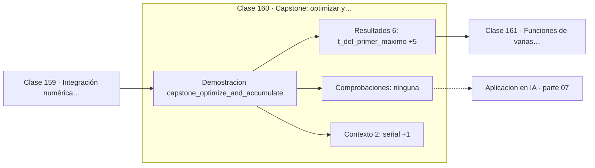

# 160 — Capstone: optimizar y acumular una señal

> [⬅️ 159 Integración numérica introductoria](../159-integracion-numerica-introductoria/README.md) · [📚 Parte 07](../README.md) · [🏠 Programa](../../../README.md) · [161 Funciones de varias variables ➡️](../../part-08-calculo-multivariable-matricial-y-autodiferenciacion/161-funciones-de-varias-variables/README.md)

**Parte:** 07 — Cálculo diferencial e integral · **Nivel:** `universitario` · **Horas estimadas:** 4
**Motor:** `engines.part07` · **Demostración:** `capstone_optimize_and_accumulate` · **Clase 20 de 20** de la parte

---

## 🎯 Propósito

**Derivar localiza; integrar acumula. Un mismo problema suele necesitar las dos.**

Límite, continuidad, derivada, reglas de derivación, Taylor, optimización de una variable, integral definida y teorema fundamental del cálculo.

## ✅ Resultados de aprendizaje

Al terminar podrás:

1. Explicar **Capstone: optimizar y acumular una señal** con lenguaje cotidiano y con notación matemática.
2. Resolver un caso pequeño a mano y anticipar el orden de magnitud del resultado.
3. Ejecutar y modificar `lab.py`, que corre la demostración `capstone_optimize_and_accumulate`.
4. Interpretar las 8 salidas del laboratorio y decir qué comprueba cada una.
5. Detectar el error típico de esta parte: derivar en un punto donde la función no es continua.

## 🧩 Fórmulas de la clase

```text
máximo: buscar la raíz de f'
energía: ∫f²  ·  área: ∫f  ·  valor medio: (1/T)∫f
```

## 🗺️ Ubicación en el programa



## 📖 Fundamentos

El capstone analiza una señal amortiguada, `e^(-0.5t)·sin(3t)`, con las dos operaciones
del cálculo. La derivada localiza sus extremos; la integral acumula su área, su energía y
su valor medio. Ninguna de las dos por separado describe la señal.

Encontrar el máximo se plantea como **buscar la raíz de la derivada**, y se resuelve por
bisección. Esa reformulación —optimizar equivale a resolver `f' = 0`— es la que conecta
la parte 07 con la parte 11: los métodos de búsqueda de raíces son también métodos de
optimización, y viceversa.

Las tres integrales tienen interpretaciones distintas. El **área** es la acumulación con
signo, y en una señal oscilante tiende a cancelarse. La **energía**, `∫f²`, no se cancela
porque el cuadrado es siempre positivo, y por eso es la medida estándar de «cuánta señal
hay». El **valor medio** normaliza el área por la duración.

Esa distinción entre área y energía reaparece en la parte 13: el teorema de Parseval dice
que la energía calculada en el tiempo coincide con la calculada en frecuencia, y es la
base del análisis espectral. Aquí se introduce sin nombrarla todavía.

## 🧮 Ejemplo trabajado

Analizar la señal amortiguada en [0,6].

```text
f(t) = e^(−0.5t)·sin(3t)

Primer máximo (raíz de f' por bisección):
  t = 0.4048,  f(t) = 0.7818
  f'(t) = 1.4e−09                  ✓ derivada nula

Acumulaciones en [0,6]:
  área    ∫f  = 0.3220
  energía ∫f² = 0.2856
  valor medio = 0.0537

El área casi se cancela por la oscilación;
la energía no, porque el cuadrado es positivo.
```

## 🔬 Qué ejecuta el laboratorio

`capstone_optimize_and_accumulate` — Capstone: derivar para optimizar e integrar para acumular una señal.

| Grupo | Salidas |
|---|---|
| 🔢 Resultados numéricos (6) | `t_del_primer_maximo`, `valor_maximo`, `derivada_en_el_maximo`, `area_acumulada_0_a_6`, `energia_∫f²`, `valor_medio` |
| ✅ Comprobaciones de invariante (0) | — |

Las claves booleanas no son adorno: si alguna fuera `False`, el resultado numérico
no sería fiable aunque el programa terminase sin error.

```bash
python classes/part-07-calculo-diferencial-e-integral/160-capstone-optimizar-y-acumular-una-senal/lab.py
compmath run 160
```

> [!TIP]
> Antes de ejecutar, **escribe tu predicción**. Un laboratorio que confirma lo que
> esperabas enseña tanto como uno que te contradice, pero solo si la predicción
> existía antes del resultado.

## ⚠️ Errores conceptuales frecuentes

1. Confundir el área (con signo) con la energía (siempre positiva).
2. Buscar el máximo evaluando en una malla en lugar de resolviendo f' = 0.
3. Reportar un valor medio sin declarar el intervalo sobre el que se calculó.

## 🚀 Dónde se usa de verdad

Análisis de señales, cálculo de energía en física, métricas acumuladas en el tiempo y
localización de extremos en curvas experimentales.

## 🤖 Conexión con IA

Sin regla de la cadena no hay entrenamiento por gradiente; sin Taylor no hay métodos de segundo orden ni análisis de convergencia.

## 📓 Notebooks

| Archivo | Para qué |
|---|---|
| [`notebook.ipynb`](notebook.ipynb) | recorrido guiado con la demostración ejecutada |
| [`notebook_student.ipynb`](notebook_student.ipynb) | versión con `TODO` para resolver |
| [`notebook_solution.ipynb`](notebook_solution.ipynb) | solución de referencia verificada |

## 📝 Evaluación

| Criterio | Peso |
|---|---:|
| Comprensión conceptual | 25 % |
| Resolución manual | 25 % |
| Implementación y verificación | 25 % |
| Interpretación y comunicación | 15 % |
| Conexión con aplicación real | 10 % |

Detalle y criterios de error crítico en [`assessment.md`](assessment.md).

## ❓ Preguntas de comprobación

1. ¿Cuál es la entrada, cuál la salida y qué unidades tienen?
2. ¿Qué operación domina el comportamiento del resultado?
3. ¿Qué caso extremo revelaría un error conceptual?
4. ¿Cómo verificarías el resultado por un método independiente?
5. ¿Dónde aparece esto en física?

Si necesitas releer el código para responderlas, la clase todavía no está superada.

## 📥 Entregable

`notebook_student.ipynb` resuelto más un párrafo que explique el resultado **sin citar
código**: qué entra, qué sale, qué invariante se comprueba y qué pasaría en un caso límite.

## 🔗 Referencias

- [Oppenheim & Schafer. *Discrete-Time Signal Processing*, 3ª ed., Pearson, 2009](https://www.pearson.com/en-us/subject-catalog/p/discrete-time-signal-processing/P200000003226)
- [Press, W. et al. *Numerical Recipes*, 3ª ed., Cambridge, 2007](http://numerical.recipes/)

Bibliografía completa de la parte en [`../../../docs/BIBLIOGRAPHY.md`](../../../docs/BIBLIOGRAPHY.md).

## 📂 Material de la clase

[`intuition.md`](intuition.md) · [`theory.md`](theory.md) · [`derivation.md`](derivation.md) · [`exercises.md`](exercises.md) · [`assessment.md`](assessment.md) · [`where-is-this-used.md`](where-is-this-used.md) · [`lesson.yaml`](lesson.yaml)

---

> [⬅️ 159 Integración numérica introductoria](../159-integracion-numerica-introductoria/README.md) · [📚 Parte 07](../README.md) · [🏠 Programa](../../../README.md) · [161 Funciones de varias variables ➡️](../../part-08-calculo-multivariable-matricial-y-autodiferenciacion/161-funciones-de-varias-variables/README.md)
