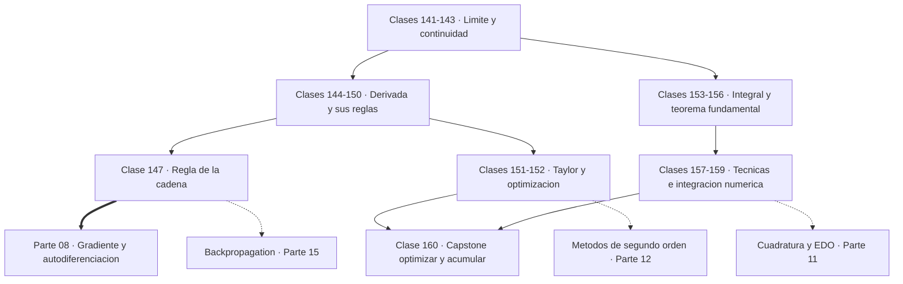

# 📈 Parte 07 — Cálculo diferencial e integral

> [⬅️ Parte 06 — Álgebra lineal II: descomposiciones y tensores](../part-06-algebra-lineal-ii-descomposiciones-y-tensores/README.md) · [🏠 Programa](../../README.md) · [📇 Catálogo](../README.md) · [Parte 08 — Cálculo multivariable, matricial y autodiferenciación ➡️](../part-08-calculo-multivariable-matricial-y-autodiferenciacion/README.md)

**Nivel:** `universitario` · **Clases:** 20 · **Horas estimadas:** 80 · **Motor:** [`part07.py`](../../src/computational_math/engines/part07.py)

---

## 🎯 De qué trata esta parte

Límite, continuidad, derivada, reglas de derivación, Taylor, optimización de una variable, integral definida y teorema fundamental del cálculo.

El cálculo es el estudio del cambio, y su invención independiente por Newton y Leibniz en
la década de 1660 es probablemente el acontecimiento más productivo de la historia de la
matemática. Esta parte lo reconstruye con una orientación concreta: **la derivada es la
mejor aproximación lineal local**, y la regla de la cadena es el mecanismo entero del
entrenamiento de una red neuronal.

Las clases 141 a 143 tratan el límite y la continuidad. El límite responde a una pregunta
que la aritmética no puede: qué valor «debería» tener una función donde no está definida.
`sin(x)/x` no existe en cero y sin embargo tiene un límite perfectamente definido, y esa
distinción entre valor y límite es la que hace posible definir la derivada.

Las clases 144 a 150 construyen la derivada y sus reglas. La más importante con diferencia
es la **regla de la cadena** (147): derivar una composición es multiplicar las derivadas de
sus piezas. Como una red neuronal es una composición de capas (clase 057), su gradiente es
un producto de factores, uno por capa. Ese producto explica de golpe el desvanecimiento del
gradiente, por qué ReLU funciona mejor que la sigmoide y por qué las conexiones residuales
ayudan.

Las clases 151 y 152 introducen Taylor y la optimización de una variable. Taylor cambia una
función difícil por un polinomio con error acotado, y es la base de los métodos de segundo
orden, del análisis de convergencia y de la mitad de las aproximaciones que usa el análisis
numérico. La condición `f'(x) = 0` es el caso unidimensional de `∇f = 0`, la condición de
primer orden de toda la parte 12.

Las clases 153 a 158 desarrollan la integral como acumulación y el teorema fundamental, que
establece que derivar e integrar son operaciones inversas. Ese teorema conecta dos ideas
que nacieron separadas —la tangente y el área— y es el resultado que da nombre a la
asignatura.

El cierre (159 y 160) pasa a la integración numérica, que es como se calcula en la práctica
casi cualquier integral: no hay forma cerrada para `e^(-x²)` y sin embargo su integral es
la que define la distribución normal. Trapecio y Simpson introducen el concepto de **orden
de convergencia**, que reaparecerá en toda la parte 11.

## 🗺️ Mapa conceptual



## 🧠 Ideas centrales

- La derivada es la mejor aproximación lineal local, no solo una pendiente.
- La regla de la cadena es el mecanismo entero de backpropagation.
- Taylor cambia una función difícil por un polinomio con error acotado.
- Integrar es acumular; derivar e integrar son operaciones inversas.
- Derivada nula señala punto crítico, no necesariamente mínimo.

## 🤖 Por qué importa en IA

> [!IMPORTANT]
> Sin regla de la cadena no hay entrenamiento por gradiente; sin Taylor no hay métodos de segundo orden ni análisis de convergencia.

## ⚠️ Errores frecuentes de esta parte

- Usar diferencias finitas con h demasiado pequeño y amplificar el error de redondeo.
- Derivar en un punto donde la función no es continua.
- Confundir punto crítico con extremo global.

## 🧭 Secuencia de la parte

```mermaid
flowchart LR
    subgraph B1["Bloque 1"]
        direction TB
        L141["141 · Intuición de límite"]
        L142["142 · Límites algebraicos"]
        L143["143 · Continuidad"]
        L144["144 · Derivada como tasa de cambio"]
        L145["145 · Reglas de derivación"]
        L141 --> L142
        L142 --> L143
        L143 --> L144
        L144 --> L145
    end
    subgraph B2["Bloque 2"]
        direction TB
        L146["146 · Regla del producto y cociente"]
        L147["147 · Regla de la cadena"]
        L148["148 · Derivadas de exponenciales y…"]
        L149["149 · Derivadas trigonométricas"]
        L150["150 · Derivación implícita"]
        L146 --> L147
        L147 --> L148
        L148 --> L149
        L149 --> L150
    end
    subgraph B3["Bloque 3"]
        direction TB
        L151["151 · Aproximación lineal y Taylor"]
        L152["152 · Máximos y mínimos"]
        L153["153 · Integral como acumulación"]
        L154["154 · Integral definida"]
        L155["155 · Antiderivadas"]
        L151 --> L152
        L152 --> L153
        L153 --> L154
        L154 --> L155
    end
    subgraph B4["Bloque 4"]
        direction TB
        L156["156 · Teorema fundamental del…"]
        L157["157 · Integración por sustitución"]
        L158["158 · Integración por partes"]
        L159["159 · Integración numérica…"]
        L160["160 · Capstone: optimizar y…"]
        L156 --> L157
        L157 --> L158
        L158 --> L159
        L159 --> L160
    end
    L145 --> L146
    L150 --> L151
    L155 --> L156
```



## 📚 Las clases

| # | Clase | Demostración | Idea central |
|---|---|---|---|
| `141` | [Intuición de límite](141-intuicion-de-limite/README.md) | `limit_intuition` | Una función puede no estar definida en un punto y tener límite perfectamente definido en él. |
| `142` | [Límites algebraicos](142-limites-algebraicos/README.md) | `algebraic_limits` | Una indeterminación es una propiedad de la expresión, no del límite: casi siempre se resuelve reescribiéndola. |
| `143` | [Continuidad](143-continuidad/README.md) | `continuity` | Continuidad exige tres condiciones; ser continua no implica ser derivable. |
| `144` | [Derivada como tasa de cambio](144-derivada-como-tasa-de-cambio/README.md) | `derivative_as_rate` | La derivada es la pendiente de la mejor recta que aproxima la función cerca de un punto. |
| `145` | [Reglas de derivación](145-reglas-de-derivacion/README.md) | `derivative_rules` | Las reglas de derivación se deducen del límite una vez y se aplican mecánicamente después. |
| `146` | [Regla del producto y cociente](146-regla-del-producto-y-cociente/README.md) | `product_quotient_rule` | La derivada de un producto no es el producto de las derivadas. |
| `147` | [Regla de la cadena](147-regla-de-la-cadena/README.md) | `chain_rule` | La regla de la cadena es el mecanismo completo de backpropagation: derivar una composición es multiplicar factores. |
| `148` | [Derivadas de exponenciales y logaritmos](148-derivadas-de-exponenciales-y-logaritmos/README.md) | `exp_log_derivatives` | e^x es la única función que es su propia derivada, y por eso e aparece en todas partes. |
| `149` | [Derivadas trigonométricas](149-derivadas-trigonometricas/README.md) | `trig_derivatives` | Las derivadas trigonométricas forman un ciclo de periodo cuatro. |
| `150` | [Derivación implícita](150-derivacion-implicita/README.md) | `implicit_differentiation` | La derivación implícita permite derivar una relación sin despejar una variable en función de la otra. |
| `151` | [Aproximación lineal y Taylor](151-aproximacion-lineal-y-taylor/README.md) | `taylor_approximation` | Taylor cambia una función difícil por un polinomio con error acotado por el primer término omitido. |
| `152` | [Máximos y mínimos](152-maximos-y-minimos/README.md) | `extrema` | La derivada nula señala un punto crítico; el signo de la segunda derivada decide de qué tipo es. |
| `153` | [Integral como acumulación](153-integral-como-acumulacion/README.md) | `integral_as_accumulation` | La integral es el límite de sumas de rectángulos, y la regla del punto medio converge como O(h²). |
| `154` | [Integral definida](154-integral-definida/README.md) | `definite_integral` | La integral definida es aditiva en el intervalo y cambia de signo al invertir la orientación. |
| `155` | [Antiderivadas](155-antiderivadas/README.md) | `antiderivatives` | La antiderivada está determinada salvo una constante, y esa constante desaparece en la integral definida. |
| `156` | [Teorema fundamental del cálculo](156-teorema-fundamental-del-calculo/README.md) | `fundamental_theorem` | Derivar e integrar son operaciones inversas: ese es el teorema que da nombre al cálculo. |
| `157` | [Integración por sustitución](157-integracion-por-sustitucion/README.md) | `substitution` | La sustitución es la regla de la cadena leída al revés. |
| `158` | [Integración por partes](158-integracion-por-partes/README.md) | `integration_by_parts` | La integración por partes es la regla del producto leída al revés. |
| `159` | [Integración numérica introductoria](159-integracion-numerica-introductoria/README.md) | `numerical_integration_intro` | El orden de convergencia dice cómo cae el error al refinar: trapecio es O(h²) y Simpson O(h⁴). |
| `160` | [Capstone: optimizar y acumular una señal](160-capstone-optimizar-y-acumular-una-senal/README.md) | `capstone_optimize_and_accumulate` | Derivar localiza; integrar acumula. Un mismo problema suele necesitar las dos. |

## 📖 Glosario de la parte (18 términos)

Definiciones precisas en [`GLOSARIO.md`](GLOSARIO.md).

## 🧰 Stack de referencia

`math`, `sympy (opcional)`, `scipy (opcional)`

Los laboratorios se ejecutan con biblioteca estándar; estas herramientas aparecen
como contraste profesional, no como requisito.

## 🧪 Ejecutar toda la parte

```bash
compmath run --part 07
compmath catalog --part 07
```

## 📊 Evaluación de la parte

| Componente | Peso |
|---|---:|
| Clases y ejercicios | 40 % |
| Laboratorios y notebooks | 25 % |
| Explicación oral o escrita | 15 % |
| Capstone ([160](160-capstone-optimizar-y-acumular-una-senal/README.md)) | 20 % |

## 📖 Bibliografía

Obras de referencia de la parte:

- Spivak, M. *Calculus*. 4ª ed., Publish or Perish, 2008.
- Apostol, T. *Calculus, Vol. 1*. 2ª ed., Wiley, 1967.
- Strang, G. *Calculus*. 3ª ed., Wellesley-Cambridge, 2017.

Las 20 clases de esta parte citan 17 obras distintas. Cuál sostiene cada clase, y por qué, en [`docs/BIBLIOGRAPHY.md`](../../docs/BIBLIOGRAPHY.md#parte-07-calculo-diferencial-e-integral).

---

> [⬅️ Parte 06 — Álgebra lineal II: descomposiciones y tensores](../part-06-algebra-lineal-ii-descomposiciones-y-tensores/README.md) · [🏠 Programa](../../README.md) · [📇 Catálogo](../README.md) · [Parte 08 — Cálculo multivariable, matricial y autodiferenciación ➡️](../part-08-calculo-multivariable-matricial-y-autodiferenciacion/README.md)
