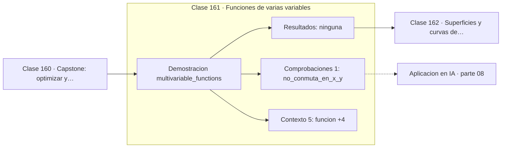

# 161 — Funciones de varias variables

> [⬅️ 160 Capstone: optimizar y acumular una señal](../../part-07-calculo-diferencial-e-integral/160-capstone-optimizar-y-acumular-una-senal/README.md) · [📚 Parte 08](../README.md) · [🏠 Programa](../../../README.md) · [162 Superficies y curvas de nivel ➡️](../162-superficies-y-curvas-de-nivel/README.md)

**Parte:** 08 — Cálculo multivariable, matricial y autodiferenciación · **Nivel:** `universitario-avanzado` · **Horas estimadas:** 4
**Motor:** `engines.part08` · **Demostración:** `multivariable_functions` · **Clase 1 de 20** de la parte

---

## 🎯 Propósito

**Una función de varias variables asigna un número a cada punto de un espacio; su gráfica vive una dimensión más arriba.**

Derivadas parciales, gradiente, Jacobiano, Hessiano, Taylor multivariable, multiplicadores de Lagrange, cálculo matricial y autodiferenciación.

## ✅ Resultados de aprendizaje

Al terminar podrás:

1. Explicar **Funciones de varias variables** con lenguaje cotidiano y con notación matemática.
2. Resolver un caso pequeño a mano y anticipar el orden de magnitud del resultado.
3. Ejecutar y modificar `lab.py`, que corre la demostración `multivariable_functions`.
4. Interpretar las 6 salidas del laboratorio y decir qué comprueba cada una.
5. Detectar el error típico de esta parte: confundir la convención de layout (numerador vs denominador) en cálculo matricial.

## 🧩 Fórmulas de la clase

```text
f: ℝⁿ → ℝ
f(x,y) = x²y + 3xy² + 2
```

## 🗺️ Ubicación en el programa



## 📖 Fundamentos

Pasar de una a varias variables no es un cambio de grado: es un cambio de naturaleza. La
gráfica de `f(x)` es una curva en el plano; la de `f(x,y)` es una superficie en el
espacio; la de una función de diez variables no se puede dibujar. A partir de tres
variables hay que razonar con álgebra, y esa es la habilidad que instala esta parte.

La función del laboratorio, `x²y + 3xy² + 2`, es deliberadamente **no simétrica**: `f(2,1)`
y `f(1,2)` dan valores distintos. Esa asimetría importa porque en machine learning las
variables casi nunca son intercambiables, y suponer simetría donde no la hay produce
errores de interpretación.

La forma práctica de explorar una función de varias variables es fijar todas las
variables menos una y observar el corte resultante, que es una función de una variable.
Esa es exactamente la idea de derivada parcial (clase 163), y es también la técnica de
los gráficos de dependencia parcial en interpretabilidad de modelos.

En machine learning, la función de pérdida es una función de varias variables donde las
«variables» son los parámetros: millones de ellos. Su gráfica vive en un espacio de
millones de dimensiones y no se puede visualizar. Todo lo que se dice sobre «paisajes de
pérdida» son proyecciones bidimensionales, útiles como intuición y engañosas si se toman
literalmente.

## 🧮 Ejemplo trabajado

Evaluar una función de dos variables.

```text
f(x,y) = x²y + 3xy² + 2

f(0,0) = 2
f(1,1) = 1 + 3 + 2 = 6
f(2,1) = 4 + 6 + 2 = 12
f(1,2) = 2 + 12 + 2 = 16

f(2,1) ≠ f(1,2)  →  no simétrica         ✓

dominio: ℝ²      codominio: ℝ
la gráfica es una superficie en ℝ³
```

## 🔬 Qué ejecuta el laboratorio

`multivariable_functions` — Una función de dos variables evaluada sobre una malla.

| Grupo | Salidas |
|---|---|
| 🔢 Resultados numéricos (0) | — |
| ✅ Comprobaciones de invariante (1) | `no_conmuta_en_x_y` |

Las claves booleanas no son adorno: si alguna fuera `False`, el resultado numérico
no sería fiable aunque el programa terminase sin error.

```bash
python classes/part-08-calculo-multivariable-matricial-y-autodiferenciacion/161-funciones-de-varias-variables/lab.py
compmath run 161
```

> [!TIP]
> Antes de ejecutar, **escribe tu predicción**. Un laboratorio que confirma lo que
> esperabas enseña tanto como uno que te contradice, pero solo si la predicción
> existía antes del resultado.

## ⚠️ Errores conceptuales frecuentes

1. Suponer simetría entre variables sin comprobarla.
2. Intentar visualizar funciones de más de dos variables.
3. Confundir el dominio (ℝⁿ) con la gráfica (que vive en ℝⁿ⁺¹).

## 🚀 Dónde se usa de verdad

Funciones de pérdida, superficies de respuesta, modelos con varias entradas y gráficos de
dependencia parcial en interpretabilidad.

## 🤖 Conexión con IA

Autograd de PyTorch y JAX es exactamente el modo reverso del grafo de cómputo que se construye en esta parte a mano.

## 📓 Notebooks

| Archivo | Para qué |
|---|---|
| [`notebook.ipynb`](notebook.ipynb) | recorrido guiado con la demostración ejecutada |
| [`notebook_student.ipynb`](notebook_student.ipynb) | versión con `TODO` para resolver |
| [`notebook_solution.ipynb`](notebook_solution.ipynb) | solución de referencia verificada |

## 📝 Evaluación

| Criterio | Peso |
|---|---:|
| Comprensión conceptual | 25 % |
| Resolución manual | 25 % |
| Implementación y verificación | 25 % |
| Interpretación y comunicación | 15 % |
| Conexión con aplicación real | 10 % |

Detalle y criterios de error crítico en [`assessment.md`](assessment.md).

## ❓ Preguntas de comprobación

1. ¿Cuál es la entrada, cuál la salida y qué unidades tienen?
2. ¿Qué operación domina el comportamiento del resultado?
3. ¿Qué caso extremo revelaría un error conceptual?
4. ¿Cómo verificarías el resultado por un método independiente?
5. ¿Dónde aparece esto en optimización multivariable?

Si necesitas releer el código para responderlas, la clase todavía no está superada.

## 📥 Entregable

`notebook_student.ipynb` resuelto más un párrafo que explique el resultado **sin citar
código**: qué entra, qué sale, qué invariante se comprueba y qué pasaría en un caso límite.

## 🔗 Referencias

- [Stewart, J. *Calculus*, 8ª ed., Cengage, 2015, cap. 14](https://www.cengage.com/c/calculus-8e-stewart/) — *uso:* obra de referencia consultada en «Funciones de varias variables».
- [Goodfellow, Bengio & Courville. *Deep Learning*. MIT Press, 2016, cap. 4](https://www.deeplearningbook.org/) — *uso:* obra de referencia consultada en «Funciones de varias variables».

Bibliografía completa de la parte en [`../../../docs/BIBLIOGRAPHY.md`](../../../docs/BIBLIOGRAPHY.md) · localizador verificable de cada obra en [`sources/bibliography.json`](../../../sources/bibliography.json).

## 📂 Material de la clase

[`intuition.md`](intuition.md) · [`theory.md`](theory.md) · [`derivation.md`](derivation.md) · [`exercises.md`](exercises.md) · [`assessment.md`](assessment.md) · [`where-is-this-used.md`](where-is-this-used.md) · [`lesson.yaml`](lesson.yaml)

---

> [⬅️ 160 Capstone: optimizar y acumular una señal](../../part-07-calculo-diferencial-e-integral/160-capstone-optimizar-y-acumular-una-senal/README.md) · [📚 Parte 08](../README.md) · [🏠 Programa](../../../README.md) · [162 Superficies y curvas de nivel ➡️](../162-superficies-y-curvas-de-nivel/README.md)
