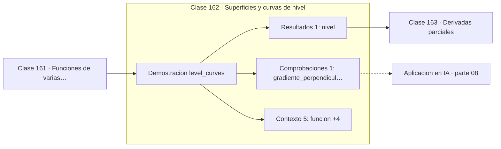

# 162 — Superficies y curvas de nivel

> [⬅️ 161 Funciones de varias variables](../161-funciones-de-varias-variables/README.md) · [📚 Parte 08](../README.md) · [🏠 Programa](../../../README.md) · [163 Derivadas parciales ➡️](../163-derivadas-parciales/README.md)

**Parte:** 08 — Cálculo multivariable, matricial y autodiferenciación · **Nivel:** `universitario-avanzado` · **Horas estimadas:** 4
**Motor:** `engines.part08` · **Demostración:** `level_curves` · **Clase 2 de 20** de la parte

---

## 🎯 Propósito

**Las curvas de nivel son los conjuntos donde la función vale lo mismo, y el gradiente es perpendicular a ellas.**

Derivadas parciales, gradiente, Jacobiano, Hessiano, Taylor multivariable, multiplicadores de Lagrange, cálculo matricial y autodiferenciación.

## ✅ Resultados de aprendizaje

Al terminar podrás:

1. Explicar **Superficies y curvas de nivel** con lenguaje cotidiano y con notación matemática.
2. Resolver un caso pequeño a mano y anticipar el orden de magnitud del resultado.
3. Ejecutar y modificar `lab.py`, que corre la demostración `level_curves`.
4. Interpretar las 7 salidas del laboratorio y decir qué comprueba cada una.
5. Detectar el error típico de esta parte: suponer que el hessiano es definido positivo sin comprobarlo.

## 🧩 Fórmulas de la clase

```text
curva de nivel: f(x,y) = c
∇f ⊥ curva de nivel
curvas juntas ⟹ pendiente alta
```

## 🗺️ Ubicación en el programa



## 📖 Fundamentos

Una curva de nivel une los puntos donde la función toma el mismo valor. Es el mismo
concepto que las isolíneas de un mapa topográfico, y la analogía es exacta: la altura del
terreno es una función de dos variables, y las curvas de nivel son las líneas de altitud
constante.

De esa imagen se leen dos hechos importantes. Primero, el **gradiente es perpendicular a
la curva de nivel**: la dirección de máximo ascenso es la que cruza las isolíneas de
frente, no la que las recorre. Segundo, **cuanto más juntas están las curvas, mayor es la
pendiente**: la misma diferencia de valor en menos distancia.

Esa segunda observación es la que explica el zigzagueo del descenso de gradiente. Cuando
las curvas de nivel son elipses muy alargadas —función mal condicionada, clase 128—, el
gradiente apunta casi perpendicular al eje largo, es decir, casi perpendicular a la
dirección hacia el mínimo. El algoritmo rebota entre las paredes del valle en lugar de
avanzar por él.

Los gráficos de contorno son la herramienta estándar para visualizar funciones de dos
variables, y en optimización se usan para mostrar trayectorias de convergencia. Su
limitación es la misma de siempre: solo funcionan en dos dimensiones, y los paisajes
reales tienen millones.

## 🧮 Ejemplo trabajado

Curvas de nivel de x² + y².

```text
g(x,y) = x² + y²,   nivel c = 4

puntos del nivel 4:
  (2,0)     → 4    ✓
  (0,2)     → 4    ✓
  (√2,√2)   → 4    ✓
  (−2,0)    → 4    ✓

forma: circunferencia de radio 2

gradiente en (2,0): (4, 0)
  apunta radialmente hacia fuera
  perpendicular a la circunferencia        ✓
```

## 🔬 Qué ejecuta el laboratorio

`level_curves` — Curvas de nivel: dónde la función vale lo mismo.

| Grupo | Salidas |
|---|---|
| 🔢 Resultados numéricos (1) | `nivel` |
| ✅ Comprobaciones de invariante (1) | `gradiente_perpendicular_a_la_curva` |

Las claves booleanas no son adorno: si alguna fuera `False`, el resultado numérico
no sería fiable aunque el programa terminase sin error.

```bash
python classes/part-08-calculo-multivariable-matricial-y-autodiferenciacion/162-superficies-y-curvas-de-nivel/lab.py
compmath run 162
```

> [!TIP]
> Antes de ejecutar, **escribe tu predicción**. Un laboratorio que confirma lo que
> esperabas enseña tanto como uno que te contradice, pero solo si la predicción
> existía antes del resultado.

## ⚠️ Errores conceptuales frecuentes

1. Suponer que el gradiente es tangente a la curva de nivel: es perpendicular.
2. Interpretar la separación entre curvas al revés: juntas significa pendiente alta.
3. Extrapolar la intuición de un gráfico de contorno 2D a un espacio de millones de dimensiones.

## 🚀 Dónde se usa de verdad

Visualización de paisajes de pérdida, mapas topográficos, análisis de convergencia y
diagnóstico de mal condicionamiento.

## 🤖 Conexión con IA

Autograd de PyTorch y JAX es exactamente el modo reverso del grafo de cómputo que se construye en esta parte a mano.

## 📓 Notebooks

| Archivo | Para qué |
|---|---|
| [`notebook.ipynb`](notebook.ipynb) | recorrido guiado con la demostración ejecutada |
| [`notebook_student.ipynb`](notebook_student.ipynb) | versión con `TODO` para resolver |
| [`notebook_solution.ipynb`](notebook_solution.ipynb) | solución de referencia verificada |

## 📝 Evaluación

| Criterio | Peso |
|---|---:|
| Comprensión conceptual | 25 % |
| Resolución manual | 25 % |
| Implementación y verificación | 25 % |
| Interpretación y comunicación | 15 % |
| Conexión con aplicación real | 10 % |

Detalle y criterios de error crítico en [`assessment.md`](assessment.md).

## ❓ Preguntas de comprobación

1. ¿Cuál es la entrada, cuál la salida y qué unidades tienen?
2. ¿Qué operación domina el comportamiento del resultado?
3. ¿Qué caso extremo revelaría un error conceptual?
4. ¿Cómo verificarías el resultado por un método independiente?
5. ¿Dónde aparece esto en optimización multivariable?

Si necesitas releer el código para responderlas, la clase todavía no está superada.

## 📥 Entregable

`notebook_student.ipynb` resuelto más un párrafo que explique el resultado **sin citar
código**: qué entra, qué sale, qué invariante se comprueba y qué pasaría en un caso límite.

## 📚 Bibliografía de la clase

Esta clase enseña **Cálculo multivariable y matricial · Cálculo · Diferenciación automática**. Cada obra dice qué aporta aquí y cómo se comprobó su localizador:

- [Stewart, J. *Calculus*, 8ª ed., Cengage, 2015, cap. 14](https://www.cengage.com/c/calculus-8e-stewart/) — Cálculo: el tema de esta clase · ISBN-13 `9781285740621` verificado en International ISBN Agency (2026-08-19).
- [Li, H. et al. *Visualizing the Loss Landscape of Neural Nets*. NeurIPS, 2018](https://arxiv.org/abs/1712.09913) — Deep learning y Optimización: conexión declarada de esta parte · DOI `10.48550/arxiv.1712.09913` verificado en DataCite (2026-08-19).

Bibliografía de todas las clases, con el porqué de cada obra, en [`docs/BIBLIOGRAPHY.md`](../../../docs/BIBLIOGRAPHY.md) · localizador y estado de cada obra en [`sources/bibliography.json`](../../../sources/bibliography.json).

## 📂 Material de la clase

[`intuition.md`](intuition.md) · [`theory.md`](theory.md) · [`derivation.md`](derivation.md) · [`exercises.md`](exercises.md) · [`assessment.md`](assessment.md) · [`where-is-this-used.md`](where-is-this-used.md) · [`lesson.yaml`](lesson.yaml)

---

> [⬅️ 161 Funciones de varias variables](../161-funciones-de-varias-variables/README.md) · [📚 Parte 08](../README.md) · [🏠 Programa](../../../README.md) · [163 Derivadas parciales ➡️](../163-derivadas-parciales/README.md)
