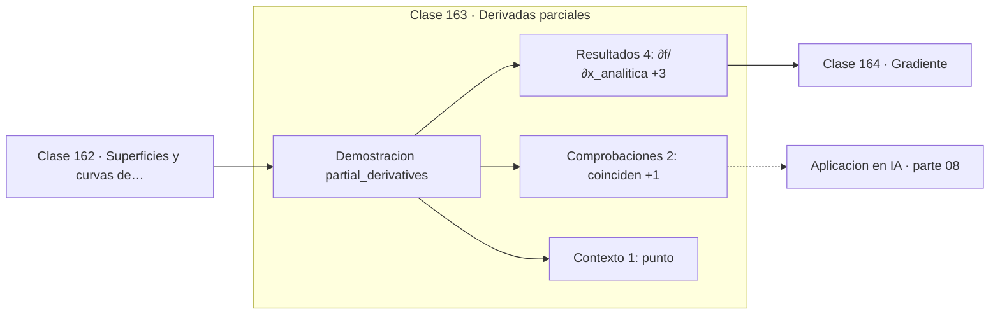

# 163 — Derivadas parciales

> [⬅️ 162 Superficies y curvas de nivel](../162-superficies-y-curvas-de-nivel/README.md) · [📚 Parte 08](../README.md) · [🏠 Programa](../../../README.md) · [164 Gradiente ➡️](../164-gradiente/README.md)

**Parte:** 08 — Cálculo multivariable, matricial y autodiferenciación · **Nivel:** `universitario-avanzado` · **Horas estimadas:** 4
**Motor:** `engines.part08` · **Demostración:** `partial_derivatives` · **Clase 3 de 20** de la parte

---

## 🎯 Propósito

**Una derivada parcial mide el cambio en una dirección de eje, congelando el resto.**

Derivadas parciales, gradiente, Jacobiano, Hessiano, Taylor multivariable, multiplicadores de Lagrange, cálculo matricial y autodiferenciación.

## ✅ Resultados de aprendizaje

Al terminar podrás:

1. Explicar **Derivadas parciales** con lenguaje cotidiano y con notación matemática.
2. Resolver un caso pequeño a mano y anticipar el orden de magnitud del resultado.
3. Ejecutar y modificar `lab.py`, que corre la demostración `partial_derivatives`.
4. Interpretar las 7 salidas del laboratorio y decir qué comprueba cada una.
5. Detectar el error típico de esta parte: olvidar acumular gradientes cuando un nodo se reutiliza en el grafo.

## 🧩 Fórmulas de la clase

```text
∂f/∂x = derivada tratando y como constante
teorema de Schwarz: ∂²f/∂x∂y = ∂²f/∂y∂x
```

## 🗺️ Ubicación en el programa



## 📖 Fundamentos

La derivada parcial respecto a `x` se calcula tratando todas las demás variables como
constantes. Operativamente, es la derivada de una variable de la clase 144 aplicada al
corte de la función. La notación `∂` en lugar de `d` recuerda que hay otras variables
congeladas.

El **teorema de Schwarz** garantiza que las derivadas cruzadas coinciden —`∂²f/∂x∂y =
∂²f/∂y∂x`— si son continuas. Ese resultado es el que hace que el Hessiano sea simétrico
(clase 169), y la simetría del Hessiano es lo que permite aplicarle el teorema espectral
de la clase 126.

La limitación conceptual de las parciales es que solo miran en direcciones de eje. Una
función puede tener ambas parciales definidas en un punto y no ser diferenciable allí,
porque el comportamiento en direcciones oblicuas es distinto. La diferenciabilidad exige
más: que exista una buena aproximación lineal en **todas** las direcciones (clase 166).

En machine learning, cada componente del gradiente es una derivada parcial: cuánto cambia
la pérdida al mover **un** parámetro dejando el resto fijo. Con millones de parámetros,
calcularlas una a una por diferencias finitas costaría millones de evaluaciones; la
autodiferenciación las obtiene todas de una vez, y esa es su razón de ser.

## 🧮 Ejemplo trabajado

Parciales de x²y + 3xy² en (2,3).

```text
∂f/∂x = 2xy + 3y²
      = 2·2·3 + 3·9 = 12 + 27 = 39
numérica: 39.000000                        ✓

∂f/∂y = x² + 6xy
      = 4 + 6·2·3 = 4 + 36 = 40
numérica: 40.000000                        ✓

Cruzadas (Schwarz):
  ∂²f/∂x∂y = 2x + 6y
  ∂²f/∂y∂x = 2x + 6y                       ✓ coinciden
```

## 🔬 Qué ejecuta el laboratorio

`partial_derivatives` — Derivadas parciales: mover una variable congelando el resto.

| Grupo | Salidas |
|---|---|
| 🔢 Resultados numéricos (4) | `∂f/∂x_analitica`, `∂f/∂x_numerica`, `∂f/∂y_analitica`, `∂f/∂y_numerica` |
| ✅ Comprobaciones de invariante (2) | `coinciden`, `cruzadas_iguales_(Schwarz)` |

Las claves booleanas no son adorno: si alguna fuera `False`, el resultado numérico
no sería fiable aunque el programa terminase sin error.

```bash
python classes/part-08-calculo-multivariable-matricial-y-autodiferenciacion/163-derivadas-parciales/lab.py
compmath run 163
```

> [!TIP]
> Antes de ejecutar, **escribe tu predicción**. Un laboratorio que confirma lo que
> esperabas enseña tanto como uno que te contradice, pero solo si la predicción
> existía antes del resultado.

## ⚠️ Errores conceptuales frecuentes

1. Derivar respecto a una variable sin tratar las demás como constantes.
2. Deducir diferenciabilidad de la existencia de las parciales.
3. Confundir la notación ∂ con d en funciones de una sola variable.

## 🚀 Dónde se usa de verdad

Componentes del gradiente, análisis de sensibilidad respecto a un parámetro, elasticidades
en economía y ecuaciones en derivadas parciales.

## 🤖 Conexión con IA

Autograd de PyTorch y JAX es exactamente el modo reverso del grafo de cómputo que se construye en esta parte a mano.

## 📓 Notebooks

| Archivo | Para qué |
|---|---|
| [`notebook.ipynb`](notebook.ipynb) | recorrido guiado con la demostración ejecutada |
| [`notebook_student.ipynb`](notebook_student.ipynb) | versión con `TODO` para resolver |
| [`notebook_solution.ipynb`](notebook_solution.ipynb) | solución de referencia verificada |

## 📝 Evaluación

| Criterio | Peso |
|---|---:|
| Comprensión conceptual | 25 % |
| Resolución manual | 25 % |
| Implementación y verificación | 25 % |
| Interpretación y comunicación | 15 % |
| Conexión con aplicación real | 10 % |

Detalle y criterios de error crítico en [`assessment.md`](assessment.md).

## ❓ Preguntas de comprobación

1. ¿Cuál es la entrada, cuál la salida y qué unidades tienen?
2. ¿Qué operación domina el comportamiento del resultado?
3. ¿Qué caso extremo revelaría un error conceptual?
4. ¿Cómo verificarías el resultado por un método independiente?
5. ¿Dónde aparece esto en optimización multivariable?

Si necesitas releer el código para responderlas, la clase todavía no está superada.

## 📥 Entregable

`notebook_student.ipynb` resuelto más un párrafo que explique el resultado **sin citar
código**: qué entra, qué sale, qué invariante se comprueba y qué pasaría en un caso límite.

## 🔗 Referencias

- [Stewart, J. *Calculus*, 8ª ed., Cengage, 2015, cap. 14](https://www.cengage.com/c/calculus-8e-stewart/) — *uso:* obra de referencia consultada en «Derivadas parciales».
- [Apostol, T. *Mathematical Analysis*, 2ª ed., Addison-Wesley, 1974](https://www.pearson.com/en-us/subject-catalog/p/mathematical-analysis/P200000006155) — *uso:* obra de referencia consultada en «Derivadas parciales».

Bibliografía completa de la parte en [`../../../docs/BIBLIOGRAPHY.md`](../../../docs/BIBLIOGRAPHY.md) · localizador verificable de cada obra en [`sources/bibliography.json`](../../../sources/bibliography.json).

## 📂 Material de la clase

[`intuition.md`](intuition.md) · [`theory.md`](theory.md) · [`derivation.md`](derivation.md) · [`exercises.md`](exercises.md) · [`assessment.md`](assessment.md) · [`where-is-this-used.md`](where-is-this-used.md) · [`lesson.yaml`](lesson.yaml)

---

> [⬅️ 162 Superficies y curvas de nivel](../162-superficies-y-curvas-de-nivel/README.md) · [📚 Parte 08](../README.md) · [🏠 Programa](../../../README.md) · [164 Gradiente ➡️](../164-gradiente/README.md)
