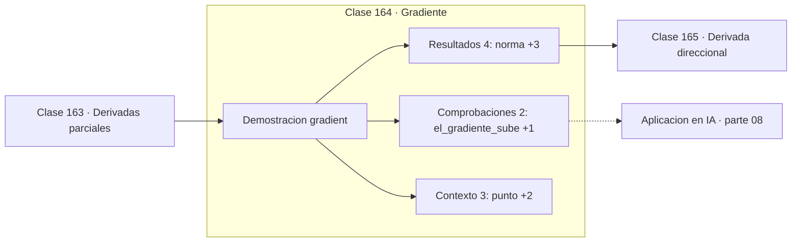

# 164 — Gradiente

> [⬅️ 163 Derivadas parciales](../163-derivadas-parciales/README.md) · [📚 Parte 08](../README.md) · [🏠 Programa](../../../README.md) · [165 Derivada direccional ➡️](../165-derivada-direccional/README.md)

**Parte:** 08 — Cálculo multivariable, matricial y autodiferenciación · **Nivel:** `universitario-avanzado` · **Horas estimadas:** 4
**Motor:** `engines.part08` · **Demostración:** `gradient` · **Clase 4 de 20** de la parte

---

## 🎯 Propósito

**El gradiente apunta al mayor ascenso; por eso se minimiza moviéndose en dirección contraria.**

Derivadas parciales, gradiente, Jacobiano, Hessiano, Taylor multivariable, multiplicadores de Lagrange, cálculo matricial y autodiferenciación.

## ✅ Resultados de aprendizaje

Al terminar podrás:

1. Explicar **Gradiente** con lenguaje cotidiano y con notación matemática.
2. Resolver un caso pequeño a mano y anticipar el orden de magnitud del resultado.
3. Ejecutar y modificar `lab.py`, que corre la demostración `gradient`.
4. Interpretar las 9 salidas del laboratorio y decir qué comprueba cada una.
5. Detectar el error típico de esta parte: confundir la convención de layout (numerador vs denominador) en cálculo matricial.

## 🧩 Fórmulas de la clase

```text
∇f = (∂f/∂x₁, ..., ∂f/∂xₙ)
descenso: x ← x − α∇f
‖∇f‖ = pendiente máxima
```

## 🗺️ Ubicación en el programa



## 📖 Fundamentos

El gradiente reúne todas las derivadas parciales en un vector, y ese vector tiene dos
propiedades que lo convierten en el objeto central de la optimización: **apunta en la
dirección de máximo crecimiento** y **su norma es la pendiente en esa dirección**.

La primera propiedad es la que justifica el algoritmo más usado del machine learning
moderno. Si el gradiente apunta hacia arriba, moverse en `−∇f` es la forma más rápida de
bajar localmente. `x ← x − α∇f` es el descenso de gradiente, y toda la parte 12 son
variantes de esa línea.

La palabra **localmente** es esencial. El gradiente solo informa del comportamiento
infinitesimal alrededor del punto; nada garantiza que la dirección de máximo descenso
local lleve al mínimo global, ni siquiera que sea una buena dirección a media distancia.
En un valle alargado, la dirección de máximo descenso es casi perpendicular a la que
lleva al mínimo.

La norma del gradiente sirve además como **criterio de parada**: cerca de un punto
crítico, `‖∇f‖` tiende a cero. Es el indicador que usan todos los optimizadores para
decidir cuándo detenerse, y es preferible a un número fijo de iteraciones porque se
adapta al problema.

## 🧮 Ejemplo trabajado

Gradiente y verificación de la dirección de ascenso.

```text
f(x,y) = x²y + 3xy² + 2   en el punto (2,3)

∇f = (39, 40),   ‖∇f‖ = 55.87
dirección unitaria: (0.6981, 0.7160)

f(2,3) = 68.0

Moverse h = 0.001 en dirección +∇f:  68.055872   ↑
Moverse h = 0.001 en dirección −∇f:  67.944128   ↓

El gradiente sube y su opuesto baja           ✓
```

## 🔬 Qué ejecuta el laboratorio

`gradient` — El gradiente apunta al mayor ascenso.

| Grupo | Salidas |
|---|---|
| 🔢 Resultados numéricos (4) | `norma`, `f(p)`, `f(p + h·∇f)`, `f(p - h·∇f)` |
| ✅ Comprobaciones de invariante (2) | `el_gradiente_sube`, `descenso_usa_-∇f` |

Las claves booleanas no son adorno: si alguna fuera `False`, el resultado numérico
no sería fiable aunque el programa terminase sin error.

```bash
python classes/part-08-calculo-multivariable-matricial-y-autodiferenciacion/164-gradiente/lab.py
compmath run 164
```

> [!TIP]
> Antes de ejecutar, **escribe tu predicción**. Un laboratorio que confirma lo que
> esperabas enseña tanto como uno que te contradice, pero solo si la predicción
> existía antes del resultado.

## ⚠️ Errores conceptuales frecuentes

1. Confundir el gradiente con la derivada direccional (que es un escalar).
2. Suponer que la dirección de máximo descenso local lleva al mínimo global.
3. Detener la optimización por número de iteraciones sin comprobar la norma del gradiente.

## 🚀 Dónde se usa de verdad

Descenso de gradiente y todas sus variantes, criterios de parada, mapas de saliencia en
interpretabilidad y ataques adversariales.

## 🤖 Conexión con IA

Autograd de PyTorch y JAX es exactamente el modo reverso del grafo de cómputo que se construye en esta parte a mano.

## 📓 Notebooks

| Archivo | Para qué |
|---|---|
| [`notebook.ipynb`](notebook.ipynb) | recorrido guiado con la demostración ejecutada |
| [`notebook_student.ipynb`](notebook_student.ipynb) | versión con `TODO` para resolver |
| [`notebook_solution.ipynb`](notebook_solution.ipynb) | solución de referencia verificada |

## 📝 Evaluación

| Criterio | Peso |
|---|---:|
| Comprensión conceptual | 25 % |
| Resolución manual | 25 % |
| Implementación y verificación | 25 % |
| Interpretación y comunicación | 15 % |
| Conexión con aplicación real | 10 % |

Detalle y criterios de error crítico en [`assessment.md`](assessment.md).

## ❓ Preguntas de comprobación

1. ¿Cuál es la entrada, cuál la salida y qué unidades tienen?
2. ¿Qué operación domina el comportamiento del resultado?
3. ¿Qué caso extremo revelaría un error conceptual?
4. ¿Cómo verificarías el resultado por un método independiente?
5. ¿Dónde aparece esto en optimización multivariable?

Si necesitas releer el código para responderlas, la clase todavía no está superada.

## 📥 Entregable

`notebook_student.ipynb` resuelto más un párrafo que explique el resultado **sin citar
código**: qué entra, qué sale, qué invariante se comprueba y qué pasaría en un caso límite.

## 🔗 Referencias

- [Nocedal & Wright. *Numerical Optimization*, 2ª ed., Springer, 2006, cap. 2](https://link.springer.com/book/10.1007/978-0-387-40065-5)
- [Ruder, S. *An overview of gradient descent optimization algorithms*. arXiv, 2016](https://arxiv.org/abs/1609.04747)

Bibliografía completa de la parte en [`../../../docs/BIBLIOGRAPHY.md`](../../../docs/BIBLIOGRAPHY.md).

## 📂 Material de la clase

[`intuition.md`](intuition.md) · [`theory.md`](theory.md) · [`derivation.md`](derivation.md) · [`exercises.md`](exercises.md) · [`assessment.md`](assessment.md) · [`where-is-this-used.md`](where-is-this-used.md) · [`lesson.yaml`](lesson.yaml)

---

> [⬅️ 163 Derivadas parciales](../163-derivadas-parciales/README.md) · [📚 Parte 08](../README.md) · [🏠 Programa](../../../README.md) · [165 Derivada direccional ➡️](../165-derivada-direccional/README.md)
