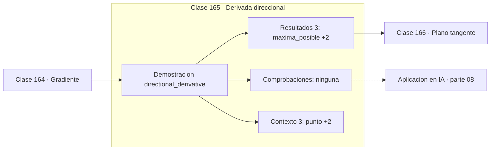

# 165 — Derivada direccional

> [⬅️ 164 Gradiente](../164-gradiente/README.md) · [📚 Parte 08](../README.md) · [🏠 Programa](../../../README.md) · [166 Plano tangente ➡️](../166-plano-tangente/README.md)

**Parte:** 08 — Cálculo multivariable, matricial y autodiferenciación · **Nivel:** `universitario-avanzado` · **Horas estimadas:** 4
**Motor:** `engines.part08` · **Demostración:** `directional_derivative` · **Clase 5 de 20** de la parte

---

## 🎯 Propósito

**La derivada direccional es la proyección del gradiente sobre una dirección unitaria.**

Derivadas parciales, gradiente, Jacobiano, Hessiano, Taylor multivariable, multiplicadores de Lagrange, cálculo matricial y autodiferenciación.

## ✅ Resultados de aprendizaje

Al terminar podrás:

1. Explicar **Derivada direccional** con lenguaje cotidiano y con notación matemática.
2. Resolver un caso pequeño a mano y anticipar el orden de magnitud del resultado.
3. Ejecutar y modificar `lab.py`, que corre la demostración `directional_derivative`.
4. Interpretar las 6 salidas del laboratorio y decir qué comprueba cada una.
5. Detectar el error típico de esta parte: suponer que el hessiano es definido positivo sin comprobarlo.

## 🧩 Fórmulas de la clase

```text
D_u f = ∇f · u,  con ‖u‖ = 1
máximo: ‖∇f‖ en la dirección de ∇f
nulo: en direcciones perpendiculares a ∇f
```

## 🗺️ Ubicación en el programa



## 📖 Fundamentos

La derivada direccional generaliza la parcial a cualquier dirección, no solo a los ejes.
Su fórmula es un producto punto: `D_u f = ∇f · u`, y de esa expresión se leen
inmediatamente sus valores extremos usando la clase 103.

Como `∇f · u = ‖∇f‖·cos θ` para `u` unitario, el valor es máximo cuando `θ = 0` —en la
dirección del gradiente— y vale `‖∇f‖`. Es mínimo en la dirección opuesta, valiendo
`−‖∇f‖`. Y es **cero** en las direcciones perpendiculares al gradiente, que son
precisamente las tangentes a la curva de nivel (clase 162).

Esa última observación cierra el círculo: moverse a lo largo de una curva de nivel no
cambia el valor de la función, y por eso la derivada direccional en esa dirección es
nula. La perpendicularidad entre gradiente y curva de nivel no es un hecho adicional: es
una consecuencia.

El requisito de que `u` sea **unitario** no es formalismo. Si no se normaliza, el
resultado escala con la longitud del vector y deja de ser una tasa de cambio por unidad
de distancia. Es el error más frecuente al implementar derivadas direccionales.

## 🧮 Ejemplo trabajado

Derivada direccional en cuatro direcciones.

```text
punto (2,3),  ∇f = (39, 40),  ‖∇f‖ = 55.87

dirección          D_u f
e₁ = (1,0)         39.00
e₂ = (0,1)         40.00
45° = (0.707,0.707) 55.86    ← casi el máximo
−∇f normalizado   −55.87     ← el mínimo

perpendicular a ∇f: (−40, 39)/‖·‖  →  0.0    ✓ nula

máximo posible = ‖∇f‖ = 55.87
```

## 🔬 Qué ejecuta el laboratorio

`directional_derivative` — Derivada direccional como proyección del gradiente.

| Grupo | Salidas |
|---|---|
| 🔢 Resultados numéricos (3) | `maxima_posible`, `minima_posible`, `nula_en_direccion_perpendicular` |
| ✅ Comprobaciones de invariante (0) | — |

Las claves booleanas no son adorno: si alguna fuera `False`, el resultado numérico
no sería fiable aunque el programa terminase sin error.

```bash
python classes/part-08-calculo-multivariable-matricial-y-autodiferenciacion/165-derivada-direccional/lab.py
compmath run 165
```

> [!TIP]
> Antes de ejecutar, **escribe tu predicción**. Un laboratorio que confirma lo que
> esperabas enseña tanto como uno que te contradice, pero solo si la predicción
> existía antes del resultado.

## ⚠️ Errores conceptuales frecuentes

1. No normalizar el vector de dirección.
2. Confundir la derivada direccional (escalar) con el gradiente (vector).
3. Suponer que la derivada direccional es máxima en la dirección de una variable.

## 🚀 Dónde se usa de verdad

Análisis de sensibilidad en direcciones combinadas, búsqueda de línea en optimización
(clase 254) y estudio de la anisotropía de una función de pérdida.

## 🤖 Conexión con IA

Autograd de PyTorch y JAX es exactamente el modo reverso del grafo de cómputo que se construye en esta parte a mano.

## 📓 Notebooks

| Archivo | Para qué |
|---|---|
| [`notebook.ipynb`](notebook.ipynb) | recorrido guiado con la demostración ejecutada |
| [`notebook_student.ipynb`](notebook_student.ipynb) | versión con `TODO` para resolver |
| [`notebook_solution.ipynb`](notebook_solution.ipynb) | solución de referencia verificada |

## 📝 Evaluación

| Criterio | Peso |
|---|---:|
| Comprensión conceptual | 25 % |
| Resolución manual | 25 % |
| Implementación y verificación | 25 % |
| Interpretación y comunicación | 15 % |
| Conexión con aplicación real | 10 % |

Detalle y criterios de error crítico en [`assessment.md`](assessment.md).

## ❓ Preguntas de comprobación

1. ¿Cuál es la entrada, cuál la salida y qué unidades tienen?
2. ¿Qué operación domina el comportamiento del resultado?
3. ¿Qué caso extremo revelaría un error conceptual?
4. ¿Cómo verificarías el resultado por un método independiente?
5. ¿Dónde aparece esto en optimización multivariable?

Si necesitas releer el código para responderlas, la clase todavía no está superada.

## 📥 Entregable

`notebook_student.ipynb` resuelto más un párrafo que explique el resultado **sin citar
código**: qué entra, qué sale, qué invariante se comprueba y qué pasaría en un caso límite.

## 🔗 Referencias

- [Stewart, J. *Calculus*, 8ª ed., Cengage, 2015, cap. 14](https://www.cengage.com/c/calculus-8e-stewart/) — *uso:* obra de referencia consultada en «Derivada direccional».
- [Nocedal & Wright. *Numerical Optimization*, 2ª ed., Springer, 2006](https://link.springer.com/book/10.1007/978-0-387-40065-5) — *uso:* desarrollo formal del tema en «Derivada direccional».

Bibliografía completa de la parte en [`../../../docs/BIBLIOGRAPHY.md`](../../../docs/BIBLIOGRAPHY.md) · localizador verificable de cada obra en [`sources/bibliography.json`](../../../sources/bibliography.json).

## 📂 Material de la clase

[`intuition.md`](intuition.md) · [`theory.md`](theory.md) · [`derivation.md`](derivation.md) · [`exercises.md`](exercises.md) · [`assessment.md`](assessment.md) · [`where-is-this-used.md`](where-is-this-used.md) · [`lesson.yaml`](lesson.yaml)

---

> [⬅️ 164 Gradiente](../164-gradiente/README.md) · [📚 Parte 08](../README.md) · [🏠 Programa](../../../README.md) · [166 Plano tangente ➡️](../166-plano-tangente/README.md)
