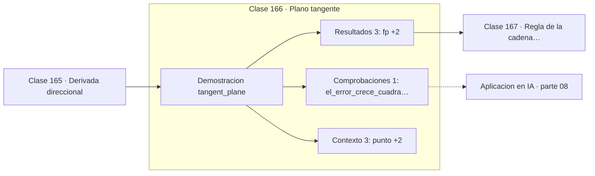

# 166 — Plano tangente

> [⬅️ 165 Derivada direccional](../165-derivada-direccional/README.md) · [📚 Parte 08](../README.md) · [🏠 Programa](../../../README.md) · [167 Regla de la cadena multivariable ➡️](../167-regla-de-la-cadena-multivariable/README.md)

**Parte:** 08 — Cálculo multivariable, matricial y autodiferenciación · **Nivel:** `universitario-avanzado` · **Horas estimadas:** 4
**Motor:** `engines.part08` · **Demostración:** `tangent_plane` · **Clase 6 de 20** de la parte

---

## 🎯 Propósito

**El plano tangente es la aproximación lineal en varias variables, y su error crece cuadráticamente.**

Derivadas parciales, gradiente, Jacobiano, Hessiano, Taylor multivariable, multiplicadores de Lagrange, cálculo matricial y autodiferenciación.

## ✅ Resultados de aprendizaje

Al terminar podrás:

1. Explicar **Plano tangente** con lenguaje cotidiano y con notación matemática.
2. Resolver un caso pequeño a mano y anticipar el orden de magnitud del resultado.
3. Ejecutar y modificar `lab.py`, que corre la demostración `tangent_plane`.
4. Interpretar las 7 salidas del laboratorio y decir qué comprueba cada una.
5. Detectar el error típico de esta parte: olvidar acumular gradientes cuando un nodo se reutiliza en el grafo.

## 🧩 Fórmulas de la clase

```text
z = f(a) + ∇f(a)·(x − a)
error ≈ ½·(x−a)ᵀH(x−a) = O(‖x−a‖²)
```

## 🗺️ Ubicación en el programa



## 📖 Fundamentos

El plano tangente es a las superficies lo que la recta tangente a las curvas: la mejor
aproximación lineal en un punto. Su ecuación usa el gradiente como vector de pendientes:
`f(a) + ∇f(a)·(x − a)`.

Lo interesante es cómo se comporta el error. Al alejarse del punto de tangencia, el error
crece **cuadráticamente**, no linealmente. Duplicar la distancia cuadruplica el error. Eso
explica por qué las aproximaciones lineales funcionan bien cerca y mal lejos, y por qué
el paso del descenso de gradiente debe ser pequeño: el gradiente solo describe la función
en un entorno.

El término cuadrático del error es exactamente el que captura el Hessiano, y por eso
Taylor de segundo orden (clase 170) es tanto más preciso. Los métodos de Newton usan esa
información para dar pasos más largos con seguridad.

La diferenciabilidad en varias variables se define precisamente como la existencia de una
buena aproximación lineal, con error `o(‖x−a‖)`. Es una condición más fuerte que la mera
existencia de las parciales, y es la que garantiza que el plano tangente merece ese
nombre.

## 🧮 Ejemplo trabajado

Plano tangente y crecimiento del error.

```text
f(x,y) = x²y + 3xy² + 2   en (2,3)
f(2,3) = 68,  ∇f = (39, 40)

plano: z = 68 + 39(x−2) + 40(y−3)

punto cercano (2.01, 3.01):
  f real     = 68.79
  plano      = 68.79
  error      = 0.0034

punto lejano (3, 4):
  f real     = 182.0
  plano      = 147.0
  error      = 35.0

Distancia ×100 → error ×10 000: crecimiento cuadrático  ✓
```

## 🔬 Qué ejecuta el laboratorio

`tangent_plane` — Plano tangente: la aproximación lineal en dos variables.

| Grupo | Salidas |
|---|---|
| 🔢 Resultados numéricos (3) | `f(p)`, `error_cerca`, `error_lejos` |
| ✅ Comprobaciones de invariante (1) | `el_error_crece_cuadraticamente` |

Las claves booleanas no son adorno: si alguna fuera `False`, el resultado numérico
no sería fiable aunque el programa terminase sin error.

```bash
python classes/part-08-calculo-multivariable-matricial-y-autodiferenciacion/166-plano-tangente/lab.py
compmath run 166
```

> [!TIP]
> Antes de ejecutar, **escribe tu predicción**. Un laboratorio que confirma lo que
> esperabas enseña tanto como uno que te contradice, pero solo si la predicción
> existía antes del resultado.

## ⚠️ Errores conceptuales frecuentes

1. Usar la aproximación lineal lejos del punto de tangencia.
2. Confundir el plano tangente con la superficie.
3. Suponer que la existencia de las parciales implica que hay plano tangente.

## 🚀 Dónde se usa de verdad

Linealización de modelos, propagación de incertidumbre de primer orden, un paso de
descenso de gradiente y aproximación local de funciones complejas.

## 🤖 Conexión con IA

Autograd de PyTorch y JAX es exactamente el modo reverso del grafo de cómputo que se construye en esta parte a mano.

## 📓 Notebooks

| Archivo | Para qué |
|---|---|
| [`notebook.ipynb`](notebook.ipynb) | recorrido guiado con la demostración ejecutada |
| [`notebook_student.ipynb`](notebook_student.ipynb) | versión con `TODO` para resolver |
| [`notebook_solution.ipynb`](notebook_solution.ipynb) | solución de referencia verificada |

## 📝 Evaluación

| Criterio | Peso |
|---|---:|
| Comprensión conceptual | 25 % |
| Resolución manual | 25 % |
| Implementación y verificación | 25 % |
| Interpretación y comunicación | 15 % |
| Conexión con aplicación real | 10 % |

Detalle y criterios de error crítico en [`assessment.md`](assessment.md).

## ❓ Preguntas de comprobación

1. ¿Cuál es la entrada, cuál la salida y qué unidades tienen?
2. ¿Qué operación domina el comportamiento del resultado?
3. ¿Qué caso extremo revelaría un error conceptual?
4. ¿Cómo verificarías el resultado por un método independiente?
5. ¿Dónde aparece esto en optimización multivariable?

Si necesitas releer el código para responderlas, la clase todavía no está superada.

## 📥 Entregable

`notebook_student.ipynb` resuelto más un párrafo que explique el resultado **sin citar
código**: qué entra, qué sale, qué invariante se comprueba y qué pasaría en un caso límite.

## 🔗 Referencias

- [Stewart, J. *Calculus*, 8ª ed., Cengage, 2015, cap. 14](https://www.cengage.com/c/calculus-8e-stewart/)
- [Apostol, T. *Mathematical Analysis*, 2ª ed., 1974](https://www.pearson.com/en-us/subject-catalog/p/mathematical-analysis/P200000006155)

Bibliografía completa de la parte en [`../../../docs/BIBLIOGRAPHY.md`](../../../docs/BIBLIOGRAPHY.md).

## 📂 Material de la clase

[`intuition.md`](intuition.md) · [`theory.md`](theory.md) · [`derivation.md`](derivation.md) · [`exercises.md`](exercises.md) · [`assessment.md`](assessment.md) · [`where-is-this-used.md`](where-is-this-used.md) · [`lesson.yaml`](lesson.yaml)

---

> [⬅️ 165 Derivada direccional](../165-derivada-direccional/README.md) · [📚 Parte 08](../README.md) · [🏠 Programa](../../../README.md) · [167 Regla de la cadena multivariable ➡️](../167-regla-de-la-cadena-multivariable/README.md)
