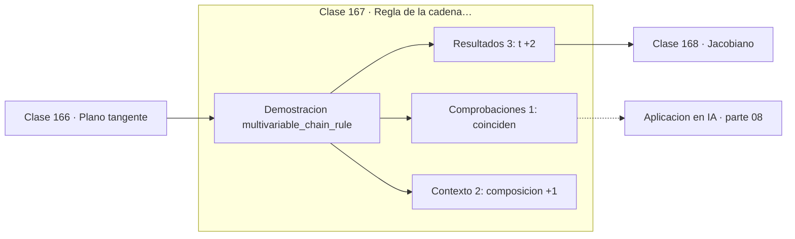

# 167 — Regla de la cadena multivariable

> [⬅️ 166 Plano tangente](../166-plano-tangente/README.md) · [📚 Parte 08](../README.md) · [🏠 Programa](../../../README.md) · [168 Jacobiano ➡️](../168-jacobiano/README.md)

**Parte:** 08 — Cálculo multivariable, matricial y autodiferenciación · **Nivel:** `universitario-avanzado` · **Horas estimadas:** 4
**Motor:** `engines.part08` · **Demostración:** `multivariable_chain_rule` · **Clase 7 de 20** de la parte

---

## 🎯 Propósito

**La regla de la cadena multivariable suma las contribuciones de todos los caminos.**

Derivadas parciales, gradiente, Jacobiano, Hessiano, Taylor multivariable, multiplicadores de Lagrange, cálculo matricial y autodiferenciación.

## ✅ Resultados de aprendizaje

Al terminar podrás:

1. Explicar **Regla de la cadena multivariable** con lenguaje cotidiano y con notación matemática.
2. Resolver un caso pequeño a mano y anticipar el orden de magnitud del resultado.
3. Ejecutar y modificar `lab.py`, que corre la demostración `multivariable_chain_rule`.
4. Interpretar las 6 salidas del laboratorio y decir qué comprueba cada una.
5. Detectar el error típico de esta parte: confundir la convención de layout (numerador vs denominador) en cálculo matricial.

## 🧩 Fórmulas de la clase

```text
dh/dt = (∂f/∂x)(dx/dt) + (∂f/∂y)(dy/dt)
en general: producto punto entre gradiente y velocidad
```

## 🗺️ Ubicación en el programa



## 📖 Fundamentos

Cuando una función depende de variables que a su vez dependen de un parámetro, la tasa de
cambio total suma las contribuciones de cada camino. Esa es la regla de la cadena
multivariable, y su forma compacta es un producto punto: gradiente por vector velocidad.

La lectura de «suma sobre caminos» es la que se generaliza al grafo de cómputo. En una
red neuronal, un parámetro puede influir en la pérdida por varias rutas —pesos
compartidos, conexiones residuales, capas que se reutilizan— y su gradiente total es la
**suma** de las contribuciones de todas ellas.

Ese detalle es la causa del error más común al implementar autodiferenciación a mano: si
un nodo se usa dos veces, hay que **acumular** su gradiente en lugar de sobrescribirlo.
El motor del programa usa `+=` precisamente por eso, y la clase 306 lo hace explícito. En
PyTorch, olvidar `zero_grad()` es el mismo problema al revés: acumular cuando no se debe.

La verificación numérica es directa: componer las funciones, derivar la composición por
diferencias finitas y comparar con la suma de productos. El laboratorio lo hace sobre una
trayectoria circular, donde `x = cos t` e `y = sin t`.

## 🧮 Ejemplo trabajado

Derivar f(x(t), y(t)) sobre una circunferencia.

```text
f(x,y) = x²y + 3xy² + 2
x(t) = cos t,  y(t) = sin t,   t = 1.5

∇f en (cos 1.5, sin 1.5) = (2.9787, 0.2318)
velocidad (dx/dt, dy/dt) = (−sin 1.5, cos 1.5) = (−0.9975, 0.0707)

Regla de la cadena:
  2.9787·(−0.9975) + 0.2318·0.0707 = −2.9548

Derivada numérica de h(t):  −2.9548           ✓

Estructura: producto punto entre gradiente y velocidad
```

## 🔬 Qué ejecuta el laboratorio

`multivariable_chain_rule` — Regla de la cadena con variables intermedias.

| Grupo | Salidas |
|---|---|
| 🔢 Resultados numéricos (3) | `t`, `∂f/∂x·dx/dt + ∂f/∂y·dy/dt`, `dh/dt_numerica` |
| ✅ Comprobaciones de invariante (1) | `coinciden` |

Las claves booleanas no son adorno: si alguna fuera `False`, el resultado numérico
no sería fiable aunque el programa terminase sin error.

```bash
python classes/part-08-calculo-multivariable-matricial-y-autodiferenciacion/167-regla-de-la-cadena-multivariable/lab.py
compmath run 167
```

> [!TIP]
> Antes de ejecutar, **escribe tu predicción**. Un laboratorio que confirma lo que
> esperabas enseña tanto como uno que te contradice, pero solo si la predicción
> existía antes del resultado.

## ⚠️ Errores conceptuales frecuentes

1. Sobrescribir el gradiente de un nodo reutilizado en lugar de acumularlo.
2. Olvidar alguno de los caminos de dependencia.
3. Evaluar el gradiente en el punto equivocado de la trayectoria.

## 🚀 Dónde se usa de verdad

Backpropagation con pesos compartidos, redes recurrentes, conexiones residuales y
propagación de incertidumbre a través de varias etapas.

## 🤖 Conexión con IA

Autograd de PyTorch y JAX es exactamente el modo reverso del grafo de cómputo que se construye en esta parte a mano.

## 📓 Notebooks

| Archivo | Para qué |
|---|---|
| [`notebook.ipynb`](notebook.ipynb) | recorrido guiado con la demostración ejecutada |
| [`notebook_student.ipynb`](notebook_student.ipynb) | versión con `TODO` para resolver |
| [`notebook_solution.ipynb`](notebook_solution.ipynb) | solución de referencia verificada |

## 📝 Evaluación

| Criterio | Peso |
|---|---:|
| Comprensión conceptual | 25 % |
| Resolución manual | 25 % |
| Implementación y verificación | 25 % |
| Interpretación y comunicación | 15 % |
| Conexión con aplicación real | 10 % |

Detalle y criterios de error crítico en [`assessment.md`](assessment.md).

## ❓ Preguntas de comprobación

1. ¿Cuál es la entrada, cuál la salida y qué unidades tienen?
2. ¿Qué operación domina el comportamiento del resultado?
3. ¿Qué caso extremo revelaría un error conceptual?
4. ¿Cómo verificarías el resultado por un método independiente?
5. ¿Dónde aparece esto en optimización multivariable?

Si necesitas releer el código para responderlas, la clase todavía no está superada.

## 📥 Entregable

`notebook_student.ipynb` resuelto más un párrafo que explique el resultado **sin citar
código**: qué entra, qué sale, qué invariante se comprueba y qué pasaría en un caso límite.

## 📚 Bibliografía de la clase

Esta clase enseña **Cálculo multivariable y matricial · Cálculo · Diferenciación automática**. Cada obra dice qué aporta aquí y cómo se comprobó su localizador:

- [Baydin, A. et al. *Automatic Differentiation in Machine Learning: a Survey*. JMLR, 2018](https://jmlr.org/papers/v18/17-468.html) — Diferenciación automática: el tema de esta clase · URL de la fuente primaria comprobada en Journal of Machine Learning Research (2026-08-19).
- [Stewart, J. *Calculus*, 8ª ed., Cengage, 2015, cap. 14](https://www.cengage.com/c/calculus-8e-stewart/) — Cálculo: el tema de esta clase · ISBN-13 `9781285740621` verificado en International ISBN Agency (2026-08-19).

Bibliografía de todas las clases, con el porqué de cada obra, en [`docs/BIBLIOGRAPHY.md`](../../../docs/BIBLIOGRAPHY.md) · localizador y estado de cada obra en [`sources/bibliography.json`](../../../sources/bibliography.json).

## 📂 Material de la clase

[`intuition.md`](intuition.md) · [`theory.md`](theory.md) · [`derivation.md`](derivation.md) · [`exercises.md`](exercises.md) · [`assessment.md`](assessment.md) · [`where-is-this-used.md`](where-is-this-used.md) · [`lesson.yaml`](lesson.yaml)

---

> [⬅️ 166 Plano tangente](../166-plano-tangente/README.md) · [📚 Parte 08](../README.md) · [🏠 Programa](../../../README.md) · [168 Jacobiano ➡️](../168-jacobiano/README.md)
