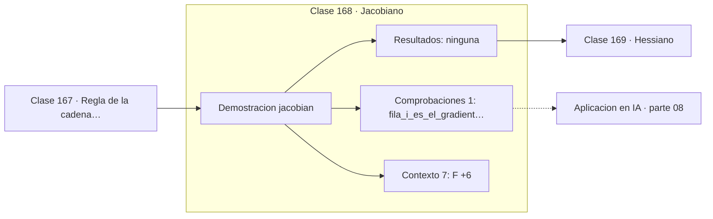

# 168 — Jacobiano

> [⬅️ 167 Regla de la cadena multivariable](../167-regla-de-la-cadena-multivariable/README.md) · [📚 Parte 08](../README.md) · [🏠 Programa](../../../README.md) · [169 Hessiano ➡️](../169-hessiano/README.md)

**Parte:** 08 — Cálculo multivariable, matricial y autodiferenciación · **Nivel:** `universitario-avanzado` · **Horas estimadas:** 4
**Motor:** `engines.part08` · **Demostración:** `jacobian` · **Clase 8 de 20** de la parte

---

## 🎯 Propósito

**El Jacobiano es la derivada de una función vectorial; el modo reverso calcula vᵀJ sin construirlo.**

Derivadas parciales, gradiente, Jacobiano, Hessiano, Taylor multivariable, multiplicadores de Lagrange, cálculo matricial y autodiferenciación.

## ✅ Resultados de aprendizaje

Al terminar podrás:

1. Explicar **Jacobiano** con lenguaje cotidiano y con notación matemática.
2. Resolver un caso pequeño a mano y anticipar el orden de magnitud del resultado.
3. Ejecutar y modificar `lab.py`, que corre la demostración `jacobian`.
4. Interpretar las 8 salidas del laboratorio y decir qué comprueba cada una.
5. Detectar el error típico de esta parte: suponer que el hessiano es definido positivo sin comprobarlo.

## 🧩 Fórmulas de la clase

```text
J ∈ ℝ^(m×n) para F: ℝⁿ → ℝᵐ
fila i = ∇Fᵢ
VJP: vᵀJ · JVP: Jv
```

## 🗺️ Ubicación en el programa



## 📖 Fundamentos

Cuando la función devuelve un vector en lugar de un escalar, su derivada es una matriz: el
**Jacobiano**. Su fila `i` es el gradiente de la componente `i` de la salida, y su columna
`j` recoge cómo afecta la entrada `j` a todas las salidas.

Su tamaño es el problema. Para una capa que va de 1000 entradas a 1000 salidas, el
Jacobiano tiene un millón de entradas; para un modelo completo, sería inmanejable. Por eso
**los frameworks nunca lo construyen**.

Lo que sí calculan son productos con el Jacobiano. El **VJP** (vector-Jacobian product),
`vᵀJ`, es lo que hace `backward()`: propaga un gradiente hacia atrás sin materializar la
matriz. El **JVP** (Jacobian-vector product), `Jv`, es lo que hace el modo directo. Cada
uno cuesta aproximadamente lo mismo que evaluar la función una vez.

La elección entre modos depende de la forma. Si hay muchas entradas y una sola salida
—el caso de una función de pérdida, con millones de parámetros y un escalar— el **modo
reverso** obtiene todos los gradientes con un solo barrido. Si hay pocas entradas y
muchas salidas, el modo directo es más eficiente. El entrenamiento de redes es el primer
caso, y por eso backpropagation es modo reverso.

## 🧮 Ejemplo trabajado

Jacobiano de una función de ℝ² en ℝ³.

```text
F(x,y) = (x²+y,  sin(x)·y,  x−3y)   en (1,2)

J (shape 3×2):
  [[2x,        1     ]     [[2.0,     1.0   ]
   [cos(x)·y,  sin(x)]  =   [1.0806,  0.8415]
   [1,        −3     ]]     [1.0,    −3.0   ]]

fila 1 = ∇(x²+y) = (2x, 1) = (2, 1)          ✓

VJP (modo reverso): vᵀJ, coste ≈ 1 evaluación
JVP (modo directo): Jv,  coste ≈ 1 evaluación
```

## 🔬 Qué ejecuta el laboratorio

`jacobian` — Jacobiano de una función vectorial.

| Grupo | Salidas |
|---|---|
| 🔢 Resultados numéricos (0) | — |
| ✅ Comprobaciones de invariante (1) | `fila_i_es_el_gradiente_de_Fi` |

Las claves booleanas no son adorno: si alguna fuera `False`, el resultado numérico
no sería fiable aunque el programa terminase sin error.

```bash
python classes/part-08-calculo-multivariable-matricial-y-autodiferenciacion/168-jacobiano/lab.py
compmath run 168
```

> [!TIP]
> Antes de ejecutar, **escribe tu predicción**. Un laboratorio que confirma lo que
> esperabas enseña tanto como uno que te contradice, pero solo si la predicción
> existía antes del resultado.

## ⚠️ Errores conceptuales frecuentes

1. Construir el Jacobiano completo cuando basta un producto con él.
2. Confundir filas con columnas al escribirlo.
3. Elegir el modo directo cuando hay muchas entradas y una salida.

## 🚀 Dónde se usa de verdad

Autodiferenciación, cambio de variable en densidades, cinemática de robots y análisis de
sensibilidad de sistemas con varias salidas.

## 🤖 Conexión con IA

Autograd de PyTorch y JAX es exactamente el modo reverso del grafo de cómputo que se construye en esta parte a mano.

## 📓 Notebooks

| Archivo | Para qué |
|---|---|
| [`notebook.ipynb`](notebook.ipynb) | recorrido guiado con la demostración ejecutada |
| [`notebook_student.ipynb`](notebook_student.ipynb) | versión con `TODO` para resolver |
| [`notebook_solution.ipynb`](notebook_solution.ipynb) | solución de referencia verificada |

## 📝 Evaluación

| Criterio | Peso |
|---|---:|
| Comprensión conceptual | 25 % |
| Resolución manual | 25 % |
| Implementación y verificación | 25 % |
| Interpretación y comunicación | 15 % |
| Conexión con aplicación real | 10 % |

Detalle y criterios de error crítico en [`assessment.md`](assessment.md).

## ❓ Preguntas de comprobación

1. ¿Cuál es la entrada, cuál la salida y qué unidades tienen?
2. ¿Qué operación domina el comportamiento del resultado?
3. ¿Qué caso extremo revelaría un error conceptual?
4. ¿Cómo verificarías el resultado por un método independiente?
5. ¿Dónde aparece esto en optimización multivariable?

Si necesitas releer el código para responderlas, la clase todavía no está superada.

## 📥 Entregable

`notebook_student.ipynb` resuelto más un párrafo que explique el resultado **sin citar
código**: qué entra, qué sale, qué invariante se comprueba y qué pasaría en un caso límite.

## 📚 Bibliografía de la clase

Esta clase enseña **Cálculo multivariable y matricial · Cálculo · Diferenciación automática**. Cada obra dice qué aporta aquí y cómo se comprobó su localizador:

- [Baydin, A. et al. *Automatic Differentiation in Machine Learning: a Survey*. JMLR, 2018](https://jmlr.org/papers/v18/17-468.html) — Diferenciación automática: el tema de esta clase · URL de la fuente primaria comprobada en Journal of Machine Learning Research (2026-08-19).
- [JAX: autodiff cookbook](https://docs.jax.dev/en/latest/notebooks/autodiff_cookbook.html) — Diferenciación automática: el tema de esta clase · URL de la fuente primaria comprobada en JAX developers (2026-08-19).

Bibliografía de todas las clases, con el porqué de cada obra, en [`docs/BIBLIOGRAPHY.md`](../../../docs/BIBLIOGRAPHY.md) · localizador y estado de cada obra en [`sources/bibliography.json`](../../../sources/bibliography.json).

## 📂 Material de la clase

[`intuition.md`](intuition.md) · [`theory.md`](theory.md) · [`derivation.md`](derivation.md) · [`exercises.md`](exercises.md) · [`assessment.md`](assessment.md) · [`where-is-this-used.md`](where-is-this-used.md) · [`lesson.yaml`](lesson.yaml)

---

> [⬅️ 167 Regla de la cadena multivariable](../167-regla-de-la-cadena-multivariable/README.md) · [📚 Parte 08](../README.md) · [🏠 Programa](../../../README.md) · [169 Hessiano ➡️](../169-hessiano/README.md)
