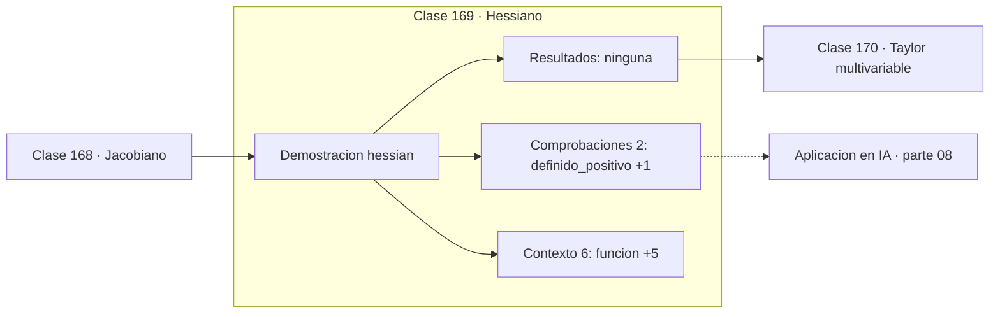

# 169 — Hessiano

> [⬅️ 168 Jacobiano](../168-jacobiano/README.md) · [📚 Parte 08](../README.md) · [🏠 Programa](../../../README.md) · [170 Taylor multivariable ➡️](../170-taylor-multivariable/README.md)

**Parte:** 08 — Cálculo multivariable, matricial y autodiferenciación · **Nivel:** `universitario-avanzado` · **Horas estimadas:** 4
**Motor:** `engines.part08` · **Demostración:** `hessian` · **Clase 9 de 20** de la parte

---

## 🎯 Propósito

**El Hessiano describe la curvatura, y el signo de sus autovalores clasifica el punto crítico.**

Derivadas parciales, gradiente, Jacobiano, Hessiano, Taylor multivariable, multiplicadores de Lagrange, cálculo matricial y autodiferenciación.

## ✅ Resultados de aprendizaje

Al terminar podrás:

1. Explicar **Hessiano** con lenguaje cotidiano y con notación matemática.
2. Resolver un caso pequeño a mano y anticipar el orden de magnitud del resultado.
3. Ejecutar y modificar `lab.py`, que corre la demostración `hessian`.
4. Interpretar las 8 salidas del laboratorio y decir qué comprueba cada una.
5. Detectar el error típico de esta parte: olvidar acumular gradientes cuando un nodo se reutiliza en el grafo.

## 🧩 Fórmulas de la clase

```text
Hᵢⱼ = ∂²f/∂xᵢ∂xⱼ
definido positivo ⟹ mínimo; definido negativo ⟹ máximo; signos mixtos ⟹ silla
```

## 🗺️ Ubicación en el programa



## 📖 Fundamentos

El Hessiano recoge todas las segundas derivadas y describe cómo se curva la función en
cada dirección. Es simétrico por el teorema de Schwarz (clase 163), y por tanto tiene
autovalores reales y autovectores ortogonales (clase 126).

Los autovalores son las **curvaturas principales**. Todos positivos significa que la
función se curva hacia arriba en todas las direcciones: mínimo local. Todos negativos:
máximo. Signos mixtos: **punto de silla**, mínimo en unas direcciones y máximo en otras.

Ese último caso es el que domina en alta dimensión. En un espacio de un millón de
dimensiones, que todos los autovalores tengan el mismo signo es extraordinariamente
improbable; lo típico es que haya mezcla. Por eso el consenso actual es que el problema
del entrenamiento de redes profundas **no son los mínimos locales malos, son los puntos
de silla y las mesetas** que los rodean.

El Hessiano también determina la velocidad de convergencia. El cociente entre su mayor y
su menor autovalor es el número de condición del problema, y controla lo lento que
converge el descenso de gradiente (clase 244). Los métodos de segundo orden usan el
Hessiano para corregir esa anisotropía, a costa de un coste `O(n³)` que los hace
inviables con millones de parámetros.

## 🧮 Ejemplo trabajado

Hessiano de x² + 3y² en el origen.

```text
f(x,y) = x² + 3y²

∇f(0,0) = (0, 0)                    → punto crítico

H = [[2, 0],
     [0, 6]]

autovalores: 2 y 6,  ambos positivos → definido positivo

Clasificación: MÍNIMO local          ✓

Número de condición: 6/2 = 3
  curvas de nivel: elipses con ejes 3:1
```

## 🔬 Qué ejecuta el laboratorio

`hessian` — Hessiano: curvatura y clasificación del punto crítico.

| Grupo | Salidas |
|---|---|
| 🔢 Resultados numéricos (0) | — |
| ✅ Comprobaciones de invariante (2) | `definido_positivo`, `silla_si_hay_signos_mixtos` |

Las claves booleanas no son adorno: si alguna fuera `False`, el resultado numérico
no sería fiable aunque el programa terminase sin error.

```bash
python classes/part-08-calculo-multivariable-matricial-y-autodiferenciacion/169-hessiano/lab.py
compmath run 169
```

> [!TIP]
> Antes de ejecutar, **escribe tu predicción**. Un laboratorio que confirma lo que
> esperabas enseña tanto como uno que te contradice, pero solo si la predicción
> existía antes del resultado.

## ⚠️ Errores conceptuales frecuentes

1. Clasificar un punto crítico sin calcular los autovalores del Hessiano.
2. Suponer que los mínimos locales son el principal obstáculo en alta dimensión.
3. Construir el Hessiano completo en problemas con muchos parámetros.

## 🚀 Dónde se usa de verdad

Clasificación de puntos críticos, método de Newton, análisis de convergencia,
aproximación de Laplace en inferencia bayesiana y K-FAC.

## 🤖 Conexión con IA

Autograd de PyTorch y JAX es exactamente el modo reverso del grafo de cómputo que se construye en esta parte a mano.

## 📓 Notebooks

| Archivo | Para qué |
|---|---|
| [`notebook.ipynb`](notebook.ipynb) | recorrido guiado con la demostración ejecutada |
| [`notebook_student.ipynb`](notebook_student.ipynb) | versión con `TODO` para resolver |
| [`notebook_solution.ipynb`](notebook_solution.ipynb) | solución de referencia verificada |

## 📝 Evaluación

| Criterio | Peso |
|---|---:|
| Comprensión conceptual | 25 % |
| Resolución manual | 25 % |
| Implementación y verificación | 25 % |
| Interpretación y comunicación | 15 % |
| Conexión con aplicación real | 10 % |

Detalle y criterios de error crítico en [`assessment.md`](assessment.md).

## ❓ Preguntas de comprobación

1. ¿Cuál es la entrada, cuál la salida y qué unidades tienen?
2. ¿Qué operación domina el comportamiento del resultado?
3. ¿Qué caso extremo revelaría un error conceptual?
4. ¿Cómo verificarías el resultado por un método independiente?
5. ¿Dónde aparece esto en optimización multivariable?

Si necesitas releer el código para responderlas, la clase todavía no está superada.

## 📥 Entregable

`notebook_student.ipynb` resuelto más un párrafo que explique el resultado **sin citar
código**: qué entra, qué sale, qué invariante se comprueba y qué pasaría en un caso límite.

## 📚 Bibliografía de la clase

Esta clase enseña **Cálculo multivariable y matricial · Optimización**. Cada obra dice qué aporta aquí y cómo se comprobó su localizador:

- [Dauphin, Y. et al. *Identifying and attacking the saddle point problem in high-dimensional non-convex optimization*. NeurIPS, 2014](https://arxiv.org/abs/1406.2572) — Optimización: el tema de esta clase · DOI `10.48550/arxiv.1406.2572` verificado en DataCite (2026-08-19).
- [Nocedal & Wright. *Numerical Optimization*, 2ª ed., Springer, 2006](https://link.springer.com/book/10.1007/978-0-387-40065-5) — Optimización: el tema de esta clase · ISBN-13 `9780387400655` verificado en International ISBN Agency (2026-08-19).

Bibliografía de todas las clases, con el porqué de cada obra, en [`docs/BIBLIOGRAPHY.md`](../../../docs/BIBLIOGRAPHY.md) · localizador y estado de cada obra en [`sources/bibliography.json`](../../../sources/bibliography.json).

## 📂 Material de la clase

[`intuition.md`](intuition.md) · [`theory.md`](theory.md) · [`derivation.md`](derivation.md) · [`exercises.md`](exercises.md) · [`assessment.md`](assessment.md) · [`where-is-this-used.md`](where-is-this-used.md) · [`lesson.yaml`](lesson.yaml)

---

> [⬅️ 168 Jacobiano](../168-jacobiano/README.md) · [📚 Parte 08](../README.md) · [🏠 Programa](../../../README.md) · [170 Taylor multivariable ➡️](../170-taylor-multivariable/README.md)
