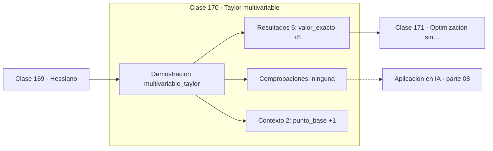

# 170 — Taylor multivariable

> [⬅️ 169 Hessiano](../169-hessiano/README.md) · [📚 Parte 08](../README.md) · [🏠 Programa](../../../README.md) · [171 Optimización sin restricciones ➡️](../171-optimizacion-sin-restricciones/README.md)

**Parte:** 08 — Cálculo multivariable, matricial y autodiferenciación · **Nivel:** `universitario-avanzado` · **Horas estimadas:** 4
**Motor:** `engines.part08` · **Demostración:** `multivariable_taylor` · **Clase 10 de 20** de la parte

---

## 🎯 Propósito

**Taylor de segundo orden usa el Hessiano y reduce el error de cuadrático a cúbico.**

Derivadas parciales, gradiente, Jacobiano, Hessiano, Taylor multivariable, multiplicadores de Lagrange, cálculo matricial y autodiferenciación.

## ✅ Resultados de aprendizaje

Al terminar podrás:

1. Explicar **Taylor multivariable** con lenguaje cotidiano y con notación matemática.
2. Resolver un caso pequeño a mano y anticipar el orden de magnitud del resultado.
3. Ejecutar y modificar `lab.py`, que corre la demostración `multivariable_taylor`.
4. Interpretar las 8 salidas del laboratorio y decir qué comprueba cada una.
5. Detectar el error típico de esta parte: confundir la convención de layout (numerador vs denominador) en cálculo matricial.

## 🧩 Fórmulas de la clase

```text
f(x+d) ≈ f(x) + ∇fᵀd + ½dᵀHd
error de orden 1: O(‖d‖²); de orden 2: O(‖d‖³)
```

## 🗺️ Ubicación en el programa



## 📖 Fundamentos

El desarrollo de Taylor multivariable tiene la misma estructura que el de una variable,
con el gradiente en el término lineal y el Hessiano en el cuadrático. La expresión
`½dᵀHd` es una forma cuadrática (clase 128), y su valor depende de la dirección del
desplazamiento.

La ganancia de precisión es sustancial: el término de orden 2 reduce el error de `O(‖d‖²)`
a `O(‖d‖³)`. Para un desplazamiento de 0.05, eso significa pasar de un error del orden de
0.0025 a uno del orden de 0.000125: veinte veces mejor.

Esa mejora es la que justifica los métodos de segundo orden. Newton aproxima la función
por su Taylor cuadrático y salta directamente al mínimo de esa parábola, lo que converge
cuadráticamente cerca del óptimo. El precio es calcular e invertir el Hessiano.

Todos los optimizadores adaptativos de la parte 12 —AdaGrad, RMSProp, Adam— son intentos
de capturar información de segundo orden **sin** calcular el Hessiano, usando en su lugar
estadísticas acumuladas del gradiente. Entender qué aproximan exige entender este
desarrollo.

## 🧮 Ejemplo trabajado

Órdenes 0, 1 y 2 alrededor de (1,1).

```text
f(x,y) = x²y + 3xy² + 2,  desplazamiento d = (0.05, −0.03)

valor exacto:  6.0296

orden 0:  6.0000     error 2.96e−02
orden 1:  6.0250     error 4.60e−03
orden 2:  6.0296     error 1.11e−04

Cada orden reduce el error en más de un factor 10.
```

## 🔬 Qué ejecuta el laboratorio

`multivariable_taylor` — Taylor de segundo orden en dos variables.

| Grupo | Salidas |
|---|---|
| 🔢 Resultados numéricos (6) | `valor_exacto`, `orden_0`, `orden_1`, `orden_2`, `error_orden_1`, `error_orden_2` |
| ✅ Comprobaciones de invariante (0) | — |

Las claves booleanas no son adorno: si alguna fuera `False`, el resultado numérico
no sería fiable aunque el programa terminase sin error.

```bash
python classes/part-08-calculo-multivariable-matricial-y-autodiferenciacion/170-taylor-multivariable/lab.py
compmath run 170
```

> [!TIP]
> Antes de ejecutar, **escribe tu predicción**. Un laboratorio que confirma lo que
> esperabas enseña tanto como uno que te contradice, pero solo si la predicción
> existía antes del resultado.

## ⚠️ Errores conceptuales frecuentes

1. Olvidar el factor ½ en el término cuadrático.
2. Usar el desarrollo lejos del punto base.
3. Suponer que el Hessiano es constante fuera del caso cuadrático.

## 🚀 Dónde se usa de verdad

Método de Newton, análisis de convergencia, aproximación de Laplace y justificación de
los optimizadores adaptativos.

## 🤖 Conexión con IA

Autograd de PyTorch y JAX es exactamente el modo reverso del grafo de cómputo que se construye en esta parte a mano.

## 📓 Notebooks

| Archivo | Para qué |
|---|---|
| [`notebook.ipynb`](notebook.ipynb) | recorrido guiado con la demostración ejecutada |
| [`notebook_student.ipynb`](notebook_student.ipynb) | versión con `TODO` para resolver |
| [`notebook_solution.ipynb`](notebook_solution.ipynb) | solución de referencia verificada |

## 📝 Evaluación

| Criterio | Peso |
|---|---:|
| Comprensión conceptual | 25 % |
| Resolución manual | 25 % |
| Implementación y verificación | 25 % |
| Interpretación y comunicación | 15 % |
| Conexión con aplicación real | 10 % |

Detalle y criterios de error crítico en [`assessment.md`](assessment.md).

## ❓ Preguntas de comprobación

1. ¿Cuál es la entrada, cuál la salida y qué unidades tienen?
2. ¿Qué operación domina el comportamiento del resultado?
3. ¿Qué caso extremo revelaría un error conceptual?
4. ¿Cómo verificarías el resultado por un método independiente?
5. ¿Dónde aparece esto en optimización multivariable?

Si necesitas releer el código para responderlas, la clase todavía no está superada.

## 📥 Entregable

`notebook_student.ipynb` resuelto más un párrafo que explique el resultado **sin citar
código**: qué entra, qué sale, qué invariante se comprueba y qué pasaría en un caso límite.

## 🔗 Referencias

- [Nocedal & Wright. *Numerical Optimization*, 2ª ed., Springer, 2006, cap. 2](https://link.springer.com/book/10.1007/978-0-387-40065-5) — *uso:* desarrollo formal del tema en «Taylor multivariable».
- [Boyd & Vandenberghe. *Convex Optimization*. Cambridge, 2004](https://web.stanford.edu/~boyd/cvxbook/) — *uso:* obra de referencia consultada en «Taylor multivariable».

Bibliografía completa de la parte en [`../../../docs/BIBLIOGRAPHY.md`](../../../docs/BIBLIOGRAPHY.md) · localizador verificable de cada obra en [`sources/bibliography.json`](../../../sources/bibliography.json).

## 📂 Material de la clase

[`intuition.md`](intuition.md) · [`theory.md`](theory.md) · [`derivation.md`](derivation.md) · [`exercises.md`](exercises.md) · [`assessment.md`](assessment.md) · [`where-is-this-used.md`](where-is-this-used.md) · [`lesson.yaml`](lesson.yaml)

---

> [⬅️ 169 Hessiano](../169-hessiano/README.md) · [📚 Parte 08](../README.md) · [🏠 Programa](../../../README.md) · [171 Optimización sin restricciones ➡️](../171-optimizacion-sin-restricciones/README.md)
