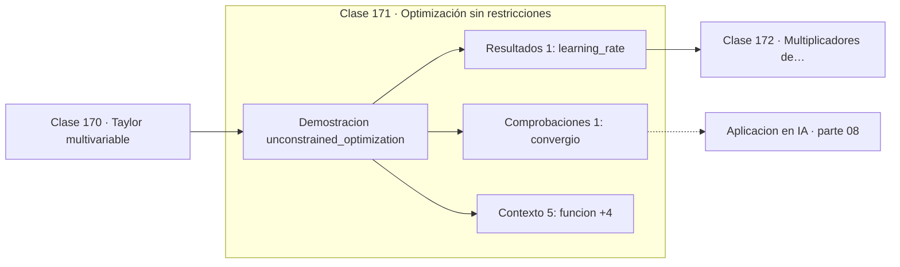

# 171 — Optimización sin restricciones

> [⬅️ 170 Taylor multivariable](../170-taylor-multivariable/README.md) · [📚 Parte 08](../README.md) · [🏠 Programa](../../../README.md) · [172 Multiplicadores de Lagrange ➡️](../172-multiplicadores-de-lagrange/README.md)

**Parte:** 08 — Cálculo multivariable, matricial y autodiferenciación · **Nivel:** `universitario-avanzado` · **Horas estimadas:** 4
**Motor:** `engines.part08` · **Demostración:** `unconstrained_optimization` · **Clase 11 de 20** de la parte

---

## 🎯 Propósito

**El descenso de gradiente converge en una cuadrática si el paso respeta el límite de estabilidad.**

Derivadas parciales, gradiente, Jacobiano, Hessiano, Taylor multivariable, multiplicadores de Lagrange, cálculo matricial y autodiferenciación.

## ✅ Resultados de aprendizaje

Al terminar podrás:

1. Explicar **Optimización sin restricciones** con lenguaje cotidiano y con notación matemática.
2. Resolver un caso pequeño a mano y anticipar el orden de magnitud del resultado.
3. Ejecutar y modificar `lab.py`, que corre la demostración `unconstrained_optimization`.
4. Interpretar las 7 salidas del laboratorio y decir qué comprueba cada una.
5. Detectar el error típico de esta parte: suponer que el hessiano es definido positivo sin comprobarlo.

## 🧩 Fórmulas de la clase

```text
x ← x − α∇f(x)
estable si α < 2/λ_max
convergencia lenta si λ_max/λ_min es grande
```

## 🗺️ Ubicación en el programa



## 📖 Fundamentos

El descenso de gradiente aplica repetidamente la misma regla: moverse en dirección
contraria al gradiente con un paso `α`. Sobre una función cuadrática se puede analizar
exactamente, y ese análisis explica todo lo que se observa en la práctica.

La condición de estabilidad es `α < 2/λ_max`, donde `λ_max` es el mayor autovalor del
Hessiano. Superarla hace que el algoritmo diverja, y por eso el learning rate es el
hiperparámetro que más divergencias explica. La clase 244 lo comprueba con cuatro valores
distintos.

La velocidad de convergencia la determina el **cociente** de autovalores. Si son
parecidos, el descenso avanza directo al mínimo; si son muy dispares, el gradiente apunta
casi perpendicular al eje largo del valle y el algoritmo zigzaguea. Con `f = x² + 20y²`,
la relación es 20 a 1 y el zigzagueo es visible.

Ese diagnóstico es el que motiva todo lo demás. Momentum (clase 246) amortigua la
oscilación acumulando velocidad; los métodos adaptativos escalan cada coordenada por
separado; los de segundo orden corrigen la anisotropía directamente. Todos atacan el
mismo problema.

## 🧮 Ejemplo trabajado

Descenso sobre una cuadrática mal condicionada.

```text
f(x,y) = (x−3)² + 5(y+1)²,  lr = 0.08
inicio (0,0),  mínimo teórico (3,−1)

paso    x                 f
  1     (0.48, −0.80)     6.55
  5     (1.72, −0.99)     1.63
 20     (2.90, −1.00)     0.0092
 60     (3.00, −1.00)     1.6e−09

gradiente final: 8.9e−05     → convergió       ✓

Límite de estabilidad: α < 2/10 = 0.2
```

## 🔬 Qué ejecuta el laboratorio

`unconstrained_optimization` — Descenso de gradiente sobre una cuadrática con historial.

| Grupo | Salidas |
|---|---|
| 🔢 Resultados numéricos (1) | `learning_rate` |
| ✅ Comprobaciones de invariante (1) | `convergio` |

Las claves booleanas no son adorno: si alguna fuera `False`, el resultado numérico
no sería fiable aunque el programa terminase sin error.

```bash
python classes/part-08-calculo-multivariable-matricial-y-autodiferenciacion/171-optimizacion-sin-restricciones/lab.py
compmath run 171
```

> [!TIP]
> Antes de ejecutar, **escribe tu predicción**. Un laboratorio que confirma lo que
> esperabas enseña tanto como uno que te contradice, pero solo si la predicción
> existía antes del resultado.

## ⚠️ Errores conceptuales frecuentes

1. Elegir el learning rate sin considerar la curvatura del problema.
2. Detener por número de iteraciones sin comprobar la norma del gradiente.
3. Suponer que la convergencia en una cuadrática predice la de un problema no convexo.

## 🚀 Dónde se usa de verdad

Entrenamiento de cualquier modelo por gradiente, ajuste del learning rate y diagnóstico de
divergencias.

## 🤖 Conexión con IA

Autograd de PyTorch y JAX es exactamente el modo reverso del grafo de cómputo que se construye en esta parte a mano.

## 📓 Notebooks

| Archivo | Para qué |
|---|---|
| [`notebook.ipynb`](notebook.ipynb) | recorrido guiado con la demostración ejecutada |
| [`notebook_student.ipynb`](notebook_student.ipynb) | versión con `TODO` para resolver |
| [`notebook_solution.ipynb`](notebook_solution.ipynb) | solución de referencia verificada |

## 📝 Evaluación

| Criterio | Peso |
|---|---:|
| Comprensión conceptual | 25 % |
| Resolución manual | 25 % |
| Implementación y verificación | 25 % |
| Interpretación y comunicación | 15 % |
| Conexión con aplicación real | 10 % |

Detalle y criterios de error crítico en [`assessment.md`](assessment.md).

## ❓ Preguntas de comprobación

1. ¿Cuál es la entrada, cuál la salida y qué unidades tienen?
2. ¿Qué operación domina el comportamiento del resultado?
3. ¿Qué caso extremo revelaría un error conceptual?
4. ¿Cómo verificarías el resultado por un método independiente?
5. ¿Dónde aparece esto en optimización multivariable?

Si necesitas releer el código para responderlas, la clase todavía no está superada.

## 📥 Entregable

`notebook_student.ipynb` resuelto más un párrafo que explique el resultado **sin citar
código**: qué entra, qué sale, qué invariante se comprueba y qué pasaría en un caso límite.

## 🔗 Referencias

- [Ruder, S. *An overview of gradient descent optimization algorithms*. arXiv, 2016](https://arxiv.org/abs/1609.04747) — *uso:* artículo de origen consultado en «Optimización sin restricciones».
- [Nocedal & Wright. *Numerical Optimization*, 2ª ed., Springer, 2006](https://link.springer.com/book/10.1007/978-0-387-40065-5) — *uso:* desarrollo formal del tema en «Optimización sin restricciones».

Bibliografía completa de la parte en [`../../../docs/BIBLIOGRAPHY.md`](../../../docs/BIBLIOGRAPHY.md) · localizador verificable de cada obra en [`sources/bibliography.json`](../../../sources/bibliography.json).

## 📂 Material de la clase

[`intuition.md`](intuition.md) · [`theory.md`](theory.md) · [`derivation.md`](derivation.md) · [`exercises.md`](exercises.md) · [`assessment.md`](assessment.md) · [`where-is-this-used.md`](where-is-this-used.md) · [`lesson.yaml`](lesson.yaml)

---

> [⬅️ 170 Taylor multivariable](../170-taylor-multivariable/README.md) · [📚 Parte 08](../README.md) · [🏠 Programa](../../../README.md) · [172 Multiplicadores de Lagrange ➡️](../172-multiplicadores-de-lagrange/README.md)
