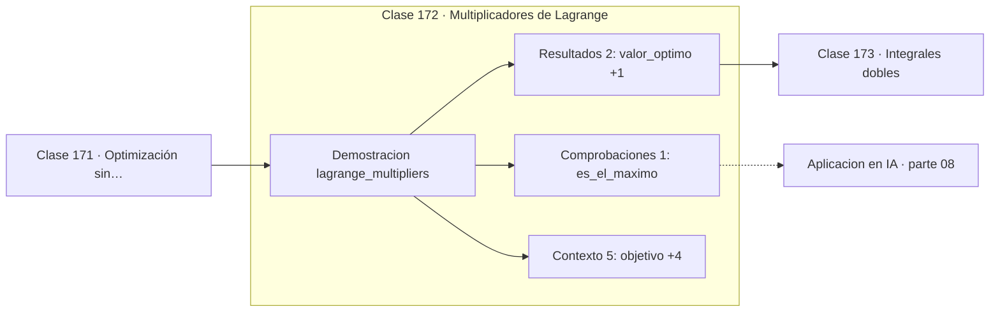

# 172 — Multiplicadores de Lagrange

> [⬅️ 171 Optimización sin restricciones](../171-optimizacion-sin-restricciones/README.md) · [📚 Parte 08](../README.md) · [🏠 Programa](../../../README.md) · [173 Integrales dobles ➡️](../173-integrales-dobles/README.md)

**Parte:** 08 — Cálculo multivariable, matricial y autodiferenciación · **Nivel:** `universitario-avanzado` · **Horas estimadas:** 4
**Motor:** `engines.part08` · **Demostración:** `lagrange_multipliers` · **Clase 12 de 20** de la parte

---

## 🎯 Propósito

**Lagrange convierte una restricción en un término del objetivo, y su multiplicador mide el precio de esa restricción.**

Derivadas parciales, gradiente, Jacobiano, Hessiano, Taylor multivariable, multiplicadores de Lagrange, cálculo matricial y autodiferenciación.

## ✅ Resultados de aprendizaje

Al terminar podrás:

1. Explicar **Multiplicadores de Lagrange** con lenguaje cotidiano y con notación matemática.
2. Resolver un caso pequeño a mano y anticipar el orden de magnitud del resultado.
3. Ejecutar y modificar `lab.py`, que corre la demostración `lagrange_multipliers`.
4. Interpretar las 8 salidas del laboratorio y decir qué comprueba cada una.
5. Detectar el error típico de esta parte: olvidar acumular gradientes cuando un nodo se reutiliza en el grafo.

## 🧩 Fórmulas de la clase

```text
L = f(x) − λ(g(x) − c)
∇f = λ∇g en el óptimo
λ = tasa de mejora del óptimo por unidad de relajación
```

## 🗺️ Ubicación en el programa



## 📖 Fundamentos

Optimizar con una restricción de igualdad no se puede hacer anulando el gradiente del
objetivo: el óptimo restringido rara vez es un punto crítico libre. La condición correcta
es que los gradientes del objetivo y de la restricción sean **paralelos**: `∇f = λ∇g`.

La intuición geométrica es clara. Si el gradiente del objetivo tuviera una componente
tangente a la curva de restricción, se podría mejorar moviéndose a lo largo de ella. En el
óptimo, esa componente tangente debe anularse, y eso ocurre exactamente cuando ambos
gradientes son colineales.

El multiplicador `λ` no es un artificio de cálculo: tiene interpretación económica
directa. Es la tasa a la que mejora el óptimo si se relaja la restricción una unidad —el
**precio sombra** en programación lineal—. En el ejemplo del laboratorio, maximizar `xy`
con `x+y=10` da `λ = 5`: cada unidad adicional de presupuesto añade 5 al óptimo.

La generalización a restricciones de **desigualdad** son las condiciones KKT (clase 257),
que añaden dos requisitos: los multiplicadores deben ser no negativos y debe cumplirse la
holgura complementaria —una restricción inactiva tiene multiplicador nulo—. Toda la
optimización con restricciones se construye sobre esta clase.

## 🧮 Ejemplo trabajado

Maximizar xy sujeto a x + y = 10.

```text
L = xy − λ(x + y − 10)

Condiciones:
  ∂L/∂x: y = λ
  ∂L/∂y: x = λ
  restricción: x + y = 10

Solución: x = y = 5,  λ = 5,  valor óptimo = 25

Verificación con alternativas:
  x=1 → 9    x=3 → 21   x=5 → 25   x=7 → 21   x=9 → 9
  el máximo está en x=5                        ✓

Interpretación de λ: si el presupuesto sube a 11,
el óptimo sube aproximadamente 5 unidades.
```

## 🔬 Qué ejecuta el laboratorio

`lagrange_multipliers` — Maximizar xy sujeto a x+y=10 con multiplicadores de Lagrange.

| Grupo | Salidas |
|---|---|
| 🔢 Resultados numéricos (2) | `valor_optimo`, `multiplicador_lambda` |
| ✅ Comprobaciones de invariante (1) | `es_el_maximo` |

Las claves booleanas no son adorno: si alguna fuera `False`, el resultado numérico
no sería fiable aunque el programa terminase sin error.

```bash
python classes/part-08-calculo-multivariable-matricial-y-autodiferenciacion/172-multiplicadores-de-lagrange/lab.py
compmath run 172
```

> [!TIP]
> Antes de ejecutar, **escribe tu predicción**. Un laboratorio que confirma lo que
> esperabas enseña tanto como uno que te contradice, pero solo si la predicción
> existía antes del resultado.

## ⚠️ Errores conceptuales frecuentes

1. Buscar el óptimo restringido anulando solo el gradiente del objetivo.
2. Ignorar la interpretación de λ como precio sombra.
3. Aplicar Lagrange a restricciones de desigualdad sin las condiciones KKT.

## 🚀 Dónde se usa de verdad

Optimización con restricciones, SVM con margen máximo, regularización vista como
restricción, y precios sombra en asignación de recursos.

## 🤖 Conexión con IA

Autograd de PyTorch y JAX es exactamente el modo reverso del grafo de cómputo que se construye en esta parte a mano.

## 📓 Notebooks

| Archivo | Para qué |
|---|---|
| [`notebook.ipynb`](notebook.ipynb) | recorrido guiado con la demostración ejecutada |
| [`notebook_student.ipynb`](notebook_student.ipynb) | versión con `TODO` para resolver |
| [`notebook_solution.ipynb`](notebook_solution.ipynb) | solución de referencia verificada |

## 📝 Evaluación

| Criterio | Peso |
|---|---:|
| Comprensión conceptual | 25 % |
| Resolución manual | 25 % |
| Implementación y verificación | 25 % |
| Interpretación y comunicación | 15 % |
| Conexión con aplicación real | 10 % |

Detalle y criterios de error crítico en [`assessment.md`](assessment.md).

## ❓ Preguntas de comprobación

1. ¿Cuál es la entrada, cuál la salida y qué unidades tienen?
2. ¿Qué operación domina el comportamiento del resultado?
3. ¿Qué caso extremo revelaría un error conceptual?
4. ¿Cómo verificarías el resultado por un método independiente?
5. ¿Dónde aparece esto en optimización multivariable?

Si necesitas releer el código para responderlas, la clase todavía no está superada.

## 📥 Entregable

`notebook_student.ipynb` resuelto más un párrafo que explique el resultado **sin citar
código**: qué entra, qué sale, qué invariante se comprueba y qué pasaría en un caso límite.

## 🔗 Referencias

- [Boyd & Vandenberghe. *Convex Optimization*. Cambridge, 2004, cap. 5](https://web.stanford.edu/~boyd/cvxbook/)
- [Nocedal & Wright. *Numerical Optimization*, 2ª ed., Springer, 2006, cap. 12](https://link.springer.com/book/10.1007/978-0-387-40065-5)

Bibliografía completa de la parte en [`../../../docs/BIBLIOGRAPHY.md`](../../../docs/BIBLIOGRAPHY.md).

## 📂 Material de la clase

[`intuition.md`](intuition.md) · [`theory.md`](theory.md) · [`derivation.md`](derivation.md) · [`exercises.md`](exercises.md) · [`assessment.md`](assessment.md) · [`where-is-this-used.md`](where-is-this-used.md) · [`lesson.yaml`](lesson.yaml)

---

> [⬅️ 171 Optimización sin restricciones](../171-optimizacion-sin-restricciones/README.md) · [📚 Parte 08](../README.md) · [🏠 Programa](../../../README.md) · [173 Integrales dobles ➡️](../173-integrales-dobles/README.md)
