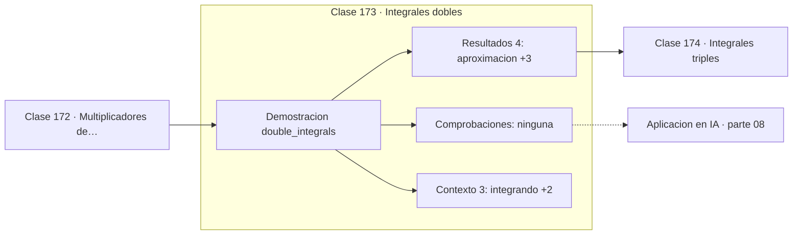

# 173 — Integrales dobles

> [⬅️ 172 Multiplicadores de Lagrange](../172-multiplicadores-de-lagrange/README.md) · [📚 Parte 08](../README.md) · [🏠 Programa](../../../README.md) · [174 Integrales triples ➡️](../174-integrales-triples/README.md)

**Parte:** 08 — Cálculo multivariable, matricial y autodiferenciación · **Nivel:** `universitario-avanzado` · **Horas estimadas:** 4
**Motor:** `engines.part08` · **Demostración:** `double_integrals` · **Clase 13 de 20** de la parte

---

## 🎯 Propósito

**Fubini permite calcular una integral doble como dos integrales simples encadenadas.**

Derivadas parciales, gradiente, Jacobiano, Hessiano, Taylor multivariable, multiplicadores de Lagrange, cálculo matricial y autodiferenciación.

## ✅ Resultados de aprendizaje

Al terminar podrás:

1. Explicar **Integrales dobles** con lenguaje cotidiano y con notación matemática.
2. Resolver un caso pequeño a mano y anticipar el orden de magnitud del resultado.
3. Ejecutar y modificar `lab.py`, que corre la demostración `double_integrals`.
4. Interpretar las 7 salidas del laboratorio y decir qué comprueba cada una.
5. Detectar el error típico de esta parte: confundir la convención de layout (numerador vs denominador) en cálculo matricial.

## 🧩 Fórmulas de la clase

```text
∬f dA = ∫(∫f dx)dy
sobre un rectángulo: los límites son constantes
```

## 🗺️ Ubicación en el programa



## 📖 Fundamentos

Una integral doble acumula sobre una región del plano en lugar de sobre un intervalo. Su
definición es un límite de sumas sobre una malla de rectángulos, análoga a la suma de
Riemann de la clase 153.

El **teorema de Fubini** permite calcularla como dos integrales simples encadenadas, en
cualquier orden, siempre que la función sea integrable. Esa reducción es lo que la hace
calculable: en lugar de un límite bidimensional, dos aplicaciones del cálculo de una
variable.

El coste computacional de la integración numérica en varias dimensiones crece
exponencialmente: una malla con `n` puntos por dimensión requiere `nᵈ` evaluaciones. En
dimensión 10 con 100 puntos por eje son 10²⁰ evaluaciones: imposible. Esa es la maldición
de la dimensionalidad aplicada a la integración.

La salida es **Monte Carlo** (clase 198), cuyo error decae como `1/√n` **independientemente
de la dimensión**. Por eso toda expectativa de alta dimensión en machine learning se
estima muestreando en lugar de integrando en malla: el ELBO de un VAE, la esperanza de una
política en RL, cualquier integral sobre el espacio de parámetros.

## 🧮 Ejemplo trabajado

Integral doble de xy sobre un rectángulo.

```text
∬ xy dA  sobre [0,2] × [0,3]

Por Fubini:
  ∫₀³ (∫₀² xy dx) dy = ∫₀³ (2y) dy = 9

Valor exacto: (2²/2)·(3²/2) = 2·4.5 = 9

Numérico con malla 200×200: 9.00000000
error: 1.1e−13                              ✓

Coste: 40 000 evaluaciones para 2 dimensiones.
En 10 dimensiones serían 100¹⁰.
```

## 🔬 Qué ejecuta el laboratorio

`double_integrals` — Integral doble sobre un rectángulo por suma de Riemann.

| Grupo | Salidas |
|---|---|
| 🔢 Resultados numéricos (4) | `aproximacion`, `valor_exacto`, `error`, `subdivisiones` |
| ✅ Comprobaciones de invariante (0) | — |

Las claves booleanas no son adorno: si alguna fuera `False`, el resultado numérico
no sería fiable aunque el programa terminase sin error.

```bash
python classes/part-08-calculo-multivariable-matricial-y-autodiferenciacion/173-integrales-dobles/lab.py
compmath run 173
```

> [!TIP]
> Antes de ejecutar, **escribe tu predicción**. Un laboratorio que confirma lo que
> esperabas enseña tanto como uno que te contradice, pero solo si la predicción
> existía antes del resultado.

## ⚠️ Errores conceptuales frecuentes

1. Intercambiar el orden de integración sin comprobar las hipótesis de Fubini.
2. Usar integración en malla en dimensión alta.
3. Confundir los límites al cambiar el orden en regiones no rectangulares.

## 🚀 Dónde se usa de verdad

Probabilidades conjuntas, marginalización, cálculo de masas y centros de gravedad, y
normalización de densidades multivariantes.

## 🤖 Conexión con IA

Autograd de PyTorch y JAX es exactamente el modo reverso del grafo de cómputo que se construye en esta parte a mano.

## 📓 Notebooks

| Archivo | Para qué |
|---|---|
| [`notebook.ipynb`](notebook.ipynb) | recorrido guiado con la demostración ejecutada |
| [`notebook_student.ipynb`](notebook_student.ipynb) | versión con `TODO` para resolver |
| [`notebook_solution.ipynb`](notebook_solution.ipynb) | solución de referencia verificada |

## 📝 Evaluación

| Criterio | Peso |
|---|---:|
| Comprensión conceptual | 25 % |
| Resolución manual | 25 % |
| Implementación y verificación | 25 % |
| Interpretación y comunicación | 15 % |
| Conexión con aplicación real | 10 % |

Detalle y criterios de error crítico en [`assessment.md`](assessment.md).

## ❓ Preguntas de comprobación

1. ¿Cuál es la entrada, cuál la salida y qué unidades tienen?
2. ¿Qué operación domina el comportamiento del resultado?
3. ¿Qué caso extremo revelaría un error conceptual?
4. ¿Cómo verificarías el resultado por un método independiente?
5. ¿Dónde aparece esto en optimización multivariable?

Si necesitas releer el código para responderlas, la clase todavía no está superada.

## 📥 Entregable

`notebook_student.ipynb` resuelto más un párrafo que explique el resultado **sin citar
código**: qué entra, qué sale, qué invariante se comprueba y qué pasaría en un caso límite.

## 📚 Bibliografía de la clase

Esta clase enseña **Cálculo multivariable y matricial · Cálculo · Diferenciación automática**. Cada obra dice qué aporta aquí y cómo se comprobó su localizador:

- [Stewart, J. *Calculus*, 8ª ed., Cengage, 2015, cap. 15](https://www.cengage.com/c/calculus-8e-stewart/) — Cálculo: el tema de esta clase · ISBN-13 `9781285740621` verificado en International ISBN Agency (2026-08-19).
- [Robert & Casella. *Monte Carlo Statistical Methods*, 2ª ed., Springer, 2004](https://link.springer.com/book/10.1007/978-1-4757-4145-2) — Estadística e inferencia y Métodos de Monte Carlo: conexión declarada de esta parte · ISBN-13 `9781475741452` verificado en International ISBN Agency (2026-08-19).

Bibliografía de todas las clases, con el porqué de cada obra, en [`docs/BIBLIOGRAPHY.md`](../../../docs/BIBLIOGRAPHY.md) · localizador y estado de cada obra en [`sources/bibliography.json`](../../../sources/bibliography.json).

## 📂 Material de la clase

[`intuition.md`](intuition.md) · [`theory.md`](theory.md) · [`derivation.md`](derivation.md) · [`exercises.md`](exercises.md) · [`assessment.md`](assessment.md) · [`where-is-this-used.md`](where-is-this-used.md) · [`lesson.yaml`](lesson.yaml)

---

> [⬅️ 172 Multiplicadores de Lagrange](../172-multiplicadores-de-lagrange/README.md) · [📚 Parte 08](../README.md) · [🏠 Programa](../../../README.md) · [174 Integrales triples ➡️](../174-integrales-triples/README.md)
