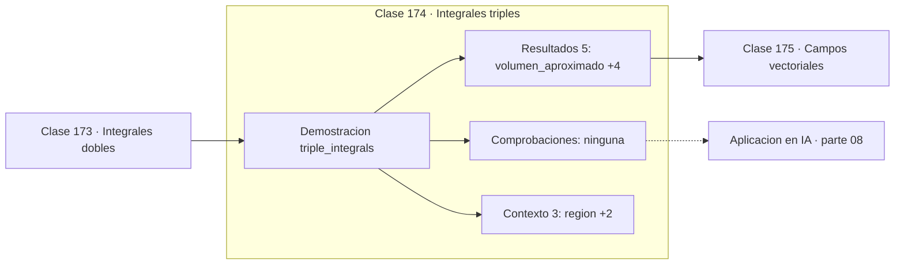

# 174 — Integrales triples

> [⬅️ 173 Integrales dobles](../173-integrales-dobles/README.md) · [📚 Parte 08](../README.md) · [🏠 Programa](../../../README.md) · [175 Campos vectoriales ➡️](../175-campos-vectoriales/README.md)

**Parte:** 08 — Cálculo multivariable, matricial y autodiferenciación · **Nivel:** `universitario-avanzado` · **Horas estimadas:** 4
**Motor:** `engines.part08` · **Demostración:** `triple_integrals` · **Clase 14 de 20** de la parte

---

## 🎯 Propósito

Derivadas parciales, gradiente, Jacobiano, Hessiano, Taylor multivariable, multiplicadores de Lagrange, cálculo matricial y autodiferenciación.

Esta clase concreta ese objetivo sobre **Integrales triples**: qué es, cómo se
calcula a mano, cómo se implementa sin ocultar el procedimiento y cómo se verifica
que el resultado es correcto y no solo plausible.

## ✅ Resultados de aprendizaje

Al terminar podrás:

1. Explicar **Integrales triples** con lenguaje cotidiano y con notación matemática.
2. Resolver un caso pequeño a mano y anticipar el orden de magnitud del resultado.
3. Ejecutar y modificar `lab.py`, que corre la demostración `triple_integrals`.
4. Interpretar las 8 salidas del laboratorio y decir qué comprueba cada una.
5. Detectar el error típico de esta parte: suponer que el hessiano es definido positivo sin comprobarlo.

## 🗺️ Ubicación en el programa



## 🧠 Idea rectora de la parte 08

> Modo reverso calcula todas las derivadas en un solo barrido hacia atrás.

## 🔬 Qué ejecuta el laboratorio

`triple_integrals` — Volumen y masa de un cubo con densidad variable.

| Grupo | Salidas |
|---|---|
| 🔢 Resultados numéricos (5) | `volumen_aproximado`, `volumen_exacto`, `masa_aproximada`, `masa_exacta_3/2`, `error_masa` |
| ✅ Comprobaciones de invariante (0) | — |

Las claves booleanas no son adorno: si alguna fuera `False`, el resultado numérico
no sería fiable aunque el programa terminase sin error.

```bash
python classes/part-08-calculo-multivariable-matricial-y-autodiferenciacion/174-integrales-triples/lab.py
compmath run 174
```

> [!TIP]
> Antes de ejecutar, **escribe tu predicción**. Un laboratorio que confirma lo que
> esperabas enseña tanto como uno que te contradice, pero solo si la predicción
> existía antes del resultado.

## ⚠️ Errores frecuentes en esta parte

- Confundir la convención de layout (numerador vs denominador) en cálculo matricial.
- Suponer que el Hessiano es definido positivo sin comprobarlo.
- Olvidar acumular gradientes cuando un nodo se reutiliza en el grafo.

## 🤖 Conexión con IA

Autograd de PyTorch y JAX es exactamente el modo reverso del grafo de cómputo que se construye en esta parte a mano.

## 📓 Notebooks

| Archivo | Para qué |
|---|---|
| [`notebook.ipynb`](notebook.ipynb) | recorrido guiado con la demostración ejecutada |
| [`notebook_student.ipynb`](notebook_student.ipynb) | versión con `TODO` para resolver |
| [`notebook_solution.ipynb`](notebook_solution.ipynb) | solución de referencia verificada |

## 📝 Evaluación

| Criterio | Peso |
|---|---:|
| Comprensión conceptual | 25 % |
| Resolución manual | 25 % |
| Implementación y verificación | 25 % |
| Interpretación y comunicación | 15 % |
| Conexión con aplicación real | 10 % |

Detalle y criterios de error crítico en [`assessment.md`](assessment.md).

## ❓ Preguntas de comprobación

1. ¿Cuál es la entrada, cuál la salida y qué unidades tienen?
2. ¿Qué operación domina el comportamiento del resultado?
3. ¿Qué caso extremo revelaría un error conceptual?
4. ¿Cómo verificarías el resultado por un método independiente?
5. ¿Dónde aparece esto en optimización multivariable?

Si necesitas releer el código para responderlas, la clase todavía no está superada.

## 📥 Entregable

`notebook_student.ipynb` resuelto más un párrafo que explique el resultado **sin citar
código**: qué entra, qué sale, qué invariante se comprueba y qué pasaría en un caso límite.

## 🔗 Referencias

- Petersen, K.; Pedersen, M. *The Matrix Cookbook*. 2012.
- Baydin, A. et al. *Automatic Differentiation in Machine Learning: a Survey*. JMLR, 2018.
- Magnus, J.; Neudecker, H. *Matrix Differential Calculus*. 3ª ed., Wiley, 2019.

## 📂 Material de la clase

[`intuition.md`](intuition.md) · [`theory.md`](theory.md) · [`derivation.md`](derivation.md) · [`exercises.md`](exercises.md) · [`assessment.md`](assessment.md) · [`where-is-this-used.md`](where-is-this-used.md) · [`lesson.yaml`](lesson.yaml)

---

> [⬅️ 173 Integrales dobles](../173-integrales-dobles/README.md) · [📚 Parte 08](../README.md) · [🏠 Programa](../../../README.md) · [175 Campos vectoriales ➡️](../175-campos-vectoriales/README.md)
