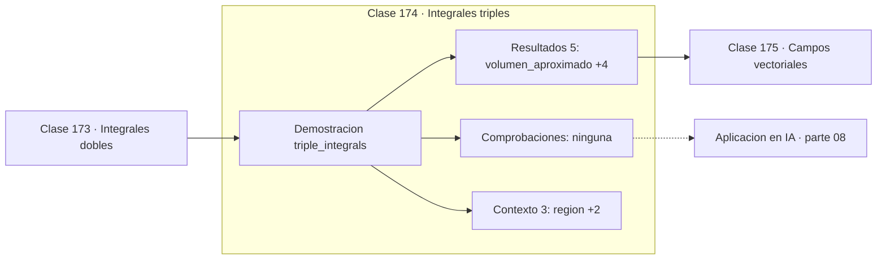

# 174 — Integrales triples

> [⬅️ 173 Integrales dobles](../173-integrales-dobles/README.md) · [📚 Parte 08](../README.md) · [🏠 Programa](../../../README.md) · [175 Campos vectoriales ➡️](../175-campos-vectoriales/README.md)

**Parte:** 08 — Cálculo multivariable, matricial y autodiferenciación · **Nivel:** `universitario-avanzado` · **Horas estimadas:** 4
**Motor:** `engines.part08` · **Demostración:** `triple_integrals` · **Clase 14 de 20** de la parte

---

## 🎯 Propósito

**Una integral triple con densidad variable calcula masa; el volumen es el caso de densidad unitaria.**

Derivadas parciales, gradiente, Jacobiano, Hessiano, Taylor multivariable, multiplicadores de Lagrange, cálculo matricial y autodiferenciación.

## ✅ Resultados de aprendizaje

Al terminar podrás:

1. Explicar **Integrales triples** con lenguaje cotidiano y con notación matemática.
2. Resolver un caso pequeño a mano y anticipar el orden de magnitud del resultado.
3. Ejecutar y modificar `lab.py`, que corre la demostración `triple_integrals`.
4. Interpretar las 8 salidas del laboratorio y decir qué comprueba cada una.
5. Detectar el error típico de esta parte: suponer que el hessiano es definido positivo sin comprobarlo.

## 🧩 Fórmulas de la clase

```text
V = ∭ dV
m = ∭ ρ(x,y,z) dV
```

## 🗺️ Ubicación en el programa



## 📖 Fundamentos

La integral triple extiende la acumulación a tres dimensiones. Con integrando 1 da el
**volumen**; con una función de densidad da la **masa**. Esa distinción —volumen como caso
particular de masa con densidad constante— es la que se generaliza a la probabilidad: la
masa total de una densidad debe ser 1.

El coste crece con el cubo del refinamiento: una malla de 60 puntos por eje son 216 000
celdas para un cubo unitario. Ya en tres dimensiones la integración en malla empieza a ser
cara, y en más dimensiones deja de ser viable.

Los cambios de coordenadas —cilíndricas, esféricas— simplifican regiones con simetría, al
precio de introducir el **jacobiano** como factor: `r` en cilíndricas, `r²sin φ` en
esféricas. Ese factor es el determinante de la clase 117 corrigiendo el cambio de volumen,
y olvidarlo es el error clásico.

En probabilidad, la integral triple aparece al marginalizar una densidad conjunta de tres
variables, y la normalización de la gaussiana multivariante es una integral de este tipo
resuelta con un cambio de variable que diagonaliza la covarianza.

## 🧮 Ejemplo trabajado

Volumen y masa de un cubo con densidad variable.

```text
región: cubo unitario [0,1]³
densidad: ρ(x,y,z) = 1 + x

volumen numérico: 1.00000000     exacto 1     ✓

masa = ∭(1+x)dV = 1 + 1/2 = 1.5
masa numérica: 1.500000
error: 4.2e−07

malla: 60³ = 216 000 celdas
```

## 🔬 Qué ejecuta el laboratorio

`triple_integrals` — Volumen y masa de un cubo con densidad variable.

| Grupo | Salidas |
|---|---|
| 🔢 Resultados numéricos (5) | `volumen_aproximado`, `volumen_exacto`, `masa_aproximada`, `masa_exacta_3/2`, `error_masa` |
| ✅ Comprobaciones de invariante (0) | — |

Las claves booleanas no son adorno: si alguna fuera `False`, el resultado numérico
no sería fiable aunque el programa terminase sin error.

```bash
python classes/part-08-calculo-multivariable-matricial-y-autodiferenciacion/174-integrales-triples/lab.py
compmath run 174
```

> [!TIP]
> Antes de ejecutar, **escribe tu predicción**. Un laboratorio que confirma lo que
> esperabas enseña tanto como uno que te contradice, pero solo si la predicción
> existía antes del resultado.

## ⚠️ Errores conceptuales frecuentes

1. Olvidar el jacobiano al cambiar a coordenadas cilíndricas o esféricas.
2. Usar integración en malla en más de tres o cuatro dimensiones.
3. Confundir volumen (densidad 1) con masa (densidad variable).

## 🚀 Dónde se usa de verdad

Masa y centro de gravedad, marginalización de densidades conjuntas, normalización de
distribuciones multivariantes y cálculo de momentos.

## 🤖 Conexión con IA

Autograd de PyTorch y JAX es exactamente el modo reverso del grafo de cómputo que se construye en esta parte a mano.

## 📓 Notebooks

| Archivo | Para qué |
|---|---|
| [`notebook.ipynb`](notebook.ipynb) | recorrido guiado con la demostración ejecutada |
| [`notebook_student.ipynb`](notebook_student.ipynb) | versión con `TODO` para resolver |
| [`notebook_solution.ipynb`](notebook_solution.ipynb) | solución de referencia verificada |

## 📝 Evaluación

| Criterio | Peso |
|---|---:|
| Comprensión conceptual | 25 % |
| Resolución manual | 25 % |
| Implementación y verificación | 25 % |
| Interpretación y comunicación | 15 % |
| Conexión con aplicación real | 10 % |

Detalle y criterios de error crítico en [`assessment.md`](assessment.md).

## ❓ Preguntas de comprobación

1. ¿Cuál es la entrada, cuál la salida y qué unidades tienen?
2. ¿Qué operación domina el comportamiento del resultado?
3. ¿Qué caso extremo revelaría un error conceptual?
4. ¿Cómo verificarías el resultado por un método independiente?
5. ¿Dónde aparece esto en optimización multivariable?

Si necesitas releer el código para responderlas, la clase todavía no está superada.

## 📥 Entregable

`notebook_student.ipynb` resuelto más un párrafo que explique el resultado **sin citar
código**: qué entra, qué sale, qué invariante se comprueba y qué pasaría en un caso límite.

## 🔗 Referencias

- [Stewart, J. *Calculus*, 8ª ed., Cengage, 2015, cap. 15](https://www.cengage.com/c/calculus-8e-stewart/) — *uso:* obra de referencia consultada en «Integrales triples».
- [Bishop, C. *Pattern Recognition and Machine Learning*. Springer, 2006, cap. 2](https://www.microsoft.com/en-us/research/publication/pattern-recognition-machine-learning/) — *uso:* obra de referencia consultada en «Integrales triples».

Bibliografía completa de la parte en [`../../../docs/BIBLIOGRAPHY.md`](../../../docs/BIBLIOGRAPHY.md) · localizador verificable de cada obra en [`sources/bibliography.json`](../../../sources/bibliography.json).

## 📂 Material de la clase

[`intuition.md`](intuition.md) · [`theory.md`](theory.md) · [`derivation.md`](derivation.md) · [`exercises.md`](exercises.md) · [`assessment.md`](assessment.md) · [`where-is-this-used.md`](where-is-this-used.md) · [`lesson.yaml`](lesson.yaml)

---

> [⬅️ 173 Integrales dobles](../173-integrales-dobles/README.md) · [📚 Parte 08](../README.md) · [🏠 Programa](../../../README.md) · [175 Campos vectoriales ➡️](../175-campos-vectoriales/README.md)
