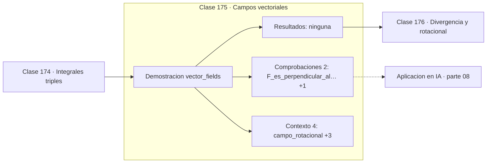

# 175 — Campos vectoriales

> [⬅️ 174 Integrales triples](../174-integrales-triples/README.md) · [📚 Parte 08](../README.md) · [🏠 Programa](../../../README.md) · [176 Divergencia y rotacional ➡️](../176-divergencia-y-rotacional/README.md)

**Parte:** 08 — Cálculo multivariable, matricial y autodiferenciación · **Nivel:** `universitario-avanzado` · **Horas estimadas:** 4
**Motor:** `engines.part08` · **Demostración:** `vector_fields` · **Clase 15 de 20** de la parte

---

## 🎯 Propósito

**Un campo conservativo es el gradiente de un potencial; no todos los campos lo son.**

Derivadas parciales, gradiente, Jacobiano, Hessiano, Taylor multivariable, multiplicadores de Lagrange, cálculo matricial y autodiferenciación.

## ✅ Resultados de aprendizaje

Al terminar podrás:

1. Explicar **Campos vectoriales** con lenguaje cotidiano y con notación matemática.
2. Resolver un caso pequeño a mano y anticipar el orden de magnitud del resultado.
3. Ejecutar y modificar `lab.py`, que corre la demostración `vector_fields`.
4. Interpretar las 6 salidas del laboratorio y decir qué comprueba cada una.
5. Detectar el error típico de esta parte: olvidar acumular gradientes cuando un nodo se reutiliza en el grafo.

## 🧩 Fórmulas de la clase

```text
campo: F(x,y) = (P, Q)
conservativo ⟺ F = ∇φ para algún potencial φ
condición necesaria: ∂P/∂y = ∂Q/∂x
```

## 🗺️ Ubicación en el programa



## 📖 Fundamentos

Un campo vectorial asigna un vector a cada punto: velocidad de un fluido, fuerza
gravitatoria, dirección de descenso. La distinción fundamental es entre campos que
**derivan de un potencial** y los que no.

Un campo conservativo es el gradiente de una función escalar. Su propiedad característica
es que el trabajo entre dos puntos no depende del camino, solo de los extremos, y por
tanto el trabajo en un circuito cerrado es cero. La gravedad es conservativa; el rozamiento
no.

El campo `F(x,y) = (−y, x)` del laboratorio es puramente rotacional: en cada punto es
perpendicular al radio, así que hace girar sin acercar ni alejar. No es conservativo, y su
rotacional es no nulo (clase 176).

La conexión con optimización es exacta: el campo de gradientes de una función escalar es
**siempre conservativo por construcción**, y esa es la razón por la que el descenso de
gradiente no puede quedar atrapado en un ciclo. En cambio, en optimización de dos jugadores
—los GAN de la clase 333— el campo de actualizaciones **no** es un gradiente de nada, puede
tener componente rotacional, y de ahí que el entrenamiento pueda ciclar en lugar de
converger.

## 🧮 Ejemplo trabajado

Un campo rotacional y uno conservativo.

```text
Campo F(x,y) = (−y, x)      rotacional puro
  en (1,0): (0, 1)
  en (0,1): (−1, 0)
  en (1,1): (−1, 1)

  F·(x,y) = −xy + yx = 0     ✓ perpendicular al radio

Campo G = ∇(x²+y²) = (2x, 2y)   conservativo
  en (1,0): (2, 0)
  en (1,1): (2, 2)
  deriva del potencial φ = x²+y²
```

## 🔬 Qué ejecuta el laboratorio

`vector_fields` — Campo vectorial, líneas de flujo y campo conservativo.

| Grupo | Salidas |
|---|---|
| 🔢 Resultados numéricos (0) | — |
| ✅ Comprobaciones de invariante (2) | `F_es_perpendicular_al_radio`, `G_deriva_de_un_potencial` |

Las claves booleanas no son adorno: si alguna fuera `False`, el resultado numérico
no sería fiable aunque el programa terminase sin error.

```bash
python classes/part-08-calculo-multivariable-matricial-y-autodiferenciacion/175-campos-vectoriales/lab.py
compmath run 175
```

> [!TIP]
> Antes de ejecutar, **escribe tu predicción**. Un laboratorio que confirma lo que
> esperabas enseña tanto como uno que te contradice, pero solo si la predicción
> existía antes del resultado.

## ⚠️ Errores conceptuales frecuentes

1. Suponer que todo campo vectorial tiene potencial.
2. Confundir un campo vectorial con una función escalar.
3. Olvidar que la condición ∂P/∂y = ∂Q/∂x es necesaria pero no suficiente en dominios no simplemente conexos.

## 🚀 Dónde se usa de verdad

Campos de fuerzas en física, campos de gradientes en optimización, dinámica de
entrenamiento adversarial y flujos en modelos generativos continuos.

## 🤖 Conexión con IA

Autograd de PyTorch y JAX es exactamente el modo reverso del grafo de cómputo que se construye en esta parte a mano.

## 📓 Notebooks

| Archivo | Para qué |
|---|---|
| [`notebook.ipynb`](notebook.ipynb) | recorrido guiado con la demostración ejecutada |
| [`notebook_student.ipynb`](notebook_student.ipynb) | versión con `TODO` para resolver |
| [`notebook_solution.ipynb`](notebook_solution.ipynb) | solución de referencia verificada |

## 📝 Evaluación

| Criterio | Peso |
|---|---:|
| Comprensión conceptual | 25 % |
| Resolución manual | 25 % |
| Implementación y verificación | 25 % |
| Interpretación y comunicación | 15 % |
| Conexión con aplicación real | 10 % |

Detalle y criterios de error crítico en [`assessment.md`](assessment.md).

## ❓ Preguntas de comprobación

1. ¿Cuál es la entrada, cuál la salida y qué unidades tienen?
2. ¿Qué operación domina el comportamiento del resultado?
3. ¿Qué caso extremo revelaría un error conceptual?
4. ¿Cómo verificarías el resultado por un método independiente?
5. ¿Dónde aparece esto en optimización multivariable?

Si necesitas releer el código para responderlas, la clase todavía no está superada.

## 📥 Entregable

`notebook_student.ipynb` resuelto más un párrafo que explique el resultado **sin citar
código**: qué entra, qué sale, qué invariante se comprueba y qué pasaría en un caso límite.

## 🔗 Referencias

- [Stewart, J. *Calculus*, 8ª ed., Cengage, 2015, cap. 16](https://www.cengage.com/c/calculus-8e-stewart/)
- [Balduzzi, D. et al. *The Mechanics of n-Player Differentiable Games*. ICML, 2018](https://arxiv.org/abs/1802.05642)

Bibliografía completa de la parte en [`../../../docs/BIBLIOGRAPHY.md`](../../../docs/BIBLIOGRAPHY.md).

## 📂 Material de la clase

[`intuition.md`](intuition.md) · [`theory.md`](theory.md) · [`derivation.md`](derivation.md) · [`exercises.md`](exercises.md) · [`assessment.md`](assessment.md) · [`where-is-this-used.md`](where-is-this-used.md) · [`lesson.yaml`](lesson.yaml)

---

> [⬅️ 174 Integrales triples](../174-integrales-triples/README.md) · [📚 Parte 08](../README.md) · [🏠 Programa](../../../README.md) · [176 Divergencia y rotacional ➡️](../176-divergencia-y-rotacional/README.md)
