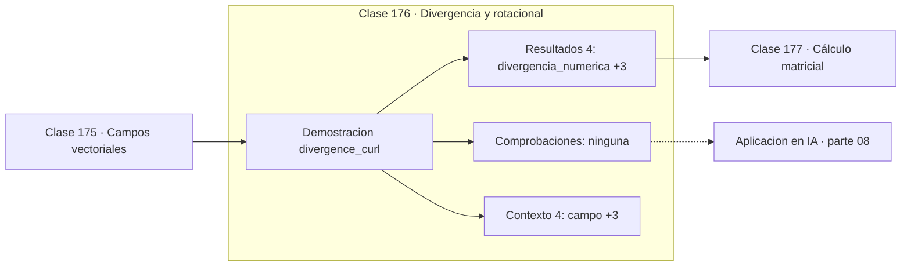

# 176 — Divergencia y rotacional

> [⬅️ 175 Campos vectoriales](../175-campos-vectoriales/README.md) · [📚 Parte 08](../README.md) · [🏠 Programa](../../../README.md) · [177 Cálculo matricial ➡️](../177-calculo-matricial/README.md)

**Parte:** 08 — Cálculo multivariable, matricial y autodiferenciación · **Nivel:** `universitario-avanzado` · **Horas estimadas:** 4
**Motor:** `engines.part08` · **Demostración:** `divergence_curl` · **Clase 16 de 20** de la parte

---

## 🎯 Propósito

**La divergencia mide fuente o sumidero; el rotacional mide circulación local.**

Derivadas parciales, gradiente, Jacobiano, Hessiano, Taylor multivariable, multiplicadores de Lagrange, cálculo matricial y autodiferenciación.

## ✅ Resultados de aprendizaje

Al terminar podrás:

1. Explicar **Divergencia y rotacional** con lenguaje cotidiano y con notación matemática.
2. Resolver un caso pequeño a mano y anticipar el orden de magnitud del resultado.
3. Ejecutar y modificar `lab.py`, que corre la demostración `divergence_curl`.
4. Interpretar las 8 salidas del laboratorio y decir qué comprueba cada una.
5. Detectar el error típico de esta parte: confundir la convención de layout (numerador vs denominador) en cálculo matricial.

## 🧩 Fórmulas de la clase

```text
div F = ∂P/∂x + ∂Q/∂y
rot F = ∂Q/∂x − ∂P/∂y  (en 2D)
div(∇φ) = Δφ  (laplaciano)
```

## 🗺️ Ubicación en el programa



## 📖 Fundamentos

La divergencia y el rotacional son las dos formas de derivar un campo vectorial. La
**divergencia** es un escalar que mide el flujo neto que sale de un entorno del punto:
positiva indica fuente, negativa sumidero, nula indica que lo que entra sale. El
**rotacional** mide la tendencia del campo a hacer girar un objeto colocado en ese punto.

Ambos aparecen en las ecuaciones de Maxwell y en la mecánica de fluidos, y su combinación
da los teoremas integrales —Green, Gauss, Stokes— que relacionan lo que ocurre en el
interior de una región con lo que ocurre en su frontera.

La divergencia del gradiente es el **laplaciano**, `Δφ = div(∇φ)`, que es la traza del
Hessiano. Ese operador aparece en la ecuación del calor, en la de ondas y —lo que importa
aquí— en el **Laplaciano de un grafo** (clase 336), que es su análogo discreto y es la
base del clustering espectral y de las GNN.

El teorema clave para esta parte es que el rotacional de un gradiente es siempre cero. Por
tanto, un campo con rotacional no nulo **no puede** ser un campo de gradientes, y ese es
el criterio para detectar dinámicas que no derivan de ninguna función objetivo.

## 🧮 Ejemplo trabajado

Divergencia y rotacional de F = (x², xy).

```text
F(x,y) = (x², xy)   en el punto (1,2)

div F = ∂(x²)/∂x + ∂(xy)/∂y = 2x + x = 3x
  analítica en (1,2): 3
  numérica:           3.000000            ✓

rot F = ∂(xy)/∂x − ∂(x²)/∂y = y − 0 = y
  analítica en (1,2): 2
  numérica:           2.000000            ✓

rot ≠ 0  →  F NO es un campo de gradientes
```

## 🔬 Qué ejecuta el laboratorio

`divergence_curl` — Divergencia y rotacional calculados numéricamente.

| Grupo | Salidas |
|---|---|
| 🔢 Resultados numéricos (4) | `divergencia_numerica`, `divergencia_analitica_2x+x`, `rotacional_numerico`, `rotacional_analitico_y` |
| ✅ Comprobaciones de invariante (0) | — |

Las claves booleanas no son adorno: si alguna fuera `False`, el resultado numérico
no sería fiable aunque el programa terminase sin error.

```bash
python classes/part-08-calculo-multivariable-matricial-y-autodiferenciacion/176-divergencia-y-rotacional/lab.py
compmath run 176
```

> [!TIP]
> Antes de ejecutar, **escribe tu predicción**. Un laboratorio que confirma lo que
> esperabas enseña tanto como uno que te contradice, pero solo si la predicción
> existía antes del resultado.

## ⚠️ Errores conceptuales frecuentes

1. Confundir divergencia (escalar) con rotacional (vector en 3D, escalar en 2D).
2. Suponer que un campo con divergencia nula es conservativo: son propiedades distintas.
3. Calcular estas derivadas con h demasiado pequeño y amplificar el redondeo.

## 🚀 Dónde se usa de verdad

Mecánica de fluidos, electromagnetismo, laplaciano de grafos, difusión y detección de
dinámicas no conservativas en entrenamiento adversarial.

## 🤖 Conexión con IA

Autograd de PyTorch y JAX es exactamente el modo reverso del grafo de cómputo que se construye en esta parte a mano.

## 📓 Notebooks

| Archivo | Para qué |
|---|---|
| [`notebook.ipynb`](notebook.ipynb) | recorrido guiado con la demostración ejecutada |
| [`notebook_student.ipynb`](notebook_student.ipynb) | versión con `TODO` para resolver |
| [`notebook_solution.ipynb`](notebook_solution.ipynb) | solución de referencia verificada |

## 📝 Evaluación

| Criterio | Peso |
|---|---:|
| Comprensión conceptual | 25 % |
| Resolución manual | 25 % |
| Implementación y verificación | 25 % |
| Interpretación y comunicación | 15 % |
| Conexión con aplicación real | 10 % |

Detalle y criterios de error crítico en [`assessment.md`](assessment.md).

## ❓ Preguntas de comprobación

1. ¿Cuál es la entrada, cuál la salida y qué unidades tienen?
2. ¿Qué operación domina el comportamiento del resultado?
3. ¿Qué caso extremo revelaría un error conceptual?
4. ¿Cómo verificarías el resultado por un método independiente?
5. ¿Dónde aparece esto en optimización multivariable?

Si necesitas releer el código para responderlas, la clase todavía no está superada.

## 📥 Entregable

`notebook_student.ipynb` resuelto más un párrafo que explique el resultado **sin citar
código**: qué entra, qué sale, qué invariante se comprueba y qué pasaría en un caso límite.

## 🔗 Referencias

- [Stewart, J. *Calculus*, 8ª ed., Cengage, 2015, cap. 16](https://www.cengage.com/c/calculus-8e-stewart/)
- [Chung, F. *Spectral Graph Theory*. AMS, 1997](https://mathweb.ucsd.edu/~fan/research/revised.html)

Bibliografía completa de la parte en [`../../../docs/BIBLIOGRAPHY.md`](../../../docs/BIBLIOGRAPHY.md).

## 📂 Material de la clase

[`intuition.md`](intuition.md) · [`theory.md`](theory.md) · [`derivation.md`](derivation.md) · [`exercises.md`](exercises.md) · [`assessment.md`](assessment.md) · [`where-is-this-used.md`](where-is-this-used.md) · [`lesson.yaml`](lesson.yaml)

---

> [⬅️ 175 Campos vectoriales](../175-campos-vectoriales/README.md) · [📚 Parte 08](../README.md) · [🏠 Programa](../../../README.md) · [177 Cálculo matricial ➡️](../177-calculo-matricial/README.md)
